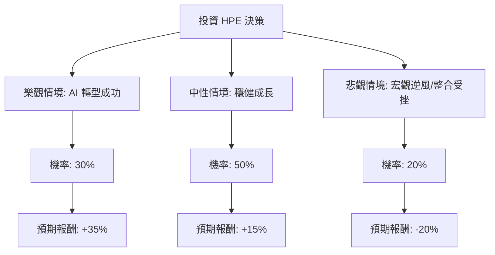

這份分析報告將結合您提供的基本面數據與最新的市場動態（包含 AI 伺服器需求、Juniper Networks 收購案、以及最新財報表現），利用**決策樹（Decision Tree）**與**期望值分析（Expected Value Analysis）**評估 HPE 的投資價值。

---

### 一、 核心假設與市場背景分析

在構建決策樹之前，我們基於最新資訊設定以下核心假設：

1.  **AI 伺服器動能（利多）**：HPE 在 2024 年第三季財報顯示 AI 系統營收達 13 億美元，訂單積壓量大。AI 伺服器是目前主要的成長引擎。
2.  **Juniper Networks 收購案（中性偏多/風險）**：這筆 140 億美元的收購預計於 2024 年底或 2025 年初完成。長期有助於提升毛利（網路業務毛利高），但短期面臨債務增加與整合風險。
3.  **估值水平（利多）**：目前 **Forward P/E 僅 8.15**，**PEG 為 0.5**。這顯示市場對其成長性的定價極低，安全邊際較高。
4.  **利潤率壓力（利空）**：AI 伺服器雖然營收高，但目前毛利率低於傳統伺服器與軟體業務，導致整體利潤率受壓（目前 Oper. Margin 僅 5.03%）。

---

### 二、 決策樹分析 (Decision Tree)

我們將未來一年的表現分為三種情境：**樂觀（AI 爆發 + 成功整合）**、**中性（穩健成長）**、**悲觀（經濟衰退 + 整合失敗）**。

#### 節點詳細說明：

1.  **樂觀情境 (Bull Case) - 30% 機率**：
    *   **描述**：AI 伺服器毛利改善，Juniper 收購案順利完成並產生協同效應，企業網路需求回升。
    *   **目標價預估**：$30.00 (約 +35%)。
2.  **中性情境 (Base Case) - 50% 機率**：
    *   **描述**：符合分析師預期（Target Price $26.07），AI 業務持續成長但被傳統硬體下滑抵銷，股息維持發放。
    *   **目標價預估**：$26.00 (約 +15%)。
3.  **悲觀情境 (Bear Case) - 20% 機率**：
    *   **描述**：全球經濟衰退導致企業 IT 支出縮減，收購 Juniper 導致債務負擔過重，AI 競爭加劇（Dell, Supermicro 擠壓）。
    *   **目標價預估**：$18.00 (約 -20%)。

---

### 三、 期望值計算 (Expected Value Calculation)

我們根據上述情境的機率與報酬率，計算投資 HPE 的總體期望報酬率。

| 情境 | 機率 (P) | 預期報酬率 (R) | 期望值 (P * R) |
| :--- | :--- | :--- | :--- |
| **樂觀 (Bull)** | 0.30 | +35% | +10.5% |
| **中性 (Base)** | 0.50 | +15% | +7.5% |
| **悲觀 (Bear)** | 0.20 | -20% | -4.0% |
| **總計期望值** | **1.00** | | **+14.0%** |

**計算過程：**
$EV = (0.30 \times 35\%) + (0.50 \times 15\%) + (0.20 \times -20\%)$
$EV = 10.5\% + 7.5\% - 4.0\% = 14.0\%$

加上 **2.38% 的股息收益率**，總預期年化報酬率約為 **16.38%**。

---

### 四、 綜合評估與最終結論

#### 1. 基本面數據支持點：
*   **極低估值**：Forward P/E 8.15 與 PEG 0.5 顯示該股被嚴重低估，即便在悲觀情境下，下行空間也因低估值而受到保護。
*   **成長動能**：Sales Q/Q 成長 19.22%，顯示 AI 浪潮確實帶動了營收增長。
*   **技術面**：股價目前在 SMA20, SMA50, SMA200 之上，呈現多頭排列。

#### 2. 潛在風險：
*   **獲利能力**：ROE (-0.47%) 與 Profit Margin (-0.65%) 目前為負值，反映了近期可能的資產減損或收購相關開支，需關注下一季財報是否轉正。
*   **債務**：Debt/Eq 0.87 尚可，但收購 Juniper 後槓桿會上升。

#### 3. 最終結論：

**判斷：適合投資 (Buy / Overweight)**

**理由：**
1.  **正向期望值**：14% 的預期資本利得加上 2.38% 的股息，優於市場平均預期。
2.  **AI 轉型紅利**：HPE 正從傳統硬體商轉型為 AI 基礎設施供應商，市場尚未完全給予其 AI 溢價（相較於 Dell 或 NVIDIA）。
3.  **安全邊際高**：P/B 僅 1.2，且 PEG 遠低於 1，代表目前的股價並未反映未來的成長潛力。

**建議操作：**
目前股價 $22.32 接近 52 週高點，建議可採取**分批進場**策略，以應對收購案整合期間可能帶來的市場波動。若股價回測 $20-$21 區間（SMA200 附近）則是更佳的買入點。