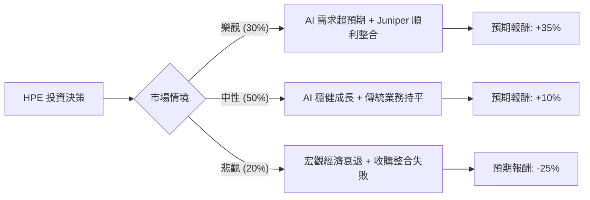

這份分析報告將結合您提供的基本面數據與最新的市場動態（包含 AI 伺服器需求、Juniper Networks 收購案進度及產業競爭），透過**決策樹（Decision Tree）**與**期望值分析（Expected Value Analysis）**來評估 HPE 的投資價值。

---

### 一、 核心假設與市場動態分析

在建立模型前，我們先整合基本面與最新資訊：

1.  **AI 伺服器動能（利多）**：HPE 的 AI 伺服器訂單積壓量持續增加，液冷技術（Liquid Cooling）在資料中心市場具備競爭優勢。
2.  **Juniper Networks 收購案（雙面刃）**：HPE 預計以 140 億美元收購 Juniper，旨在強化毛利較高的網路業務（Networking）。目前已通過歐盟與英國監管，但仍面臨整合風險與高額債務壓力。
3.  **財務數據特徵**：
    *   **低估值**：Forward P/E 僅 7.5，PEG 0.44，顯示市場對其成長潛力給予極低評價。
    *   **獲利能力暫時受壓**：ROE (0.23%) 與 Profit Margin (-0.17%) 數據不佳，反映了近期轉型成本或一次性支出。
    *   **技術面疲軟**：股價低於 SMA20/50/200，處於空頭排列。

---

### 二、 決策樹分析 (Decision Tree)

我們將未來一年的情境分為三種：**樂觀（AI 爆發與成功整合）**、**中性（穩健轉型）**、**悲觀（宏觀衰退與收購失利）**。

#### 節點詳細說明：

| 情境 | 機率 (P) | 預期報酬 (R) | 說明 |
| :--- | :--- | :--- | :--- |
| **樂觀情境** | 30% | +35% | AI 伺服器毛利改善，Juniper 併購產生綜效，股價回升至 Target Price ($26.67) 以上。 |
| **中性情境** | 50% | +10% | AI 抵銷傳統伺服器下滑，股息 (2.58%) 提供支撐，股價隨大盤小幅波動。 |
| **悲觀情境** | 20% | -25% | 併購導致債務負擔過重，企業支出縮減，股價回測 52W 低點 (~$12-$15)。 |

---

### 三、 期望值計算過程 (Expected Value Calculation)

**1. 計算公式：**
$$EV = (P_{Bull} \times R_{Bull}) + (P_{Base} \times R_{Base}) + (P_{Bear} \times R_{Bear})$$

**2. 數值帶入：**
*   樂觀：$0.30 \times 35\% = 10.5\%$
*   中性：$0.50 \times 10\% = 5.0\%$
*   悲觀：$0.20 \times (-25\%) = -5.0\%$

**3. 總期望報酬率：**
$$EV = 10.5\% + 5.0\% - 5.0\% = 10.5\%$$

**4. 考慮股息後的總期望值：**
HPE 目前股息率約為 **2.58%**。
$$Total EV = 10.5\% + 2.58\% = 13.08\%$$

---

### 四、 核心假設與風險評估

1.  **估值修復假設**：目前 Forward P/E 7.5 倍遠低於標普 500 平均與同業（如 Dell）。假設只要 AI 業務佔比提升，市場會給予估值重估（Re-rating）。
2.  **收購風險**：140 億美元的收購案對市值 274 億的 HPE 來說規模巨大。若整合失敗，債務股本比（Debt/Eq 0.98）將進一步惡化。
3.  **技術面壓力**：目前股價處於 52 週高點回落後的修正期（Perf Month -14.28%），短期內賣壓仍重。

---

### 五、 最終結論

#### **判斷：適合投資 (建議：分批佈局 / 逢低買進)**

**理由如下：**

1.  **期望值為正且具吸引力**：13.08% 的預期總報酬率優於無風險利率，且在科技股中屬於估值極低的安全邊際。
2.  **PEG 顯示嚴重低估**：PEG 0.44 意味著市場尚未反映其明年 16.59% 的 EPS 成長預期。
3.  **AI 轉型實質化**：HPE 不僅是硬體商，其 GreenLake 訂閱服務與 Juniper 的網路技術結合後，將轉型為高毛利的「邊緣到雲端」平台公司。
4.  **下行風險受限**：P/B 僅 1.1，顯示股價已接近公司淨資產價值，進一步大幅崩跌的空間有限。

**操作建議：**
由於目前技術指標（SMA20/50）顯示短期趨勢向下，不建議一次性歐印（All-in）。建議在 **$18.5 - $20.0** 區間分批建立長期倉位，目標價看好分析師預期的 **$26.67**。

---
*免責聲明：本分析僅供參考，不構成投資建議。投資股票具有風險，請根據自身風險承受能力做出決策。*