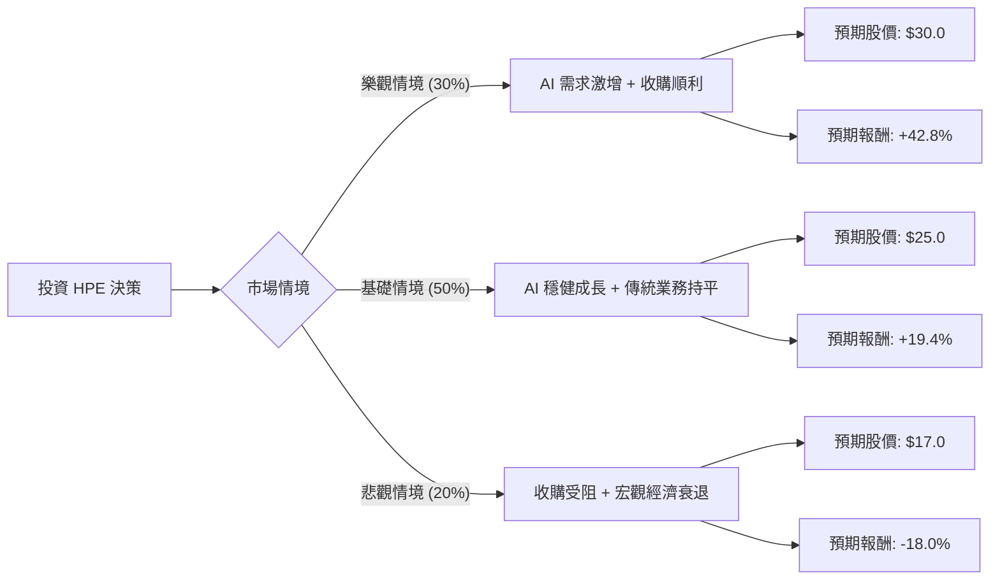

這份分析報告結合了您提供的基本面數據，以及針對 **HPE (Hewlett Packard Enterprise)** 的最新市場動態（包含 AI 伺服器需求、Juniper Networks 收購案進度及最新財報表現）進行的綜合評估。

---

### 一、 核心假設與市場背景分析

在構建決策樹之前，我們必須基於最新資訊設定核心假設：

1.  **AI 伺服器爆發力 (利多)**：HPE 在 2024 年第三季財報顯示，AI 系統營收達 13 億美元，季增 39%。AI 訂單積壓量（Backlog）依然龐大，是未來成長的主引擎。
2.  **Juniper Networks 收購案 (不確定性)**：HPE 預計以 140 億美元收購 Juniper。若成功，將強化其網路業務（高毛利）；若失敗或整合不順，則面臨高額債務壓力。
3.  **估值與財務 (中性偏利多)**：目前 Forward P/E 僅約 7.83，PEG 0.46 顯示股價相對於成長性被低估。但 Debt/Eq 0.98 顯示負債比率不低，且淨利率（Profit Margin）目前偏低。
4.  **總體經濟 (風險)**：企業端 IT 支出若因高利率環境持續萎縮，將影響傳統伺服器與儲存業務。

---

### 二、 決策樹分析 (Decision Tree)

以下使用 Markdown 繪製決策樹，評估未來一年的投資預期報酬。

#### 節點詳細說明：

| 節點名稱 | 發生機率 (P) | 預期目標價 (含股息) | 預期報酬率 (R) | 期望值 (P * R) |
| :--- | :--- | :--- | :--- | :--- |
| **樂觀情境** | 30% | $30.52 (含息) | +42.8% | +12.84% |
| **基礎情境** | 50% | $25.52 (含息) | +19.4% | +9.70% |
| **悲觀情境** | 20% | $17.52 (含息) | -18.0% | -3.60% |
| **總計** | **100%** | - | - | **+18.94%** |

---

### 三、 期望值分析 (Expected Value Analysis) 計算過程

#### 1. 參數設定：
*   **當前股價 ($P_0$)**：$21.37
*   **預期年度股息**：$21.37 * 2.49\% \approx \$0.52$
*   **樂觀目標 ($P_{bull}$)**：$30.0 (基於 AI 業務帶動 Forward P/E 擴張至 11x)
*   **基礎目標 ($P_{base}$)**：$25.0 (接近分析師平均目標價 $26.2)
*   **悲觀目標 ($P_{bear}$)**：$17.0 (回測 52 週低點區域，受收購失敗或衰退影響)

#### 2. 計算公式：
$$EV = \sum (Probability_i \times Return_i)$$

*   **樂觀報酬率** = $[(30.0 + 0.52) - 21.37] / 21.37 = 42.8\%$
*   **基礎報酬率** = $[(25.0 + 0.52) - 21.37] / 21.37 = 19.4\%$
*   **悲觀報酬率** = $[(17.0 + 0.52) - 21.37] / 21.37 = -18.0\%$

#### 3. 期望值計算：
$$EV = (0.30 \times 0.428) + (0.50 \times 0.194) + (0.20 \times -0.180)$$
$$EV = 0.1284 + 0.097 - 0.036 = 0.1894$$
**最終期望報酬率 = 18.94%**

---

### 四、 最終結論

**判斷：適合投資 (建議分批買進)**

#### 理由：
1.  **正向期望值顯著**：計算出的預期報酬率為 **18.94%**，遠高於無風險利率（美債收益率）及標普 500 的長期平均回報，具備投資吸引力。
2.  **估值極具安全邊際**：Forward P/E 僅 7.83 倍，且 PEG 0.46 顯示市場尚未完全反映其 AI 伺服器業務的成長潛力。即便在悲觀情境下，P/B 1.14 也提供了較強的資產支撐。
3.  **AI 轉型紅利**：HPE 已成功從傳統硬體商轉型為 AI 基礎設施供應商，其液冷技術（Liquid Cooling）在高效能運算市場具備競爭優勢，這將是未來 1-2 年股價催化劑。
4.  **股息收益**：2.49% 的股息率為投資者在等待股價回升期間提供了穩定的現金流緩衝。

#### 風險提示：
*   **收購整合風險**：Juniper 的收購案規模巨大，需關注後續負債比率是否過高影響信用評等。
*   **技術指標**：目前 SMA20、SMA50、SMA200 均為負值，顯示短期趨勢偏弱，建議在股價站穩均線或出現放量反彈時進場。