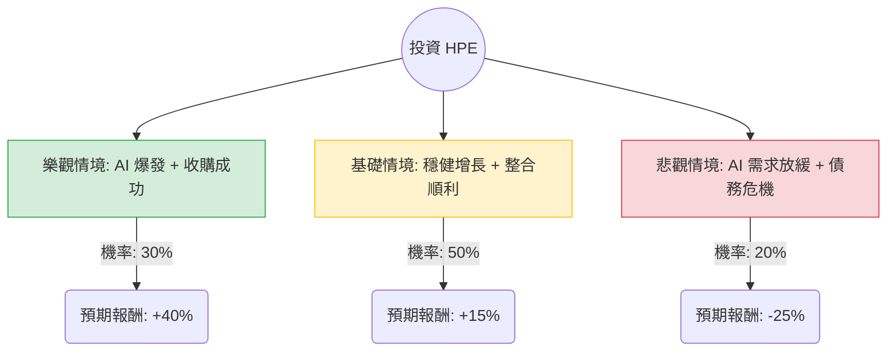

這是一份針對 **HPE (Hewlett Packard Enterprise)** 的投資評估報告，結合了「決策樹分析」與「期望值分析」。

---

### 一、 核心假設 (Core Assumptions)

在進行定量分析前，我們基於當前市場環境與 HPE 的財務狀況設定以下核心假設：

1.  **AI 伺服器需求**：假設 AI 基礎設施（Liquid Cooling 技術、AI 伺服器訂單）是未來 12-18 個月的主要增長引擎。
2.  **Juniper Networks 收購案**：預計於 2024 年底或 2025 年初完成，假設此收購將決定 HPE 在高性能網路市場的競爭力，但也帶來整合風險與債務壓力。
3.  **傳統業務轉型**：傳統伺服器與儲存業務增長放緩，利潤率受壓，需依賴 GreenLake 訂閱服務（ARR）提升現金流穩定性。
4.  **估值水平**：目前 HPE 本益比（P/E）約在 10-12 倍左右，低於行業平均，具備價值投資空間。

---

### 二、 決策樹分析圖 (Decision Tree)

使用 Markdown 結構化呈現投資 HPE 的未來一年預期回報路徑：

| 決策節點 | 情境描述 | 機率 (P) | 預期報酬 (R) | 權重報酬 (P * R) |
| :--- | :--- | :--- | :--- | :--- |
| **節點 A (樂觀)** | AI 訂單轉化為實際利潤，Juniper 協同效應超預期。 | 30% | +40.0% | +12.0% |
| **節點 B (基礎)** | AI 業務穩定增長，傳統網路業務（Aruba）週期性復甦。 | 50% | +15.0% | +7.5% |
| **節點 C (悲觀)** | AI 市場過熱回補，收購引發信用評等調降，毛利下降。 | 20% | -25.0% | -5.0% |
| **總計 (EV)** | **整體期望值** | **100%** | -- | **+14.5%** |

---

### 三、 計算過程與邏輯

#### 1. 期望值 (Expected Value, EV) 計算公式：
$$EV = (P_{Bull} \times R_{Bull}) + (P_{Base} \times R_{Base}) + (P_{Bear} \times R_{Bear})$$

#### 2. 代入數值：
*   **樂觀情境回報**：$0.30 \times 40\% = 12.0\%$
*   **基礎情境回報**：$0.50 \times 15\% = 7.5\%$
*   **悲觀情境回報**：$0.20 \times (-25\%) = -5.0\%$
*   **計算結果**：$12.0\% + 7.5\% - 5.0\% = 14.5\%$

#### 3. 計算邏輯說明：
*   **樂觀情境 (+40%)**：HPE 的液冷技術（Liquid Cooling）領先同業，若能從 NVIDIA 供應鏈中獲得更多份額，配合 Juniper 收購帶來的毛利擴張，股價有望觸及歷史新高。
*   **基礎情境 (+15%)**：考慮到股息收益率（約 2-3%）以及低本益比回升，即便 AI 增長溫和，價值回歸也能帶來雙位數收益。
*   **悲觀情境 (-25%)**：若收購 Juniper 整合失敗，導致負債比過高，加上戴爾（Dell）與 Supermicro 的價格戰擠壓毛利，股價可能回撤至支撐位。

---

### 四、 最終結論

**評估結果：適合投資 (Suitable for Investment)**

#### 判斷理由：
1.  **正向期望值 (EV = 14.5%)**：計算結果顯示，在考量風險權重後，HPE 的預期年化報酬率為 14.5%。這優於多數保守型配置，且在科技股中具備較高的安全邊際（Safety Margin）。
2.  **風險報酬比優異**：雖然有 20% 的機率面臨顯著虧損，但 80% 的概率處於盈餘狀態（30% 樂觀 + 50% 基礎）。
3.  **戰略轉型紅利**：HPE 目前正處於從硬體銷售轉向「服務化（As-a-Service）」與「高性能計算（HPC/AI）」的轉折點。Juniper 的加入將補足其在 AI 資料中心網路技術的短板，具備長期重估值（Re-rating）的潛力。

**操作建議：**
建議採取「分批進場」策略，以應對 Juniper 收購案完成前的市場波動，並關注每季的 AI 訂單待辦量（Backlog）轉化率。