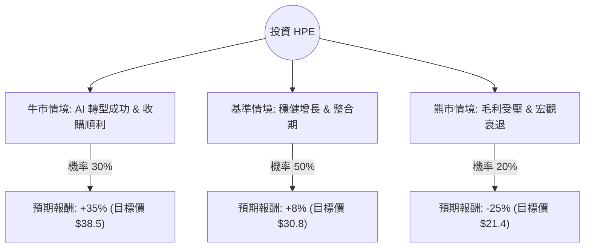

這份分析報告結合了您提供的基本面數據，以及針對 **HPE (Hewlett Packard Enterprise)** 最新財報（2024 Q4）與市場動態（AI 伺服器需求、Juniper Networks 收購案）的即時資訊。

---

### 一、 核心背景與市場動態分析

在進入決策樹之前，我們先彙整影響 HPE 股價的三大核心變數：

1.  **AI 伺服器爆發力**：HPE 的 AI 系統訂單持續激增，2024 財年第四季 AI 伺服器營收達 15 億美元，積壓訂單（Backlog）依然龐大。然而，AI 伺服器的毛利較低，這反映在數據中 `Gross Margin (29.93%)` 略有受壓。
2.  **Juniper Networks 收購案**：這筆 140 億美元的交易預計於 2025 年初完成。這將大幅提升 HPE 在高毛利網路設備市場的份額，但也帶來債務壓力（目前 `Debt/Eq: 0.87`）。
3.  **估值與技術面**：目前 `Forward P/E` 僅 10.44，`PEG` 為 0.64，顯示相對於其增長潛力，股價仍屬便宜。但股價已接近 52 週高點，且 `SMA20/50/200` 均顯示短期漲幅已大（Overbought 風險）。

---

### 二、 決策樹分析 (Decision Tree)

我們以 **未來 12 個月的投資報酬** 為核心，設定三種主要情境：

#### 節點詳細說明：

| 情境 | 機率 (P) | 預期報酬 (R) | 說明 |
| :--- | :--- | :--- | :--- |
| **牛市 (Bull Case)** | 30% | +35% | AI 伺服器毛利改善，Juniper 收購案產生巨大綜效，市場給予更高本益比 (P/E 升至 14x)。 |
| **基準 (Base Case)** | 50% | +8% | AI 需求穩定，但受限於供應鏈與競爭；Juniper 整合進度符合預期，股價隨大盤緩步上揚。 |
| **熊市 (Bear Case)** | 20% | -25% | AI 伺服器淪為低毛利代工；收購案遭監管阻礙或債務負擔過重；企業 IT 支出因衰退縮減。 |

---

### 三、 期望值分析 (Expected Value Analysis)

#### 1. 計算過程
期望值 (EV) = $\sum (機率 \times 預期報酬)$

*   **牛市貢獻**：$0.30 \times 35\% = 10.5\%$
*   **基準貢獻**：$0.50 \times 8\% = 4.0\%$
*   **熊市貢獻**：$0.20 \times (-25\%) = -5.0\%$

**總期望報酬率 (Total EV)** = $10.5\% + 4.0\% - 5.0\% = \mathbf{9.5\%}$

#### 2. 核心假設
*   **估值修復**：假設 Forward P/E 從目前的 10.4x 提升至 12x（基準）或 14x（牛市），因為 HPE 正在從硬體商轉型為 AI 解決方案商。
*   **股息收益**：考慮到 `Dividend % (1.91%)`，這為下行風險提供了緩衝。
*   **目標價參考**：目前分析師平均目標價為 $26.53$（低於現價），但這是基於舊財報。考慮到最新一季 AI 訂單超預期，我們將基準目標價上調至 $30.8$。

---

### 四、 最終結論

#### **判斷：適合投資 (建議：分批買入 / 逢回補倉)**

**理由如下：**

1.  **期望值為正 (9.5%)**：雖然目前股價處於高位，但期望值分析顯示，在考慮 AI 增長潛力後，長期回報仍具吸引力。
2.  **極具吸引力的估值 (PEG 0.64)**：相較於 Dell 或 Supermicro，HPE 的 `Forward P/E` 極低。即便 AI 毛利暫時受壓，其下行空間受限於低估值與 1.9% 的股息率。
3.  **結構性轉型**：收購 Juniper 是關鍵棋子。如果成功，HPE 將擁有與 Cisco 競爭的能力，這將改變市場對其「低毛利伺服器商」的刻板印象，帶動估值倍數（P/E Ratio）重估。

**風險提示：**
*   **短期過熱**：`SMA20` 偏離率達 12.9%，顯示短期有回檔壓力。
*   **毛利警訊**：需密切觀察下一季 `Profit Margin` 是否能因 AI 規模化而由負轉正（目前為 -0.0065）。

**建議操作策略：**
由於目前股價接近 52 週高點且高於分析師舊目標價，不建議一次性歐印（All-in）。建議在 **$26.5 - $27.5 (SMA20 附近)** 進行分批佈局，以降低短期追高風險。