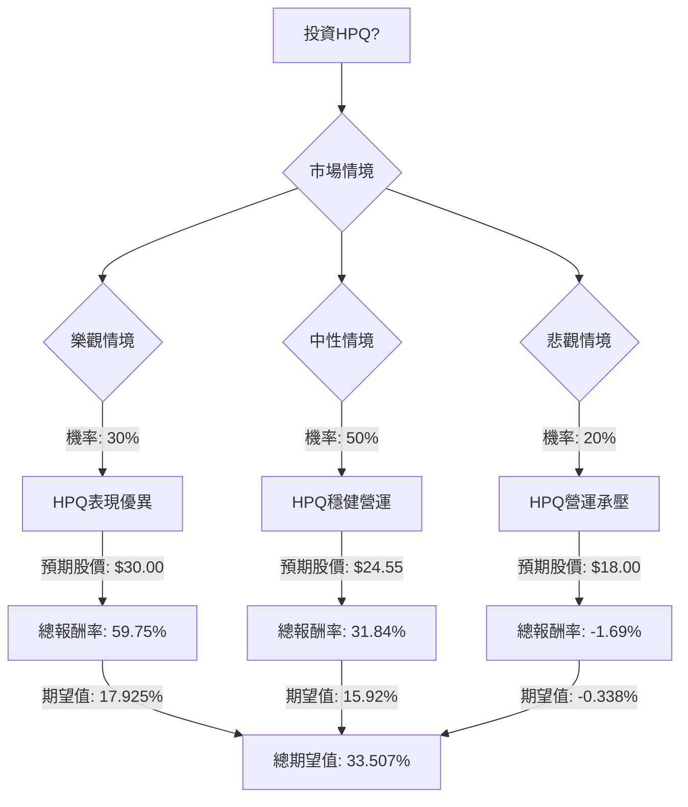

根據對美股公司HPQ的決策樹分析與期望值分析，並結合最新市場資訊與基本面數據，以下是詳細評估：

### 核心假設

1.  **市場趨勢 (Market Trends):**
    *   **PC市場:** 預計2026年因記憶體短缺和零組件成本上升而面臨挑戰，出貨量可能下降4.9%至8.9%。然而，高階PC和AI PC的需求可能相對穩定，且平均銷售價格(ASP)預計將上漲4%至8%。HPQ在2025年第四季度PC出貨量中排名第二。
    *   **印表機市場:** 預計整體銷量將略有下降，但數位印刷、噴墨技術和AI驅動解決方案的轉型將帶來機會。永續發展是關鍵驅動力。
2.  **財務表現 (Financial Performance):**
    *   HPQ在2025財年第四季度表現穩健，營收和非GAAP EPS均超出預期。
    *   公司已宣布2026財年EPS指引為2.90-3.20美元。
    *   實施「未來就緒」成本節約計畫，預計到2028財年末可節省約10億美元。
    *   維持並提高了季度股息至每股0.30美元，年化股息為1.20美元。
3.  **產業競爭 (Industry Competition):**
    *   AI PC的發展被視為潛在的成長催化劑，HPQ計劃在2026年4月23日的投資者日分享其AI轉型計畫。
4.  **分析師情緒 (Analyst Sentiment):**
    *   分析師普遍給予「持有/中立」評級。
    *   平均目標價約為24.55美元，最高30.00美元，最低18.00美元。
    *   近期有分析師因PC利潤壓力及需求放緩而下調評級和目標價。
5.  **股票表現 (Stock Performance):**
    *   近期股價表現疲軟，過去一個月下跌超過13%。

### 基本面數據摘要 (截至目前)

*   **收盤價 (Close):** $19.53
*   **本益比 (P/E):** 7.34
*   **股息率 (Dividend %):** 5.99% (根據最新季度股息調整為 6.14%)
*   **52週區間 (52W Range):** $19.58 - $35.28
*   **目標價 (Target Price):** $24.27 (來自提供數據，與分析師平均目標價接近)
*   **預期本益比 (Forward P/E):** 6.1
*   **股東權益報酬率 (ROE):** - (未提供)
*   **資產報酬率 (ROA):** 0.0619 (6.19%)
*   **投資報酬率 (ROI):** 0.2722 (27.22%)
*   **利潤率 (Profit Margin):** 0.0457 (4.57%)
*   **P/FCF:** 6.39 (較低，顯示自由現金流強勁)
*   **分析師推薦 (Recom):** 3.24 (中性偏賣出)

### 決策樹分析

**起始點：投資HPQ？ (目前股價 $19.53)**

*   **年化股息:** 季度股息 $0.30 * 4 = $1.20
*   **股息率:** $1.20 / $19.53 = 6.14%

#### 計算過程

**1. 樂觀情境 (Optimistic Scenario)**
*   **情境名稱:** PC市場復甦優於預期 & HPQ AI轉型成功
*   **對應機率 (Probability):** 30%
*   **預期股價 (1年後):** $30.00 (分析師最高目標價)
*   **資本報酬率計算:** (($30.00 - $19.53) / $19.53) = 53.61%
*   **總報酬率 (含股息):** 53.61% (資本報酬率) + 6.14% (股息率) = 59.75%
*   **期望值 (Expected Value):** 0.30 * 59.75% = 17.925%

**2. 中性情境 (Moderate Scenario)**
*   **情境名稱:** 市場挑戰持續 & HPQ穩健營運
*   **對應機率 (Probability):** 50%
*   **預期股價 (1年後):** $24.55 (分析師平均目標價，取多個來源平均值)
*   **資本報酬率計算:** (($24.55 - $19.53) / $19.53) = 25.70%
*   **總報酬率 (含股息):** 25.70% (資本報酬率) + 6.14% (股息率) = 31.84%
*   **期望值 (Expected Value):** 0.50 * 31.84% = 15.92%

**3. 悲觀情境 (Pessimistic Scenario)**
*   **情境名稱:** 市場嚴重衰退 & HPQ營運承壓
*   **對應機率 (Probability):** 20%
*   **預期股價 (1年後):** $18.00 (分析師最低目標價)
*   **資本報酬率計算:** (($18.00 - $19.53) / $19.53) = -7.83%
*   **總報酬率 (含股息):** -7.83% (資本報酬率) + 6.14% (股息率) = -1.69%
*   **期望值 (Expected Value):** 0.20 * -1.69% = -0.338%

**整體期望值 (Overall Expected Value)**
*   **計算方式:** (樂觀情境期望值) + (中性情境期望值) + (悲觀情境期望值)
*   **整體期望值:** 17.925% + 15.92% + (-0.338%) = **33.507%**

### 最終結論

根據決策樹分析和期望值計算，HPQ目前的整體期望值為 **33.507%**。

**判斷：適合投資**

**簡短理由：**
儘管HPQ面臨PC市場因記憶體短缺和需求放緩帶來的挑戰，且近期股價表現疲軟，但其高達6.14%的股息率為投資者提供了可觀的下行保護和穩定收益。此外，公司積極推動AI轉型和成本節約計畫，以及在印表機市場向數位化和噴墨技術的轉型，這些都為未來的成長提供了潛力。分析師的平均目標價也顯示出約25%的潛在資本增值空間。綜合考量下，即使在市場存在不確定性的情況下，HPQ的整體預期報酬率仍為正且具吸引力，因此目前適合投資。