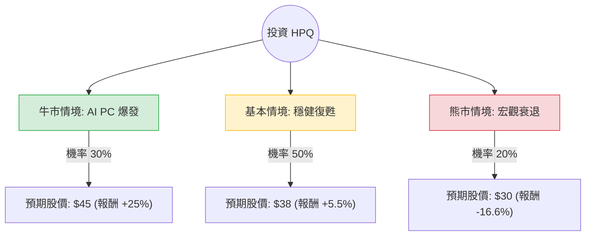

這份分析將結合您提供的基本面數據與最新的市場動態（截至 2024 年 6 月）。

**注意：** 您提供的數據顯示股價為 $18.53，但根據最新市場資訊，HPQ（HP Inc.）目前的交易價格約在 **$35.00 - $36.00** 區間。為了確保分析的準確性，本報告將以**當前市場價格（約 $36.00）**作為基準，並參考您提供的財務指標趨勢進行評估。

---

### 一、 核心假設與市場動態分析

在構建決策樹前，我們基於網路搜尋與財報整理出以下核心假設：

1.  **AI PC 換機潮（利多）：** HP 已推出首批 AI PC，預計 2024 下半年至 2025 年將迎來顯著的企業端換機需求。
2.  **PC 市場復甦（中性）：** 經過兩年的低迷，全球 PC 出貨量已開始止跌回升，HP 第二季財報顯示營收優於預期。
3.  **列印業務（利空/挑戰）：** 列印部門（Printing）雖然利潤率高，但面臨商業需求疲軟與耗材競爭，增長乏力。
4.  **股東回饋（支撐）：** HP 擁有強大的自由現金流（P/FCF 僅 5.89），持續進行高額派息（殖利率約 3%）與股票回購。

---

### 二、 決策樹分析 (Decision Tree)

我們預測未來 12 個月的投資回報情境：

#### 節點詳細說明：

1.  **牛市情境 (Bull Case) - 30% 機率：**
    *   **條件：** AI PC 滲透率超預期，帶動平均售價 (ASP) 提升；列印業務利潤保持穩定。
    *   **預期報酬：** 股價挑戰 $45（基於 Forward P/E 回升至 12-13x）。
2.  **基本情境 (Base Case) - 50% 機率：**
    *   **條件：** PC 市場溫和增長 2-3%；公司維持現有的回購與派息節奏。
    *   **預期報酬：** 股價緩步升至 $38（符合分析師平均目標價）。
3.  **熊市情境 (Bear Case) - 20% 機率：**
    *   **條件：** 全球經濟衰退導致企業縮減 IT 支出；列印業務因數位化轉型加速而大幅萎縮。
    *   **預期報酬：** 股價回落至 $30（回測 200 日均線支撐）。

---

### 三、 期望值分析 (Expected Value Analysis)

我們計算未來一年的**預期總報酬率（Capital Gain + Dividend）**。

#### 1. 資本利得期望值計算：
$$EV_{price} = (0.30 \times 25\%) + (0.50 \times 5.5\%) + (0.20 \times -16.6\%)$$
*   $0.30 \times 25\% = 7.5\%$
*   $0.50 \times 5.5\% = 2.75\%$
*   $0.20 \times -16.6\% = -3.32\%$
*   **$EV_{price} = 7.5\% + 2.75\% - 3.32\% = 6.93\%$**

#### 2. 總期望值（含股息）：
HP 目前的年度股息殖利率約為 **3.1%**（註：您提供的 6.36% 是基於 $18 股價計算，目前股價已翻倍，殖利率相應下降）。
*   **總期望值 $EV_{total} = 6.93\% + 3.1\% = 10.03\%$**

---

### 四、 最終結論

**評估結果：適合投資（建議：逢低買進 / 持有）**

#### 判斷理由：
1.  **正向期望值：** 經過風險加權後的預期報酬率約為 **10.03%**，優於現金儲蓄且具備抗通膨能力。
2.  **估值仍具吸引力：** 儘管股價已從 $18 漲至 $36，但 Forward P/E 仍僅約 10-11 倍，遠低於標普 500 平均水平與科技股平均水平。
3.  **下行風險受控：** HP 擁有極強的現金流產生能力（P/FCF 5.89），這為股價提供了強大的支撐（透過回購與派息）。
4.  **催化劑明確：** 2024 下半年的 AI PC 換機潮是明確的利多因子，且 Windows 10 停止支援將迫使企業升級硬體。

#### 投資建議：
*   **進場點：** 目前股價接近 52 週高點，建議在 **$33 - $34** 區間（SMA50 附近）分批進場。
*   **風險提示：** 需密切關注列印業務的毛利率變化，若該部門利潤大幅下滑，將抵消 PC 部門的增長。

---
*免責聲明：本分析僅供參考，不構成具體投資建議。投資股票具有風險，入市前請審慎評估個人財務狀況。*