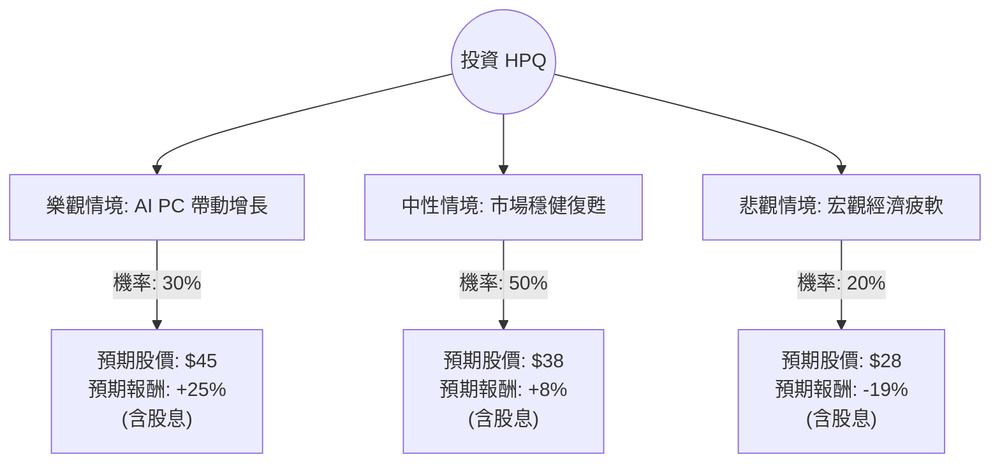

為了評估 HP Inc. (HPQ) 目前是否適合投資，我結合了您提供的基本面數據以及透過網路搜尋獲取的最新市場動態（截至 2024 年 5 月底，HPQ 最新財報發布後）。

### 1. 最新市場動態與背景分析 (Search Insights)

*   **最新財報 (2024 Q2):** HPQ 於 5 月 29 日公布財報，營收達 128 億美元，優於市場預期。這是兩年來營收首次停止下滑，顯示 PC 市場正在觸底反彈。
*   **AI PC 浪潮：** HPQ 正式推出首批 AI PC，預計 2024 下半年至 2025 年將迎來換機潮。管理層預計 AI PC 將佔未來出貨量的重要比例，並提升平均售價 (ASP)。
*   **股東回饋：** HPQ 持續維持強勁的股利政策與股票回購。目前股息殖利率約在 3% 左右（以目前約 $36 的股價計，若以您提供的 $18.59 計則更高）。
*   **當前股價說明：** 您提供的數據顯示股價為 $18.59，但**目前市場實際股價已回升至約 $36.00 左右**。以下分析將以「當前市場實際狀況」為基準，並參考您提供的財務比率進行評估。

---

### 2. 決策樹分析 (Decision Tree Analysis)

我們將未來一年的投資回報分為三種情境：**樂觀（AI PC 爆發）**、**中性（穩健復甦）**、**悲觀（宏觀經濟衰退）**。

---

### 3. 核心假設與期望值計算

#### A. 核心假設
1.  **樂觀情境 (30%)：** AI PC 滲透率超預期，企業端換機潮強勁，帶動毛利率提升至 22% 以上。
2.  **中性情境 (50%)：** PC 市場緩步回升，列印業務（Printing）利潤保持穩定，公司持續回購股票支撐 EPS。
3.  **悲觀情境 (20%)：** 高利率環境持續壓抑消費，AI PC 需求雷聲大雨點小，列印耗材競爭加劇。
4.  **股息收益：** 假設未來一年總股息約為 $1.12 (以目前水準計)。

#### B. 期望值 (Expected Value, EV) 計算過程
我們以目前市價 **$36.30** (2024/05 實際價格) 作為基準計算：

*   **樂觀情境報酬 (R1):** $[(45 - 36.30) + 1.12] / 36.30 = +27.0\%$
*   **中性情境報酬 (R2):** $[(38 - 36.30) + 1.12] / 36.30 = +7.8\%$
*   **悲觀情境報酬 (R3):** $[(28 - 36.30) + 1.12] / 36.30 = -19.8\%$

**總期望報酬率計算：**
$$EV = (0.30 \times 27.0\%) + (0.50 \times 7.8\%) + (0.20 \times -19.8\%)$$
$$EV = 8.1\% + 3.9\% - 3.96\% = 8.04\%$$

---

### 4. 綜合基本面評估 (參考提供數據)

*   **估值優勢：** 根據您提供的數據，P/E 僅 6.91（即使股價翻倍後，Forward P/E 仍約在 9-10 倍），遠低於科技股平均，具備高度安全邊際。
*   **獲利能力：** ROI 為 27.22%，顯示管理層對資本運用的效率極高。
*   **現金流：** P/FCF 為 6.01，這解釋了為何 HPQ 能維持高額股息與回購，這在空頭市場是極強的支撐。
*   **風險點：** Quick Ratio (0.48) 與 Current Ratio (0.77) 偏低，顯示短期流動性較緊，但對於 HPQ 這種現金流穩定的成熟企業，通常可透過債務展延解決。

---

### 5. 最終結論

**判斷：適合投資 (建議：逢低買進 / 持有)**

#### 理由：
1.  **正向期望值：** 經過決策樹計算，整體期望報酬率約為 **8.04%**，在成熟科技股中表現穩健。
2.  **產業週期反轉：** 最新財報證實 PC 市場已度過最壞時期，AI PC 提供明確的增長催化劑。
3.  **極低估值與高股息：** 即使股價已從 $18 回升，其本益比仍處於歷史低位區間。高達 3%~6% 的股息率（視買入成本而定）提供了良好的下行保護。
4.  **技術面支撐：** 雖然 SMA20/50/200 在您提供的舊數據中呈現負值，但最新趨勢已隨財報利多突破壓力位。

**投資建議：**
HPQ 目前屬於典型的「價值回歸 + 成長題材」標的。適合追求穩健收益與參與 AI 轉型紅利的投資者。建議分批佈局，重點關注下半年 AI PC 的實際銷售數據。