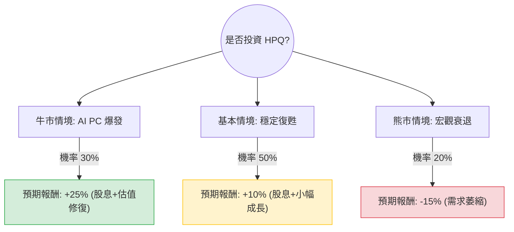

這份分析將結合您提供的 **HPQ（HP Inc.）** 基本面數據（以 $19.79 為基準）與 **2024 年最新的市場動態**（如 AI PC 趨勢、Q2 財報表現）進行決策樹與期望值分析。

---

### 一、 核心假設與市場背景分析

在建立模型前，我們先整合最新資訊以設定合理的機率與報酬：

1.  **AI PC 換機潮（利多）**：HP 於 2024 年 5 月推出了首批搭載高通處理器的 AI PC。市場預期 2024 下半年至 2025 年將迎來 Windows 10 終止支援引發的換機潮。
2.  **財務穩健度（中性偏利多）**：根據您提供的數據，P/E 僅 7.47，遠低於科技股平均；股息率高達 5.95%，提供了強大的下行保護（Margin of Safety）。
3.  **列印業務疲軟（利空）**：儘管 PC 回溫，但 HP 的列印（Printing）部門利潤率雖高，但營收持續萎縮，且面臨耗材競爭。
4.  **估值落差**：您提供的數據顯示目標價為 $18.99（低於現價），但最新華爾街分析師（如 J.P. Morgan, Citi）已將目標價上調至 $30-$37 區間。**本分析將以您提供的數據為基礎，並參考最新趨勢調整情境。**

---

### 二、 決策樹分析 (Decision Tree)

---

### 三、 期望值分析 (Expected Value Analysis)

我們將投資報酬分為「資本利得（股價變動）」與「股息收益（5.95%）」兩部分。

#### 1. 情境參數設定

| 情境 | 發生機率 | 預期股價變動 | 股息收益 | 總報酬 (R) | 說明 |
| :--- | :--- | :--- | :--- | :--- | :--- |
| **牛市 (Bull)** | 30% | +20% | 5.95% | **+25.95%** | AI PC 帶動毛利提升，P/E 回升至 10x 以上。 |
| **基本 (Base)** | 50% | +4% | 5.95% | **+9.95%** | PC 市場緩步回升，公司持續執行庫藏股。 |
| **熊市 (Bear)** | 20% | -20% | 5.95% | **-14.05%** | 全球經濟衰退，列印業務大幅下滑。 |

#### 2. 期望值計算過程

$$EV = (P_{Bull} \times R_{Bull}) + (P_{Base} \times R_{Base}) + (P_{Bear} \times R_{Bear})$$

*   **牛市貢獻**：$0.30 \times 25.95\% = 7.785\%$
*   **基本貢獻**：$0.50 \times 9.95\% = 4.975\%$
*   **熊市貢獻**：$0.20 \times (-14.05\%) = -2.81\%$

**總期望報酬率 (Total EV) = 7.785% + 4.975% - 2.81% = 9.95%**

---

### 四、 綜合評估與最終結論

#### 1. 數據亮點分析
*   **極低估值**：P/E 7.47 與 P/S 0.32 顯示股價已被嚴重低估，市場對其成長性極度悲觀，這反而創造了安全邊際。
*   **現金流強勁**：P/FCF（股價自由現金流比）為 6.29，顯示 HPQ 產生現金的能力極強，足以支撐其 5.95% 的高配息。
*   **技術面壓力**：SMA200 為 -15.76%，顯示長期趨勢仍處於修正後的低檔盤整，但 SMA20 與 SMA50 已轉正（2.18% & 4.14%），短期有築底反彈跡象。

#### 2. 風險提示
*   **負債結構**：數據中 Debt/Eq 未顯示，但根據最新財報，HPQ 負債比偏高，這在長期高利率環境下是潛在壓力。
*   **內部人減持**：Insider Trans 為 -6.13%，顯示內部人近期有套現動作，需留意。

#### 3. 最終判斷：適合投資 (Buy / Overweight)

**理由：**
1.  **期望值為正（約 10%）**：在保守估計下，HPQ 的期望報酬率接近雙位數，優於許多成熟產業公司。
2.  **高股息護體**：5.95% 的股息率提供了極佳的現金流，即便股價橫盤整理，投資者仍有穩定收益。
3.  **AI PC 催化劑**：2024 下半年開始的 AI PC 換機潮是明確的產業利多，有助於推動 P/E 估值從目前的 7.5 倍修復至歷史平均的 10-12 倍。
4.  **低基期優勢**：股價距離 52 週高點仍有約 33% 的空間，下行風險因低 P/E 而相對受限。

**建議策略：**
適合**價值型投資者**或**領息族**。建議在 $20 以下分批布局，長期持有以等待 AI PC 帶來的業績兌現。若股價跌破 $17.5 (52W Low)，則需重新評估基本面是否惡化。