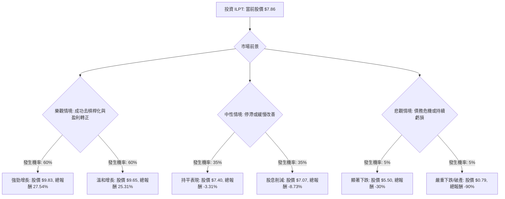

根據對 Industrial Logistics Properties Trust (ILPT) 的基本面數據和最新市場資訊的分析，以下是使用決策樹分析和期望值分析評估其目前是否適合投資的結果。

### **核心假設**

在構建決策樹和計算期望值時，我們基於以下核心假設：

*   **工業房地產市場趨勢：** 由於電子商務的持續增長，美國工業和物流房地產市場預計將保持強勁需求，支持高入住率和租金增長。
*   **債務管理：** ILPT 最近的再融資努力將有助於降低利率波動並改善現金流，但其整體高負債水平仍是顯著風險。
*   **盈利能力：** 公司預計將繼續縮小淨虧損並提高營運資金（FFO），但實現持續的淨盈利可能需要更長時間。
*   **股息政策：** 公司將努力維持目前的股息水平，但鑑於其負盈利，股息的可持續性存在疑問。
*   **分析師預期：** 分析師的目標價和建議為潛在股價變動提供了合理的參考範圍。

### **ILPT 基本面數據摘要 (截至 2026 年 5 月 17 日)**

*   **收盤價 (Close):** $7.86
*   **市淨率 (P/B):** 1.09
*   **股息率 (Dividend %):** 2.54% (年化 $0.20/股)
*   **52 週高/低 (52W High/Low):** $8.30 / $3.01
*   **過去一年表現 (Perf Year):** 140.37% (股價強勁上漲)
*   **市值 (Market Cap):** $5.24 億
*   **股東權益報酬率 (ROE):** -0.1061 (負值，顯示虧損)
*   **資產報酬率 (ROA):** -0.0103 (負值，顯示虧損)
*   **投資報酬率 (ROI):** -0.0116 (負值，顯示虧損)
*   **負債權益比 (Debt/Eq):** 8.76 (極高，財務槓桿風險大)
*   **營業利潤率 (Oper. Margin):** 0.3313 (營業層面有盈利能力，但淨利潤為負)
*   **淨利潤率 (Profit Margin):** -0.1193 (負值，顯示虧損)
*   **目標價 (Target Price):** $9.65 (分析師平均目標價)
*   **2026 年第一季度業績：** EPS 為 -$0.14，優於分析師預期的 -$0.20；營收 $1.1642 億，超出預期。淨虧損較去年同期大幅收窄 56%。
*   **近期債務再融資：** 成功為其合資企業 Mountain JV 進行 $16.2 億的五年期固定利率抵押貸款再融資，利率 5.71%，預計每年可釋放近 $2000 萬現金流，並將所有合併債務轉為固定利率。
*   **分析師評級：** 共識評級為「持有」，平均目標價為 $7.40 (來自 3 位分析師) 或 $9.65 (來自 2 位分析師)。

### **決策樹分析**

**起始節點：投資 ILPT (當前股價 $7.86)**

**節點計算過程：**

**1. 樂觀情境 (Optimistic Outlook)**
*   **核心假設：** 工業市場保持強勁，ILPT 成功管理債務，利息支出持續下降，FFO 顯著增長，淨收入轉正。
*   **總機率：** 60%
    *   **子情境 A：強勁增長 (Strong Growth)**
        *   **機率 (Conditional Probability):** 30% / 60% = 50%
        *   **預期報酬：** 股價上漲 25% ($7.86 * 1.25 = $9.83) + 股息率 2.54% ($0.20 / $7.86) = 27.54%
        *   **期望值 (Expected Value):** 0.50 * 27.54% = 13.77%
    *   **子情境 B：溫和增長 (Moderate Growth)**
        *   **機率 (Conditional Probability):** 30% / 60% = 50%
        *   **預期報酬：** 股價達到分析師平均目標價 $9.65，總報酬 (($9.65 - $7.86) / $7.86) + 2.54% = 22.77% + 2.54% = 25.31%
        *   **期望值 (Expected Value):** 0.50 * 25.31% = 12.655%
*   **樂觀情境總期望值 (EV_Optimistic):** 13.77% + 12.655% = 26.425%
*   **樂觀情境預期股價：** $7.86 * (1 + 0.26425) = $9.93

**2. 中性情境 (Neutral Outlook)**
*   **核心假設：** 工業市場穩定，但債務削減緩慢，盈利能力仍不明朗，FFO 增長溫和。
*   **總機率：** 35%
    *   **子情境 C：持平表現 (Flat Performance)**
        *   **機率 (Conditional Probability):** 25% / 35% = 71.4%
        *   **預期報酬：** 股價接近較低分析師目標價 $7.40，總報酬 (($7.40 - $7.86) / $7.86) + 2.54% = -5.85% + 2.54% = -3.31%
        *   **期望值 (Expected Value):** 0.714 * -3.31% = -2.36%
    *   **子情境 D：股息削減 (Dividend Cut)**
        *   **機率 (Conditional Probability):** 10% / 35% = 28.6%
        *   **預期報酬：** 股價下跌 10% ($7.86 * 0.90 = $7.07)，股息削減 50% ($0.10/股)，總報酬 (-10%) + ($0.10 / $7.86) = -10% + 1.27% = -8.73%
        *   **期望值 (Expected Value):** 0.286 * -8.73% = -2.497%
*   **中性情境總期望值 (EV_Neutral):** -2.36% + (-2.497%) = -4.857%
*   **中性情境預期股價：** $7.86 * (1 - 0.04857) = $7.48

**3. 悲觀情境 (Pessimistic Outlook)**
*   **核心假設：** 高負債變得難以管理，利率意外上升，工業市場疲軟，導致重大虧損和潛在財務困境。
*   **總機率：** 5%
    *   **子情境 E：顯著下跌 (Significant Decline)**
        *   **機率 (Conditional Probability):** 4% / 5% = 80%
        *   **預期報酬：** 股價下跌 30% ($7.86 * 0.70 = $5.50)，股息暫停 = -30%
        *   **期望值 (Expected Value):** 0.80 * -30% = -24%
    *   **子情境 F：嚴重下跌/破產 (Severe Decline/Bankruptcy)**
        *   **機率 (Conditional Probability):** 1% / 5% = 20%
        *   **預期報酬：** 投資損失 90% ($7.86 * 0.10 = $0.79) = -90%
        *   **期望值 (Expected Value):** 0.20 * -90% = -18%
*   **悲觀情境總期望值 (EV_Pessimistic):** -24% + (-18%) = -42%
*   **悲觀情境預期股價：** $7.86 * (1 - 0.42) = $4.56

**整體期望值計算：**

*   **整體期望報酬率 (Overall Expected Return):**
    (0.60 * 26.425%) + (0.35 * -4.857%) + (0.05 * -42%)
    = 15.855% - 1.69995% - 2.1%
    = **12.055%**

*   **整體期望股價 (Overall Expected Stock Price):**
    $7.86 * (1 + 0.12055) = **$8.80**

### **最終結論**

根據上述決策樹分析和期望值計算，ILPT 的整體期望報酬率為 **12.055%**，對應的期望股價為 **$8.80**。

**判斷：適合投資**

**理由：**

儘管 ILPT 存在極高的負債權益比和歷史虧損等重大風險，但最新的財報和市場動態顯示出積極的轉變：

1.  **債務結構改善：** 成功進行了大規模的固定利率再融資，顯著降低了未來利率波動的風險，並預計每年可釋放近 $2000 萬的現金流。
2.  **盈利能力改善：** 2026 年第一季度淨虧損大幅收窄，FFO 顯著增長，超出分析師預期，表明公司正朝著正確的方向發展。
3.  **強勁的工業房地產市場：** 電子商務的持續增長為 ILPT 的工業和物流物業提供了堅實的需求基礎，高入住率和長期租約提供了穩定的現金流。
4.  **分析師看好潛力：** 儘管共識評級為「持有」，但部分分析師給予「買入」評級，且平均目標價 ($9.65) 高於當前股價，暗示存在上漲空間。
5.  **正向的期望值：** 綜合考慮所有情境及其機率，計算出的整體期望報酬率為正值 (12.055%)，表明投資 ILPT 有望獲得正向回報。

雖然高負債和負盈利仍需密切關注，但公司在債務管理和營運表現上的最新進展，加上有利的產業趨勢，使得 ILPT 在當前價格下具有一定的投資吸引力。投資者應持續監控其債務償還進度、盈利能力改善情況以及股息政策的穩定性。