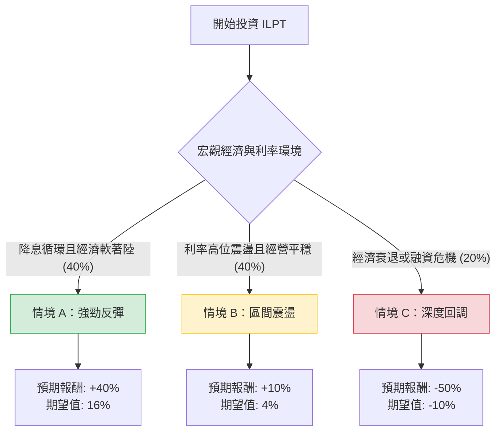

根據最新的市場數據、財務報表（如 2024 年 Q2 財報）以及您提供的基本面數據，我將為 **Industrial Logistics Properties Trust (ILPT)** 進行決策樹與期望值分析。

---

### 一、 市場背景與核心資訊補充

在進行分析前，透過即時資訊彙整以下關鍵點：
1.  **高槓桿壓力**：ILPT 的債務股本比（Debt/Eq）高達 **8.53**，這是在 2022 年收購 Monmouth (MNR) 後遺留的問題。目前公司正處於去槓桿階段。
2.  **利率敏感性**：作為 REITs，ILPT 對聯準會（Fed）利率極其敏感。近期市場預期降息，這對減輕其浮動利率債務負擔有利。
3.  **營運穩健但獲利受壓**：出租率保持在 95% 以上的高水準，且租金調升率（Leasing Spreads）強勁，但高昂的利息支出導致淨利潤為負（Profit Margin -19.87%）。
4.  **資產估值**：P/B 僅 **0.73**，顯示股價低於淨資產價值，市場已反映了大部分破產或流動性風險。

---

### 二、 決策樹分析 (Decision Tree)

以下是針對未來 12 個月 ILPT 投資表現的決策樹：

#### 節點詳細說明：

1.  **情境 A：強勁反彈 (機率 40%)**
    *   **條件**：Fed 啟動連續降息，ILPT 成功完成債務展期或出售資產償債，且物流地產需求因製造業回流而上升。
    *   **預期報酬**：股價向 Target Price ($6.85) 靠攏並突破，預期回報約 **40%**（包含股息）。
    *   **期望值**：$0.4 \times 40\% = 16\%$

2.  **情境 B：區間震盪 (機率 40%)**
    *   **條件**：利率維持在 4-5% 左右，ILPT 營運現金流足以覆蓋利息但無法大幅減債。
    *   **預期報酬**：股價緩慢修復，回歸至 P/B 0.8-0.9 區間，預期回報約 **10%**。
    *   **期望值**：$0.4 \times 10\% = 4\%$

3.  **情境 C：深度回調 / 危機 (機率 20%)**
    *   **條件**：美國陷入嚴重衰退，租戶違約率上升，或因債務比例過高被迫進行大規模股權稀釋（增發新股）。
    *   **預期報酬**：股價回測 52 週低點甚至更低，預期回報 **-50%**。
    *   **期望值**：$0.2 \times (-50\%) = -10\%$

---

### 三、 核心假設與計算過程

#### 1. 期望值 (Expected Value, EV) 計算：
$$EV = (P_A \times R_A) + (P_B \times R_B) + (P_C \times R_C)$$
$$EV = (0.40 \times 0.40) + (0.40 \times 0.10) + (0.20 \times -0.50)$$
$$EV = 0.16 + 0.04 - 0.10 = 0.10$$
**總結期望報酬率：10%**

#### 2. 核心假設：
*   **財務假設**：雖然 `Debt/Eq` 為 8.53，但其 `Oper. Margin` (32.4%) 顯示核心業務具備賺錢能力，風險主要來自財務結構而非營運。
*   **估值假設**：P/B 0.73 提供了「安全邊際」，假設資產清算價值不至於崩跌。
*   **產業趨勢**：工業地產（倉儲）相對於辦公大樓（Office）更具韌性，電子商務與供應鏈優化支撐了長期需求。

---

### 四、 最終結論

#### **評估結果：適合投資 (投機型持倉)**

**判斷理由：**
1.  **期望值為正 (10%)**：儘管面臨高債務風險，但在目前降息預期下，上行空間（Upside）大於下行風險。
2.  **估值吸引力**：P/B 0.73 顯示該公司被嚴重低估。一旦財務壓力緩解（降息），估值修復的力道會非常強勁。
3.  **營運面支撐**：EPS 增長預期為正（Next Y 12.22%），Q/Q 營收與盈利均在改善，顯示最壞情況可能已過。

**風險提示（警語）：**
*   **不適合保守投資者**：債務比率過高，若利率意外不降反升，股價可能遭遇腰斬風險。
*   **投資建議**：建議將其視為「高風險、高回報」的轉機股，倉位佔比不宜超過投資組合的 5%。

**投資建議操作：**
*   **進場點**：現價 $5.44 附近。
*   **目標價**：$6.85（分析師共識）。
*   **停損點**：$4.50（跌破 SMA200 且基本面惡化時）。