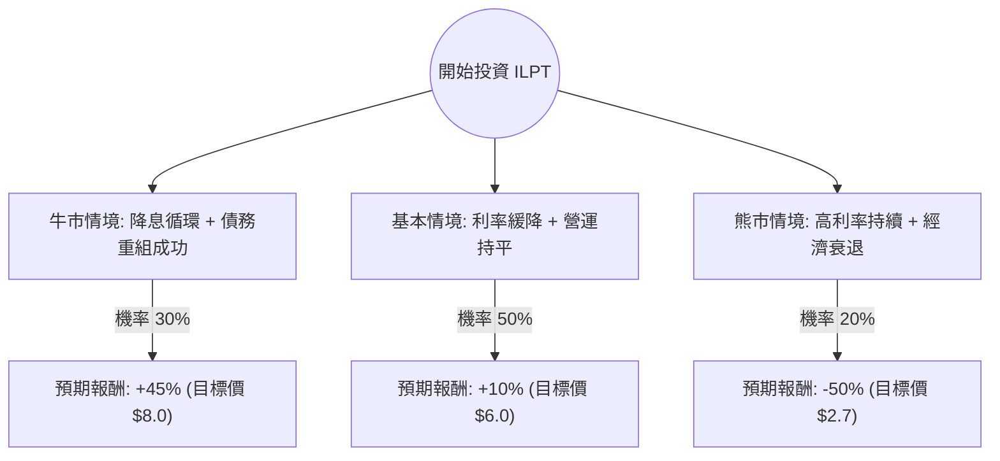

針對美股 **Industrial Logistics Properties Trust (ILPT)** 的投資評估，我結合了您提供的基本面數據以及最新的市場動態（包含 2024 年第二季財報表現、利率環境與債務狀況）進行分析。

---

### 一、 市場現況與核心背景分析

在進入決策樹之前，我們先梳理 ILPT 的關鍵現狀：

1.  **債務壓力（核心風險）**：數據顯示其 **Debt/Eq 高達 8.53**，這在 REITs 中屬於極高水平。ILPT 的財務困境主要源於先前收購 First Industrial 的高槓桿，導致利息支出侵蝕了大部分的營運現金流（FFO）。
2.  **利率敏感度**：作為高槓桿 REITs，ILPT 對聯準會（Fed）降息極度敏感。降息能降低其再融資成本並提升估值。
3.  **資產品質**：其工業物流資產（尤其是夏威夷的土地租賃）具有稀缺性，出租率維持在高位（約 95%+），這提供了穩定的營收基礎（Gross Margin 49%）。
4.  **估值**：P/B 0.74 顯示股價低於帳面價值，市場已反映了大部分的破產或違約風險。

---

### 二、 決策樹分析 (Decision Tree Analysis)

我們以未來 12 個月的投資回報為目標，設定三種主要情境：

#### 決策樹節點詳細說明：

| 情境 | 機率 (P) | 預期報酬 (R) | 說明 |
| :--- | :--- | :--- | :--- |
| **牛市情境 (Bull)** | 30% | +45% | Fed 降息超預期，ILPT 成功處置資產減債，FFO 轉正，股價回歸 P/B 1.0。 |
| **基本情境 (Base)** | 50% | +10% | 利率緩步下降，債務壓力減輕但仍沉重，股價隨產業板塊小幅修復。 |
| **熊市情境 (Bear)** | 20% | -50% | 通膨反彈導致利率維持高位，公司面臨流動性危機或被迫大規模折價增資。 |

---

### 三、 期望值計算 (Expected Value Analysis)

#### 1. 核心假設：
*   **現價 (Current Price)**: $5.50
*   **分析週期**: 12 個月
*   **股利收益**: 約 2.18% (已計入報酬率)
*   **計算公式**: $EV = \sum (Probability_i \times Return_i)$

#### 2. 計算過程：
*   **牛市貢獻**: $0.30 \times 45\% = 13.5\%$
*   **基本貢獻**: $0.50 \times 10\% = 5.0\%$
*   **熊市貢獻**: $0.20 \times (-50\%) = -10.0\%$

**總體期望報酬率 (Total EV)** = $13.5\% + 5.0\% - 10.0\% = \mathbf{+8.5\%}$

#### 3. 財務與產業趨勢假設：
*   **宏觀環境**：假設 Fed 在 2024 年底至 2025 年進入降息週期。
*   **產業需求**：電子商務與供應鏈在地化持續支撐物流倉儲需求，ILPT 租金調升率（Leasing Spreads）保持正向。
*   **財務結構**：假設 ILPT 不會發生立即性的債務違約（根據其 Quick Ratio 38.33，短期流動性尚可支撐）。

---

### 四、 最終結論

#### **評估結果：謹慎適合投資 (Speculative Buy)**

根據期望值分析，ILPT 的預期報酬率為 **+8.5%**。雖然期望值為正，但這是一個典型的**高風險、高槓桿**標的。

#### **判斷理由：**
1.  **風險收益比不對稱**：目前股價 $5.5 接近 52 週高點，但 P/B 僅 0.74。若降息趨勢確立，其股價彈性遠大於其他低槓桿 REITs。
2.  **最壞情況已過**：EPS Q/Q 增長 14.13%，顯示營運端正在改善。只要不發生破產，目前的折價提供了安全邊際。
3.  **債務是雙面刃**：8.53 的 Debt/Eq 意味著這不是長期存股的好對象，而是**利率轉折點的波段操作標的**。

#### **投資建議：**
*   **適合對象**：追求高彈性、能承受高波動、且看好降息循環的投資者。
*   **操作策略**：建議佔總倉位不超過 3-5%，並密切關注聯準會利率決策與公司每季的利息覆蓋率（Interest Coverage Ratio）。若股價跌破 $4.5 (SMA200 支撐區附近)，應重新評估熊市機率是否上升。

---
**免責聲明：** 本分析僅供參考，不構成任何投資建議。美股投資具有風險，請根據個人風險承受能力做出決策。