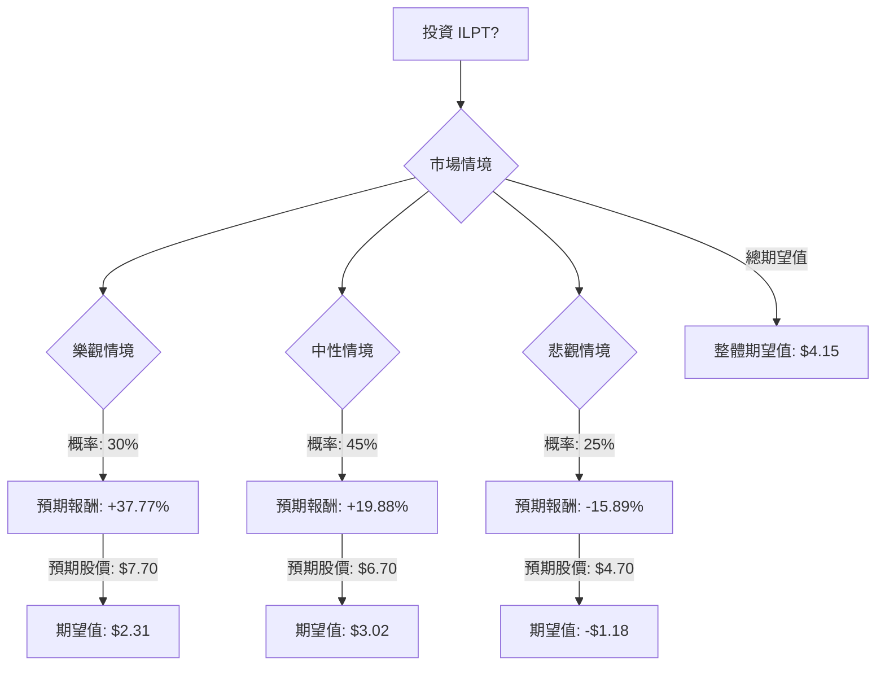

根據對 Industrial Logistics Properties Trust (ILPT) 的基本面數據和最新市場資訊的綜合分析，我們將使用決策樹分析和期望值分析來評估其目前的投資適宜性。

### **最新資訊摘要**

**利好因素：**
*   **股息增加：** ILPT 於 2025 年 8 月 14 日起將季度現金股息從每股 0.01 美元大幅提高至 0.05 美元（年化 0.20 美元），這得益於成功將浮動利率債務再融資為固定利率債務，預計每年可節省每股 0.13 美元的現金。
*   **債務再融資成功：** 成功將 12.35 億美元的浮動利率債務再融資為 11.6 億美元的固定利率債務，降低了利率風險並產生了現金節省。
*   **分析師評級（部分積極）：**
    *   部分分析師給予「適度買入」的共識評級，平均目標價為 7.00 美元，較 5.52 美元有 26.81% 的上漲空間。
    *   Investing.com 顯示，兩位分析師的共識評級為「買入」，平均 12 個月目標價為 6.85 美元。
    *   Zacks.com 的平均目標價為 6.85 美元，較 5.32 美元的收盤價有 28.76% 的增長。
*   **強勁的資產組合和入住率：** 擁有並租賃高品質的工業和物流物業。2025 年第三季度綜合入住率為 94.1%，優於美國工業平均水平。
*   **電子商務驅動增長：** 有望抓住電子商務增長帶來的工業和物流房地產需求。
*   **領導層變動：** Yael Duffy 於 2026 年 1 月 1 日起擔任管理受託人、總裁兼首席執行官，帶來了 RMR Group 的豐富經驗。
*   **跑贏行業/市場：** 在過去一年中，ILPT 的表現優於美國工業 REIT 行業（7.6%）和美國市場（13.8%）。
*   **被低估（DCF）：** WallStreetZen 根據貼現現金流（DCF）模型，認為 ILPT 相對於其 6.49 美元的公允價值被低估了 17.82%。

**利空因素：**
*   **近期盈利不及預期：** 2025 年第三季度每股收益為 -0.33 美元，低於市場普遍預期的 0.26 美元。季度收入也未達預期。
*   **負面盈利能力指標：** 股東權益報酬率 (ROE)、資產報酬率 (ROA)、投資報酬率 (ROI) 均為負值。利潤率也為負。
*   **高負債股本比：** 債務股本比為 8.53（來自提供數據）和 4.59（來自近期新聞）。 這對 REIT 而言是一個重大隱憂。
*   **負市盈率：** 市盈率為負，表明公司目前處於虧損狀態。
*   **分析師評級下調：** Weiss Ratings 重申「賣出 (d)」評級，Zacks Research 於 2026 年 1 月下旬將 ILPT 從「強烈買入」下調至「持有」。
*   **短期技術指標：** 短期趨勢向下，股價低於下降的 20 日和 50 日簡單移動平均線 (SMA)。
*   **FFO 預期未變：** 即將發布的季度 FFO（營運資金）預期在過去 30 天內保持不變，這可能不會在短期內轉化為進一步的股價上漲。
*   **市值下降：** 截至 2026 年 1 月 23 日，市值在過去 30 天內下降了 -1.07%。

**中性/混合因素：**
*   **目標價：** 提供數據顯示為 6.85 美元。分析師目標價從 5.00 美元到 7.00 美元不等。
*   **即將發布的財報：** 2025 年第四季度財報定於 2026 年 2 月 18 日發布。 這是一個近期的催化劑/風險。
*   **工業 REIT 行業：** 由於電子商務的發展，工業 REIT 行業普遍被認為具有增長潛力。

**當前股價：** 5.59 美元 (來自提供數據)。

### **核心假設**

*   **市場假設：** 工業房地產市場，儘管有電子商務的長期推動，但仍可能受到經濟週期和利率波動的影響。我們假設市場狀況從強勁增長到面臨逆風。
*   **財務假設：** 鑑於其高負債，ILPT 提高其 FFO 和盈利能力的能力至關重要。最近的再融資是積極的一步，但新領導層的執行力是關鍵。2025 年第四季度財報（定於 2026 年 2 月 18 日發布）將是一個重要的指標。
*   **產業趨勢假設：** 由於電子商務和供應鏈優化，對物流物業的需求預計將保持強勁，但當地市場的供過於求或經濟放緩可能會影響租金增長和入住率。

### **決策樹分析**

我們將構建一個決策樹，包含三種情境：樂觀、中性、悲觀。

**起始節點：投資 ILPT**
*   **當前股價：** $5.59
*   **年化股息率：** 3.6% (基於年化股息 $0.20 / $5.59)

### **計算過程**

**1. 樂觀情境 (Optimistic Scenario)**
*   **情境名稱：** 高增長/轉型成功
*   **核心假設：** 工業房地產需求強勁，新領導層成功整合，債務再融資效益持續顯現，2025 年第四季度財報優於預期，FFO 和盈利能力改善。市場認可其被低估的價值。
*   **預期股價：** $7.50 (高於分析師平均目標價，反映強勁表現)
*   **預期報酬計算：**
    *   股價增長：($7.50 - $5.59) / $5.59 = 34.17%
    *   股息收益：3.6%
    *   總預期報酬：34.17% + 3.6% = 37.77%
*   **預期報酬（絕對值）：** $5.59 * (1 + 0.3777) = $7.70
*   **機率 (Probability)：** 30%
*   **期望值 (Expected Value)：** $7.70 * 0.30 = $2.31

**2. 中性情境 (Neutral Scenario)**
*   **情境名稱：** 穩定/溫和增長
*   **核心假設：** 工業市場穩定，再融資效益部分實現，2025 年第四季度財報符合預期，FFO 適度改善。股價在分析師平均目標價附近波動。
*   **預期股價：** $6.50 (分析師目標價中位數，略低於 6.85 美元的平均值)
*   **預期報酬計算：**
    *   股價增長：($6.50 - $5.59) / $5.59 = 16.28%
    *   股息收益：3.6%
    *   總預期報酬：16.28% + 3.6% = 19.88%
*   **預期報酬（絕對值）：** $5.59 * (1 + 0.1988) = $6.70
*   **機率 (Probability)：** 45%
*   **期望值 (Expected Value)：** $6.70 * 0.45 = $3.02

**3. 悲觀情境 (Pessimistic Scenario)**
*   **情境名稱：** 表現不佳/下跌
*   **核心假設：** 工業房地產市場疲軟，高負債持續拖累，2025 年第四季度財報不及預期，盈利能力持續為負，分析師進一步下調評級。
*   **預期股價：** $4.50 (低於 5.00 美元的共識低目標價)
*   **預期報酬計算：**
    *   股價增長：($4.50 - $5.59) / $5.59 = -19.49%
    *   股息收益：3.6% (假設股息仍能維持，但若情況惡化，股息可能面臨風險)
    *   總預期報酬：-19.49% + 3.6% = -15.89%
*   **預期報酬（絕對值）：** $5.59 * (1 - 0.1589) = $4.70
*   **機率 (Probability)：** 25%
*   **期望值 (Expected Value)：** $4.70 * 0.25 = $1.18

**整體期望值 (Overall Expected Value)**
*   整體期望值 = (樂觀情境期望值) + (中性情境期望值) + (悲觀情境期望值)
*   整體期望值 = $2.31 + $3.02 + $1.18 = $6.51

### **最終結論**

根據決策樹分析和期望值計算，ILPT 的整體期望值為 **$6.51**。

*   **判斷：** 適合投資。

*   **理由：**
    儘管 ILPT 存在高負債、負盈利能力和近期財報不及預期等風險，但其在工業物流房地產領域的戰略定位、成功的債務再融資、新領導層的到位以及近期股息的大幅增加，都為其未來的增長提供了潛力。 此外，部分分析師給予「買入」或「適度買入」評級，並給出高於當前股價的目標價，且有 DCF 模型顯示其被低估。

    整體期望值 $6.51 高於當前股價 $5.59，表明在考慮了不同情境及其發生概率後，預期投資回報為正。這意味著，儘管存在下行風險，但潛在的上行空間和積極因素的權重使得 ILPT 在當前價格下具有投資吸引力。然而，投資者應密切關注即將發布的 2025 年第四季度財報以及公司在改善盈利能力和管理債務方面的進展。