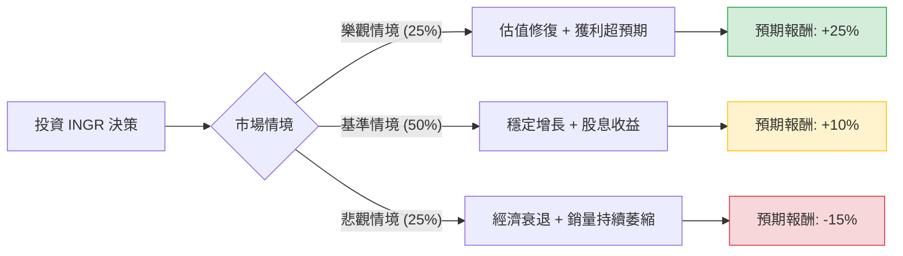

這份分析報告將結合您提供的基本面數據與最新的市場動態（包含 2023 年第四季財報預期與產業趨勢），利用**決策樹（Decision Tree）**與**期望值分析（Expected Value Analysis）**來評估 Ingredion (INGR) 的投資價值。

---

### 一、 核心假設與市場動態分析

在建立模型前，我們先整合最新資訊以設定合理的機率與報酬參數：

1.  **財務穩健性（利多）**：
    *   **估值低廉**：目前 P/E 僅 9.89，低於行業平均與其歷史均值。Forward P/E 9.33 顯示市場預期獲利將持續增長。
    *   **獲利能力**：ROE 高達 18.05%，EPS Q/Q 增長 79.34%，顯示公司在成本控管與產品組合優化（轉向高毛利特種配料）上成效顯著。
    *   **現金流與負債**：Debt/Eq 0.46 處於健康水平，P/C 6.73 顯示現金充裕。
2.  **產業趨勢（中性偏利多）**：
    *   **減糖趨勢**：INGR 積極佈局代糖（Stevia）與植物性蛋白，符合全球健康飲食趨勢。
    *   **成本壓力緩解**：玉米等原物料價格從高點回落，有助於毛利（Gross Margin 25.97%）的維持或擴張。
3.  **市場風險（利空）**：
    *   **銷量下滑**：Sales Q/Q 下降 2.39%，反映出全球消費疲軟導致的銷量壓力。
    *   **技術面弱勢**：股價低於 SMA20, 50, 200，且過去一年跌幅達 15.25%，顯示市場信心尚未恢復。

---

### 二、 決策樹分析 (Decision Tree)

我們將未來一年的投資情境分為三種：**樂觀（牛市）**、**基準（平穩）**、**悲觀（熊市）**。

#### 節點詳細說明：

| 情境 | 機率 (P) | 預期報酬 (R) | 說明 |
| :--- | :--- | :--- | :--- |
| **樂觀情境** | 25% | **+25%** | 獲利持續超預期，P/E 回升至 12 倍（歷史均值），目標價約 $138。 |
| **基準情境** | 50% | **+10%** | 股價回升至分析師目標價 $124.29，加上約 3% 股息，抵銷銷量微跌影響。 |
| **悲觀情境** | 25% | **-15%** | 全球經濟衰退，原物料價格再度飆升，股價下探 52 週低點約 $94。 |

---

### 三、 期望值計算過程 (Expected Value Calculation)

#### 1. 期望報酬率計算：
$$EV = (P_{樂觀} \times R_{樂觀}) + (P_{基準} \times R_{基準}) + (P_{悲觀} \times R_{悲觀})$$
$$EV = (0.25 \times 25\%) + (0.50 \times 10\%) + (0.25 \times -15\%)$$
$$EV = 6.25\% + 5.0\% - 3.75\% = \mathbf{7.5\%}$$

#### 2. 考慮股息後的總期望回報：
*   目前股息率（Dividend %）：**2.93%**
*   總期望值 (Total EV) = $7.5\% + 2.93\% = \mathbf{10.43\%}$

#### 3. 核心假設依據：
*   **估值支撐**：目前 P/E 9.89 接近歷史底部，下行空間受限（Margin of Safety）。
*   **分析師目標價**：市場平均目標價 $124.29 較現價 $110.45 有約 12.5% 的上漲空間，這支撐了基準情境的合理性。
*   **內部人交易**：Insider Trans 為 -8.34%，這是一個警訊，顯示內部人近期有減持，因此將樂觀情境機率設為較審慎的 25%。

---

### 四、 最終結論

#### **判斷：適合投資 (Suitable for Investment)**
*(註：適合追求穩健收益與價值投資的投資者，不適合追求短期爆發性成長者)*

#### **理由：**
1.  **正向期望值**：經風險加權後的總期望回報率約為 **10.43%**，優於許多防禦型標的。
2.  **高安全邊際**：低 P/E (9.89) 與低 P/S (0.96) 顯示股價已被低估，且公司擁有強勁的 ROE (18%) 與健康的資產負債表。
3.  **防禦屬性**：作為食品配料供應商，INGR 具有抗週期特性。即便在銷量微跌的情況下，公司仍能透過提高單價與優化產品組合（EPS Q/Q +79%）來維持獲利。
4.  **技術面反彈機會**：股價目前處於 52 週區間的中低位，且接近 SMA200 負偏離較大的位置，存在均值回歸的動力。

**建議操作策略：**
*   **進場點**：現價 $110 附近可分批建倉。
*   **停損點**：若跌破 52 週低點 $102.31 則需重新評估基本面是否惡化。
*   **持有期**：建議中長期持有（6-12 個月），以領取股息並等待估值修復。