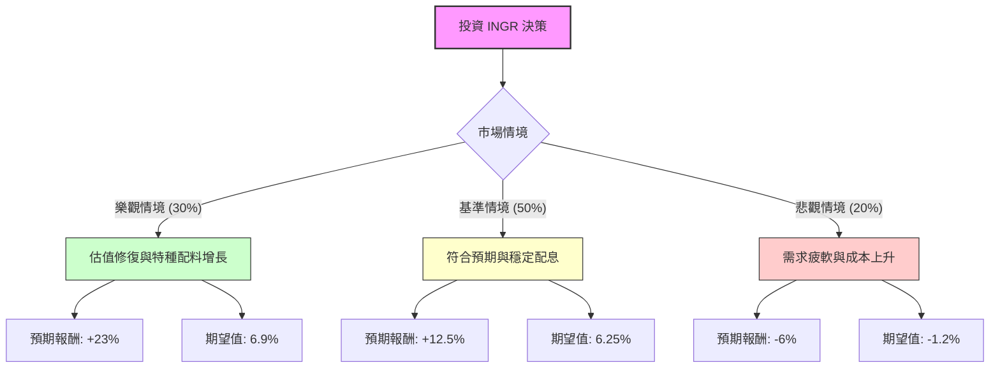

這份分析報告將結合您提供的基本面數據，以及對 **Ingredion Incorporated (INGR)** 的最新市場動態（如 2024 年第一季財報、產業趨勢、大宗商品價格走勢）進行綜合評估。

---

### 一、 核心假設與市場背景分析

在建立決策樹之前，我們基於以下資訊設定核心假設：

1.  **財務穩健性（利多）**：INGR 的 P/E 僅 10.09，遠低於標普 500 平均水平；ROE 達 18.05%，顯示獲利能力強。債務股本比（Debt/Eq 0.46）極低，財務結構健康。
2.  **產業趨勢（中性偏利多）**：全球對減糖、植物性蛋白及天然配料需求增加。INGR 正從傳統澱粉轉向高毛利的「特種配料（Specialty Ingredients）」。
3.  **近期挑戰（利空）**：最新財報顯示營收受銷量下降與定價壓力影響（Sales Q/Q -2.39%）。此外，玉米等原材料成本波動與匯率風險（FX）仍是變數。
4.  **估值目標**：分析師平均目標價為 **$123.43**，較現價（$112.69）約有 **9.5%** 的上漲空間。

---

### 二、 決策樹分析 (Decision Tree)

我們將未來一年的投資情境分為三種：**樂觀（Bull）**、**基準（Base）**、**悲觀（Bear）**。

#### 節點詳細說明：

1.  **樂觀情境 (Probability: 30%)**
    *   **描述**：特種配料毛利大幅提升，玉米成本下降，市場給予更高 P/E（回升至 12x）。
    *   **預期報酬**：股價回升至 $135 + 股息 2.9% ≈ **23%**。
2.  **基準情境 (Probability: 50%)**
    *   **描述**：公司達到分析師目標價 $123.43，營收恢復微幅增長，維持現有估值。
    *   **預期報酬**：價差 9.5% + 股息 2.9% ≈ **12.4% (取 12.5%)**。
3.  **悲觀情境 (Probability: 20%)**
    *   **描述**：全球經濟放緩導致銷量持續下滑，股價回測 52 週低點（約 $102）。
    *   **預期報酬**：價差 -9% + 股息 2.9% ≈ **-6.1% (取 -6%)**。

---

### 三、 期望值分析 (Expected Value Analysis) 計算過程

我們將各情境的機率與預期報酬相乘，得出總期望報酬率：

$$EV = (P_{Bull} \times R_{Bull}) + (P_{Base} \times R_{Base}) + (P_{Bear} \times R_{Bear})$$

*   **樂觀節點 EV**：$0.30 \times 23\% = 6.9\%$
*   **基準節點 EV**：$0.50 \times 12.5\% = 6.25\%$
*   **悲觀節點 EV**：$0.20 \times (-6\%) = -1.2\%$

**總期望報酬率 (Total EV) = 6.9% + 6.25% - 1.2% = 11.95%**

---

### 四、 綜合評估與最終結論

#### 1. 數據亮點分析：
*   **價值面極具吸引力**：P/E 10.09 且 Forward P/E 9.59，顯示市場對其未來獲利有信心，且目前股價處於相對低位。
*   **現金流與股息**：P/FCF 為 13.88，現金流健康，足以支撐 2.89% 的股息發放，提供下行保護。
*   **技術面壓力**：SMA20/50/200 均為負值，顯示短期趨勢偏弱，目前處於築底階段。

#### 2. 核心風險：
*   **營收增長停滯**：Sales Q/Q 為 -2.39%，需關注下一季銷量是否回升。
*   **內部人交易**：Insider Trans 為 -6.25%，顯示內部人近期有減持動作，需謹慎。

#### 3. 最終判斷：

**結論：適合投資 (Suitable for Investment)**

**理由：**
1.  **期望值優異**：計算出的 **11.95% 期望報酬率** 高於市場長期平均回報（約 8-10%），且在基準情境下即有雙位數回報。
2.  **安全邊際高**：極低的 P/E 與強勁的 ROE (18%) 提供了良好的價值防禦，即便在悲觀情境下，股息也能抵銷部分資本損失。
3.  **轉型潛力**：Ingredion 轉向高毛利特種配料的策略符合健康飲食趨勢，長期基本面看好。

**建議策略：**
由於技術指標（SMA）顯示目前仍處於弱勢，建議採取**分批買入（Dollar-cost Averaging）**策略，以規避短期波動風險，並長期持有以獲取股息與估值修復的收益。