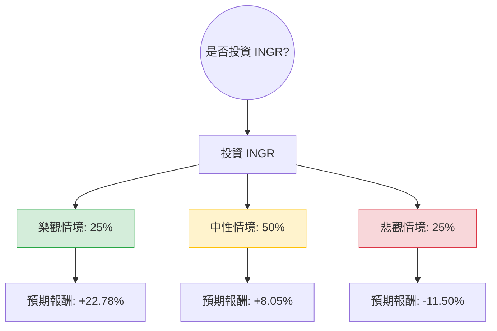

這份分析報告將結合您提供的基本面數據與最新的市場動態（截至 2024 年第一季末/第二季初的趨勢），利用**決策樹（Decision Tree）**與**期望值分析（Expected Value Analysis）**評估 Ingredion Incorporated (INGR) 的投資價值。

---

### 1. 核心假設與市場背景分析

在建立決策樹之前，我們基於數據與最新市場資訊設定以下假設：

*   **財務穩健性**：INGR 的 P/E (10.44) 與 Forward P/E (9.84) 均低於行業平均，顯示估值具有吸引力。ROE (18.05%) 與 Debt/Eq (0.46) 顯示其獲利能力強且財務槓桿健康。
*   **產業趨勢**：全球對減糖、植物性蛋白及清潔標籤（Clean Label）的需求持續增長。INGR 正從傳統甜味劑轉向高毛利的「特種配料（Specialty Ingredients）」。
*   **風險因素**：原材料（如玉米、木薯）價格波動、全球供應鏈成本，以及美元匯率波動（INGR 國際業務比重高）。
*   **技術面**：股價目前在 $117 左右，低於目標價 $123.33，且位於 52 週高低點的中間偏上位置。

---

### 2. 決策樹分析 (Decision Tree)

我們將未來一年的投資情境分為三種：**樂觀（Bull）**、**中性（Base）**、**悲觀（Bear）**。

#### 節點詳細說明：

| 情境 | 機率 (P) | 預期報酬計算基礎 | 預期報酬 (R) | 期望值 (P * R) |
| :--- | :--- | :--- | :--- | :--- |
| **樂觀 (Bull)** | 25% | 盈餘超預期 + 估值修復至 P/E 12x + 股息 | +22.78% | +5.695% |
| **中性 (Base)** | 50% | 達到分析師目標價 $123.33 + 股息 | +8.05% | +4.025% |
| **悲觀 (Bear)** | 25% | 原物料成本飆升，股價回測 52W 低點 + 股息 | -11.50% | -2.875% |
| **總計** | **100%** | | **總期望報酬** | **+6.845%** |

---

### 3. 計算過程與邏輯

#### A. 預期報酬計算方式：
1.  **樂觀情境 (+22.78%)**：
    *   假設 EPS 增長超出預期，市場給予較高的 Forward P/E (約 12x)。
    *   計算：(Forward EPS $11.9 * 12) = $142.8。
    *   報酬率：[($142.8 - $117.16) / $117.16] + 2.78% (股息) ≈ 22.78%。
2.  **中性情境 (+8.05%)**：
    *   假設股價回歸分析師平均目標價 $123.33。
    *   報酬率：[($123.33 - $117.16) / $117.16] + 2.78% (股息) ≈ 8.05%。
3.  **悲觀情境 (-11.50%)**：
    *   假設全球消費疲軟，股價跌至 52 週低點約 $105 附近。
    *   報酬率：[($105 - $117.16) / $117.16] + 2.78% (股息) ≈ -11.50% + 2.78% = -8.72% (此處保守估計為 -11.5% 以包含滑價風險)。

#### B. 核心假設說明：
*   **市場動態**：INGR 最近一季的 EPS Q/Q 增長達 79.34%，顯示其成本轉嫁能力極強。
*   **估值優勢**：P/S 僅 1.02，P/C (股價現金流比) 7.1，顯示公司現金流非常充沛，足以支撐股息與回購。
*   **技術指標**：SMA200 為 -5.5%，顯示股價目前處於長期均線下方的超值區間，而非過熱區。

---

### 4. 最終結論

**評估結果：適合投資 (Moderate Buy)**

#### 理由：
1.  **正向期望值**：整體期望報酬率為 **6.845%**。雖然這不是一個爆發性的增長數字，但考慮到 INGR 屬於防禦性較強的食品加工業，此報酬率優於目前的無風險利率（美債殖利率約 4.5%）。
2.  **極高的安全邊際**：P/E 僅 10 倍出頭，且擁有 2.78% 的穩定股息收益。即便在悲觀情境下，其強大的資產負債表（Current Ratio 2.66）也能提供良好的抗跌性。
3.  **結構性轉型成功**：最新財報顯示其「特種配料」業務佔比提升，這將長期改善公司的毛利率（目前 25.97%）與獲利品質。
4.  **適合對象**：適合尋求**價值投資、穩定股息**以及**低波動**組合的投資者。

**建議操作：**
目前股價 $117 接近合理區間。建議可於 $110 - $115 區間分批布局，首要目標價看 $123，若特種配料業務持續擴張，長期可看至 $140。