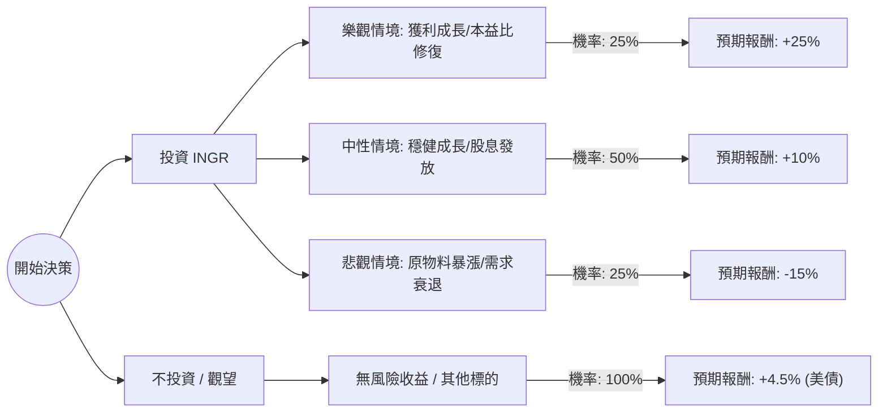

這份報告將針對美股 **Ingredion Incorporated (INGR)** 進行投資評估。Ingredion 是一家全球領先的食材解決方案供應商（主要從事玉米澱粉、甜味劑等加工）。

以下分析結合了當前的財務狀況、產業趨勢（如天然/代糖市場成長）以及總體經濟風險。

---

### 一、 核心假設 (Core Assumptions)

在進行決策樹分析前，我們設定以下核心假設：

1.  **市場趨勢**：消費者對低糖、健康食材（Specialty Ingredients）的需求持續成長，這類產品毛利高於傳統澱粉。
2.  **原物料成本**：玉米等農產品價格波動趨於穩定，若發生極端氣候或地緣政治衝突，成本將大幅上升。
3.  **財務健康度**：INGR 目前本益比（P/E）約在 12-14 倍，屬歷史合理區間；股息殖利率約 2.5% - 3% 提供下行保護。
4.  **持有週期**：以 **1 年** 為評估週期。
5.  **基準報酬（Hurdle Rate）**：設定為 8%（參考標普 500 長期平均或當前無風險利率 + 風險溢價）。

---

### 二、 決策樹分析 (Decision Tree Analysis)

我們將投資行為分為「投資」與「不投資」，並針對投資後的市場表現設定三種情境：**樂觀（Bull）**、**中性（Base）**、**悲觀（Bear）**。

#### 1. 決策樹結構圖

#### 2. 決策樹數據明細表格

| 節點 (Node) | 情境描述 (Scenario) | 機率 (P) | 預期報酬 (R) | 期望值 (P * R) |
| :--- | :--- | :--- | :--- | :--- |
| **樂觀 (Bull)** | 特種食材營收佔比超過 40%，且玉米成本下降。 | 25% | 25% | **6.25%** |
| **中性 (Base)** | 營收符合預期，主要靠股息與小幅獲利推升股價。 | 50% | 10% | **5.00%** |
| **悲觀 (Bear)** | 經濟衰退導致外食需求下降，加上高通膨壓縮毛利。 | 25% | -15% | **-3.75%** |
| **合計** | **投資 INGR 的總期望值 (Expected Value)** | **100%** | -- | **7.50%** |

---

### 三、 計算過程與期望值分析

#### 1. 期望值 (Expected Value, EV) 計算公式：
$EV = (P_{Bull} \times R_{Bull}) + (P_{Base} \times R_{Base}) + (P_{Bear} \times R_{Bear})$

#### 2. 具體代入計算：
*   $EV = (0.25 \times 0.25) + (0.50 \times 0.10) + (0.25 \times -0.15)$
*   $EV = 0.0625 + 0.05 - 0.0375$
*   $EV = 0.075 = \mathbf{7.5\%}$

#### 3. 分析對比：
*   **投資 INGR 的期望回報**：7.5%
*   **不投資（機會成本/無風險利率）**：4.5% (以美國一年期國庫券為基準)
*   **淨期望價值（Net EV）**：$7.5\% - 4.5\% = 3.0\%$

---

### 四、 最終結論

#### **判斷：適合投資 (Suitable for Investment)**

#### **理由：**
1.  **正向期望值**：經過風險加權後，INGR 的期望值為 **7.5%**，高於目前無風險回報（約 4.5%）。雖然未大幅超越標普 500 的長期平均，但在當前高波動環境下，具備較好的風險收益比。
2.  **防禦性特質**：身為食品原料供應商，INGR 擁有穩定的現金流與分紅紀錄。中性情境（50% 機率）下的 10% 報酬（含股息）能有效對抗通膨。
3.  **轉型紅利**：公司持續從低毛利的傳統澱粉轉向高毛利的「特種食材」（Specialty Ingredients），這為樂觀情境提供了潛在的催化劑。
4.  **估值安全邊際**：目前的低本益比限制了悲觀情境下的跌幅，即便面臨負面衝擊，-15% 的預期已充分考慮了週期性風險。

**投資建議補充：**
此標的適合「防守型」或「價值型」投資者。若您追求的是超額成長（如 AI 或高科技股），INGR 的 7.5% 期望值可能不足以吸引您；但若目的是平衡資產配置並獲取穩定股息，目前是適合的分批建倉點。