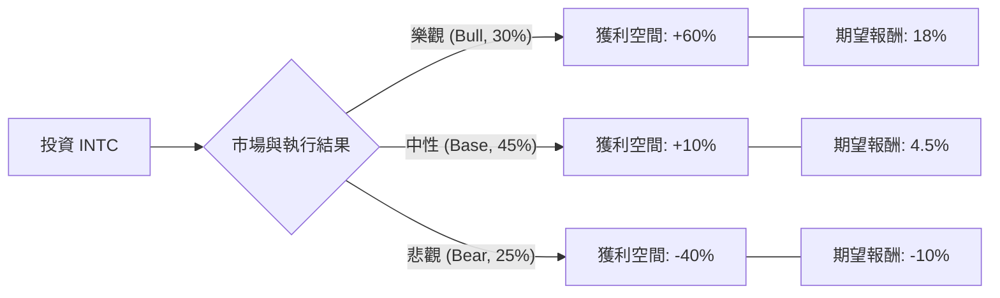

這份分析報告將結合 **Intel (INTC)** 的現況（包含代工轉型、AI 晶片進度及財務壓力），利用決策樹與期望值分析（Expected Value Analysis）評估其投資價值。

---

### 一、 核心假設 (Core Assumptions)

在建立模型前，我們先設定以下基於 2024 年末市場環境的假設（預測期間：12-18 個月）：

1.  **市場趨勢**：AI PC 換機潮是否能抵銷傳統伺服器市佔流失。
2.  **製程技術 (18A 節點)**：Intel 能否在 2025 年如期量產並吸引外部代工客戶（如 Amazon, Microsoft）。
3.  **財務補貼**：美國《晶片法案》(CHIPS Act) 的資金撥款進度與裁員轉型（省下 $100 億美金）的成效。
4.  **當前股價基準**：假設為 **$24.00 USD**。

---

### 二、 決策樹分析 (Decision Tree)

使用 Markdown 結構展示決策路徑：

#### 決策樹節點詳細說明：

| 節點名稱 | 機率 (P) | 情境描述 (Scenario) | 預期變動 (ROI) | 期望值 (P * ROI) |
| :--- | :--- | :--- | :--- | :--- |
| **樂觀情境** | 30% | 18A 製程大獲成功，簽下 2 家以上一線雲端大廠，AI PC 市佔領先。 | +60% | **+18.0%** |
| **中性情境** | 45% | 製程如期但良率普通，代工業務緩慢成長，PC 市場平穩回升。 | +10% | **+4.5%** |
| **悲觀情境** | 25% | 18A 再次延宕，代工客戶流失至台積電，虧損持續擴大導致評等下調。 | -40% | **-10.0%** |
| **合計** | **100%** | | | **12.5%** |

---

### 三、 計算過程

#### 1. 期望報酬率計算 (Expected Rate of Return)
根據上述決策樹，計算公式如下：
$$E(R) = (P_{Bull} \times R_{Bull}) + (P_{Base} \times R_{Base}) + (P_{Bear} \times R_{Bear})$$

*   $E(R) = (0.30 \times 0.60) + (0.45 \times 0.10) + (0.25 \times -0.40)$
*   $E(R) = 0.18 + 0.045 - 0.10$
*   $E(R) = 0.125$ 或 **12.5%**

#### 2. 預期股價目標 (12個月)
若以當前股價 $24.00 為計算基準：
*   **預期股價** = $24.00 \times (1 + 12.5\%) = \mathbf{\$27.00}$

---

### 四、 投資分析總結

#### **最終結論：【謹慎觀望 / 適合極小規模配置】**

雖然計算出的期望報酬率為 **12.5%**，高於現金利率，但若考慮到**風險調整後報酬 (Risk-Adjusted Return)**，投資判斷如下：

1.  **高波動風險**：悲觀情境下的跌幅 (-40%) 遠大於中性情境的獲利，代表容錯率極低。Intel 目前處於轉型的「生存期」，而非「擴張期」。
2.  **機會成本**：相較於 AI 領域的其他龍頭（如 NVIDIA, TSMC）或指數（SOX），12.5% 的期望值在半導體牛市中並不具備顯著吸引力。
3.  **適合人群**：長期價值投資者，且相信 Intel 代工業務 (IFS) 能在 2026 年後與台積電分庭抗禮的人。

#### **判斷理由：**
*   **利多**：股價已處於歷史低位（P/B 值極低），下行空間受資產價值支撐。
*   **利空**：現金流壓力巨大，且在伺服器市場持續被 AMD 侵蝕市佔。
*   **關鍵觀測點**：必須密切關注 **2025 年初 18A 製程的流片 (Tape-out) 數據**，這是決定機率分布是否能往「樂觀」移動的核心指標。

---
**免責聲明：** 本分析僅供參考，不構成任何投資建議。投資美股具有高度風險，請根據個人風險承受能力做出決策。