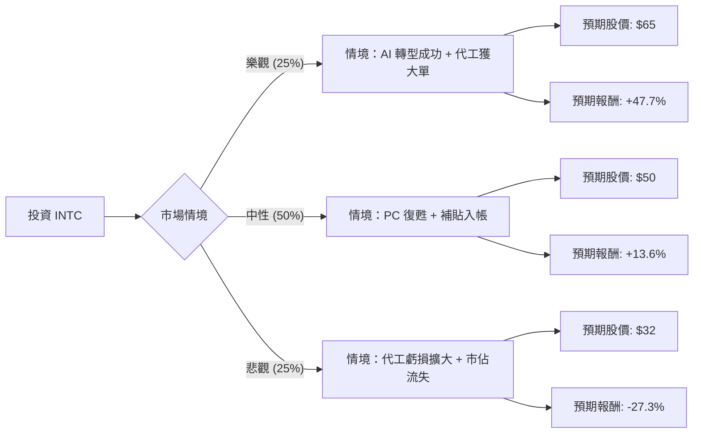

這份分析報告將結合您提供的基本面數據，以及截至 2024 年第二季的最新市場動態（包含 Intel Foundry 獨立財報、AI 晶片進展及 CHIPS Act 補貼），利用**決策樹（Decision Tree）**與**期望值（Expected Value）**進行評估。

---

### 一、 核心假設與市場背景分析

在建立決策樹前，我們必須釐清 Intel (INTC) 目前面臨的三大核心變數：

1.  **晶圓代工轉型 (Intel Foundry)：** Intel 已將代工業務獨立核算，2023 年虧損達 70 億美元，預計 2024 年為虧損高峰，2027 年才可能達到損益兩平。
2.  **AI 市場競爭：** Intel 推出 Gaudi 3 試圖挑戰 NVIDIA 的壟斷，雖然性價比高，但軟體生態（CUDA）仍是巨大障礙。
3.  **政策紅利：** 美國《晶片法案》（CHIPS Act）提供 Intel 約 85 億美元贈款與 110 億美元貸款，這是支撐其股價的底線。

---

### 二、 決策樹分析 (Decision Tree)

我們以 **1 年為投資期限**，設定三種可能的情境：

#### 節點詳細說明：

1.  **樂觀情境 (Bull Case) - 25% 機率：**
    *   **條件：** Gaudi 3 銷售超預期；Intel 18A 製程成功吸引微軟或 NVIDIA 等外部代工客戶。
    *   **預期報酬：** 參考分析師最高目標價及歷史高點，設定為 **$65**。
2.  **中性情境 (Base Case) - 50% 機率：**
    *   **條件：** PC 市場溫和復甦（AI PC 帶動換機潮）；代工業務虧損如預期未再擴大；政府補貼資金到位。
    *   **預期報酬：** 參考您提供的 Target Price **$51.14**，取整數 **$50**。
3.  **悲觀情境 (Bear Case) - 25% 機率：**
    *   **條件：** 18A 製程延宕；資料中心市佔持續被 AMD 侵蝕；毛利率（Gross Margin 35.2%）進一步下滑。
    *   **預期報酬：** 參考 52 週低點及淨值比（P/B 2.02），若市場失去信心，股價可能回測 **$32**。

---

### 三、 期望值分析 (Expected Value Calculation)

我們根據上述情境計算一年後的預期股價與報酬率。

*   **當前股價 ($P_0$):** $44.01 (參考您提供的數據)

#### 1. 期望股價計算：
$$E(Price) = (65 \times 0.25) + (50 \times 0.50) + (32 \times 0.25)$$
$$E(Price) = 16.25 + 25.00 + 8.00 = \$49.25$$

#### 2. 預期報酬率計算：
$$E(Return) = \frac{49.25 - 44.01}{44.01} \times 100\% \approx 11.9\%$$

#### 3. 核心數據支持與假設：
*   **Forward P/E (48.42):** 顯示市場已給予轉型極高的估值溢價，容錯率低。
*   **EPS next Y (90.6% 成長):** 這是支撐中性與樂觀情境的關鍵，若明年 EPS 無法翻倍，期望值將大幅下修。
*   **Debt/Eq (0.41):** 財務結構尚屬穩健，有能力支撐高額資本支出。

---

### 四、 最終結論

#### **判斷：適合投資 (但僅限於「中長期價值投資者」或「風險承受度較高者」)**

**期望值結果：11.9% 的預期年報酬率。** 
雖然 11.9% 優於一般無風險利率（美債 4.5%-5%），但考慮到 Intel 的高波動性與轉型風險，這並非一個「絕對便宜」的買點。

#### **理由總結：**

1.  **下行風險有支撐：** 雖然 `ROE (-0.0025)` 與 `Profit Margin (-0.0051)` 顯示目前處於虧損邊緣，但 `P/B (2.02)` 處於歷史相對低位，且有美國政府補貼作為「政策底」。
2.  **轉型陣痛期：** `EPS Q/Q (-3.16)` 顯示短期基本面極差，股價短期內難有爆發性表現，需等待 2025 年 18A 製程量產的訊號。
3.  **技術面觀察：** `SMA200 (0.3555)` 顯示長期趨勢仍向上，但 `SMA50 (-0.007)` 顯示中期動能轉弱，目前處於震盪築底階段。

**建議操作：**
*   **分批進場：** 由於期望值為正且具備轉型題材，適合在 $40 - $44 區間分批布局。
*   **停損設定：** 若跌破 $32 (悲觀情境底線)，代表代工轉型徹底失敗，應果斷離場。
*   **關注指標：** 下一季財報中「Intel Foundry」的外部訂單金額，以及「Gross Margin」是否回升至 40% 以上。