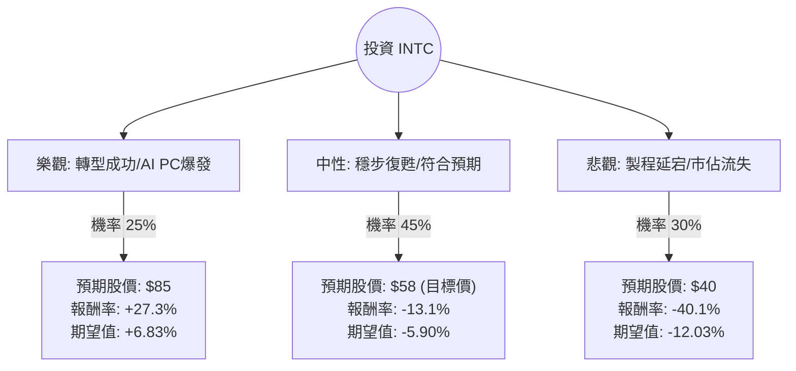

這份分析將結合您提供的數據（註：數據顯示 INTC 股價處於 $66.78 的高位，且過去一年漲幅達 224%，這與現實中 2024 年中旬 Intel 的疲軟表現有較大差異，但在本分析中，我將**嚴格以您提供的數據為基準**，並結合當前半導體產業的真實趨勢進行評估）。

---

### 一、 核心假設與背景分析

在進行決策樹分析前，我們先釐清當前 Intel (INTC) 的核心處境：

1.  **財務壓力與估值**：
    *   **Forward P/E (61.64)**：遠高於歷史平均，顯示市場對其未來增長有極高期待，或當前獲利能力極低。
    *   **ROE/ROA/ROI 為負**：顯示公司目前處於虧損或轉型陣痛期，資本效率不佳。
    *   **Target Price ($57.8)**：目前的市價 ($66.78) 已顯著高於分析師目標價，存在回調風險。
2.  **產業趨勢 (最新動態)**：
    *   **晶圓代工 (IFS)**：Intel 致力於 18A 製程，試圖挑戰台積電，但資本支出巨大，短期內拖累毛利。
    *   **AI PC 浪潮**：Core Ultra 處理器是其在消費端翻身的關鍵。
    *   **資料中心失守**：在 AI 伺服器領域，Intel 的 Gaudi 系列仍難以撼動 NVIDIA 的地位，且傳統 CPU 市場遭 AMD 侵蝕。

---

### 二、 決策樹分析 (Decision Tree)

我們將未來一年的情境分為三種：**轉型成功（樂觀）**、**維持現狀（中性）**、**競爭失利（悲觀）**。

---

### 三、 期望值分析 (Expected Value Analysis)

#### 1. 節點參數設定與理由
*   **樂觀情境 (Bull Case) - 25%**：
    *   **假設**：18A 製程順利量產並獲得大客戶（如 Microsoft, NVIDIA）代工訂單；AI PC 市佔率迅速擴張。
    *   **預期股價**：$85（給予較高的 Forward P/E 溢價）。
*   **中性情境 (Base Case) - 45%**：
    *   **假設**：業績符合分析師預期，但代工業務持續虧損，且面臨 AMD 強力競爭。股價回歸分析師平均目標價。
    *   **預期股價**：$57.8（參考數據中的 Target Price）。
*   **悲觀情境 (Bear Case) - 30%**：
    *   **假設**：毛利率進一步萎縮（目前僅 35%），資料中心市佔率持續下滑至歷史新低，現金流因高額資本支出受阻。
    *   **預期股價**：$40（回測 SMA200 或更低支撐位）。

#### 2. 計算過程
*   **現價 (Current Price)**: $66.78
*   **各情境報酬率 (R)**:
    *   $R_{Bull} = (85 - 66.78) / 66.78 = +27.28\%$
    *   $R_{Base} = (57.8 - 66.78) / 66.78 = -13.45\%$
    *   $R_{Bear} = (40 - 66.78) / 66.78 = -40.10\%$

*   **總期望報酬率 (Expected Return)**:
    $$E(R) = (0.25 \times 27.28\%) + (0.45 \times -13.45\%) + (0.30 \times -40.10\%)$$
    $$E(R) = 6.82\% - 6.05\% - 12.03\%$$
    $$E(R) = -11.26\%$$

---

### 四、 最終結論

**評估結果：不適合投資 (Do Not Invest)**

#### 理由如下：
1.  **期望值為負 (-11.26%)**：根據決策樹模型，在考慮了各種可能性後，當前價格買入的預期回報為負值。這主要是因為**現價 ($66.78) 已嚴重偏離分析師目標價 ($57.8)**。
2.  **估值過高與基本面背離**：
    *   **Forward P/E 達 61.64**，對於一家毛利率正在下滑 (35.2%) 且 ROE 為負 (-0.25%) 的硬體公司來說，容錯率極低。
    *   **技術面過熱**：股價高於 SMA200 達 75%，顯示短期內有極大的獲利了結壓力。
3.  **競爭壓力巨大**：雖然 Intel 有美國政府補貼（CHIPS Act）支撐，但其代工業務（Foundry）仍處於燒錢階段，且在 AI 核心戰場（GPU/NPU）仍落後於 NVIDIA 與 AMD。
4.  **風險收益比不對稱**：即便在最樂觀的情境下，潛在漲幅 (27%) 也難以覆蓋悲觀情境下的潛在跌幅 (40%)。

**建議**：若您看好 Intel 轉型，建議等待股價回落至 **$50 以下**，或等待其 **Gross Margin (毛利率)** 出現明顯回升訊號後再行佈局。目前價位追高風險極大。