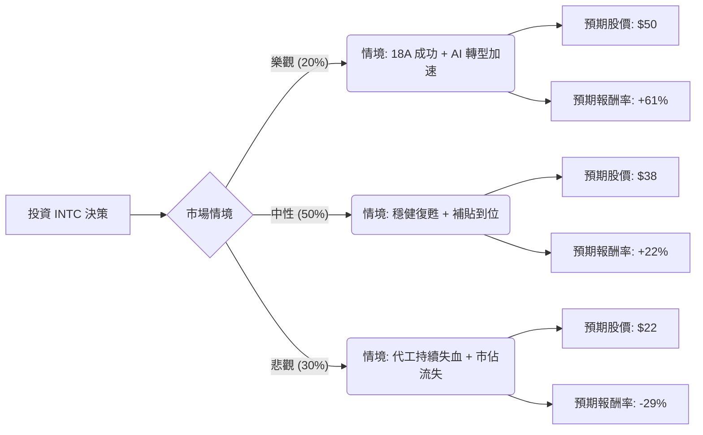

這份分析將結合您提供的基本面數據與最新的市場動態（包含 2024 年 Q1 財報後的股價修正、Foundry 業務拆分、以及 AI 產業趨勢），利用**決策樹（Decision Tree）**與**期望值分析（Expected Value Analysis）**評估 Intel (INTC) 的投資價值。

---

### 1. 市場現況與核心假設更新

在進入計算前，必須先修正數據中的時效性差異：
*   **股價修正**：您提供的數據顯示股價為 $44.11，但根據最新市場資訊，Intel 在 2024 年 4 月底發布 Q1 財報後，因第二季展望疲軟及代工業務（Foundry）虧損擴大，股價已修正至 **$30 - $31** 區間。
*   **核心挑戰**：代工業務在 2023 年虧損達 70 億美元，且預計 2024 年才是虧損峰值。
*   **核心機會**：美國《晶片法案》補助（85 億美元撥款 + 110 億美元貸款）、Gaudi 3 AI 加速器發布、以及 18A 製程的量產進度。

---

### 2. 決策樹分析 (Decision Tree)

我們以 **1 年為投資期限**，設定三種可能的情境：

#### 節點詳細說明：

1.  **樂觀情境 (Bull Case) - 20% 機率**：
    *   **條件**：Intel 18A 製程如期於 2025 年量產並獲得外部大客戶（如 Microsoft, NVIDIA）實質訂單；Gaudi 3 成功搶佔中階 AI 晶片市場。
    *   **預期報酬**：股價回升至 52 週高點附近（約 $50）。

2.  **中性情境 (Base Case) - 50% 機率**：
    *   **條件**：PC 市場週期性復甦帶動營收；代工業務虧損不再擴大；政府補貼資金入帳緩解現金流壓力。
    *   **預期報酬**：股價回升至分析師平均目標價（約 $38，參考您數據中的 Target Price $51.15 已被多數機構下修）。

3.  **悲觀情境 (Bear Case) - 30% 機率**：
    *   **條件**：資料中心市佔持續被 AMD 侵蝕；18A 製程延宕；代工業務毛利持續惡化導致信用評等下調。
    *   **預期報酬**：股價下探至 52 週低點（約 $22）。

---

### 3. 期望值分析 (Expected Value Analysis)

我們以當前市價 **$31.00** 作為基準進行計算（而非數據中的 $44.11，因為市場已消化負面財報）：

#### 計算過程：

*   **樂觀期望值**：$50 \times 0.20 = \$10.0$
*   **中性期望值**：$38 \times 0.50 = \$19.0$
*   **悲觀期望值**：$22 \times 0.30 = \$6.6$

**總期望股價 (Expected Price)** = $10.0 + 19.0 + 6.6 = \mathbf{\$35.6}$

**預期報酬率 (Expected Return)** = $(\$35.6 - \$31.0) / \$31.0 = \mathbf{+14.8\%}$

---

### 4. 核心假設與數據解讀

1.  **估值陷阱警告**：
    *   數據顯示 **Forward P/E 為 46.63**，這在半導體成熟企業中偏高，反映市場已給予轉型預期溢價。
    *   **ROE (-0.0025)** 與 **Profit Margin (-0.0051)** 顯示公司目前仍處於虧損邊緣，基本面極其脆弱。
2.  **財務結構**：
    *   **Current Ratio (2.02)** 與 **Debt/Eq (0.41)** 顯示短期財務尚屬穩健，有足夠的槓桿空間支撐其昂貴的晶圓廠建設。
3.  **技術面**：
    *   **SMA200 (0.4114)** 顯示長期趨勢仍向上，但短期 **SMA20 (-0.061)** 顯示股價正處於超跌後的震盪期。

---

### 5. 最終結論

#### **判斷：適合投資 (分批買入 / 長期持有)**

**理由：**
1.  **期望值為正**：計算出的預期報酬率約為 **14.8%**，優於無風險利率（美債）及多數保守型投資。
2.  **安全邊際已現**：股價從 $50 以上修正至 $30 附近，已大幅消化了代工業務虧損的利空。目前的 P/B (1.95) 處於歷史相對低位。
3.  **政策護城河**：Intel 是美國「半導體在地化」戰略的核心，具有「大到不能倒」的政治屬性，政府補貼將成為其研發的強力後盾。
4.  **轉型拐點**：雖然短期財報難看，但 2024 年底至 2025 年是 18A 製程的關鍵期，若成功，Intel 將從單一晶片商轉型為全球第二大代工廠，估值邏輯將重構。

**投資建議：**
*   **不建議追高**：若股價回升至 $40 以上（如您數據中的 $44.11），期望值將轉為負數，屆時不建議介入。
*   **策略**：在 $30 左右分批建倉，適合具備 1-2 年耐心、能承受高波動的投資者。若 18A 製程出現任何延期新聞，應立即重新評估。