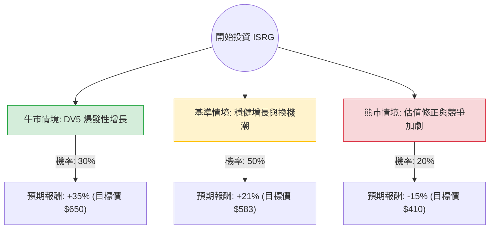

這份分析報告將結合您提供的基本面數據與最新的市場動態（如 Da Vinci 5 的推出、手術量增長趨勢及 GLP-1 藥物的影響），利用**決策樹（Decision Tree）**與**期望值分析（Expected Value Analysis）**評估 Intuitive Surgical (ISRG) 的投資價值。

---

### 一、 核心假設與市場背景分析

在建立決策樹之前，我們基於最新資訊設定以下核心假設：

1.  **產品週期（Da Vinci 5）**：ISRG 目前正處於新一代手術機器人 DV5 的推廣初期。歷史數據顯示，新系統更換週期通常會帶動未來 2-3 年的營收高成長。
2.  **手術量增長**：全球一般外科手術（如膽囊、疝氣）自動化滲透率持續提升。雖然 GLP-1 減肥藥曾引發對減重手術減少的擔憂，但目前數據顯示對整體手術量影響有限，且其他領域增長強勁。
3.  **估值水平**：目前 P/E 約 58 倍，處於歷史高位區間。這意味著市場已預期了高成長，容錯率較低。
4.  **財務穩健度**：負債比為 0，現金流極其充沛（P/C 37.55），具備極強的抗風險能力。

---

### 二、 決策樹分析 (Decision Tree)

以下為 ISRG 未來一年的投資決策模型：

#### 節點詳細說明：

1.  **牛市情境 (Bull Case) - 30% 機率**：
    *   **條件**：DV5 產能快速爬坡，利潤率因規模效應大幅提升；AI 輔助手術功能獲得額外收費許可；全球手術量增長超預期（>20%）。
    *   **預期報酬**：股價突破歷史新高，觸及 $650。

2.  **基準情境 (Base Case) - 50% 機率**：
    *   **條件**：符合分析師平均預期（Target Price $583.04）。DV5 穩步替換舊機型，耗材收入隨手術量穩定增長 15-18%。
    *   **預期報酬**：回歸分析師目標價，約 +21%。

3.  **熊市情境 (Bear Case) - 20% 機率**：
    *   **條件**：高利率環境持續壓抑醫院資本支出；競爭對手（如 Medtronic Hugo）奪取市佔；GLP-1 藥物顯著減少特定手術需求；市場進行估值修正（P/E 回落至 40x）。
    *   **預期報酬**：回測 52 週低點附近，約 -15%。

---

### 三、 期望值計算過程 (Expected Value Calculation)

我們以當前股價 **$482.22** 為基準，計算未來一年的期望報酬率：

| 情境 | 預期報酬率 (R) | 發生機率 (P) | 加權期望值 (R × P) |
| :--- | :--- | :--- | :--- |
| **牛市 (Bull)** | +35% | 0.30 | +10.5% |
| **基準 (Base)** | +21% | 0.50 | +10.5% |
| **熊市 (Bear)** | -15% | 0.20 | -3.0% |
| **總計期望值** | | **1.00** | **+18.0%** |

**計算公式：**
$EV = (35\% \times 0.3) + (21\% \times 0.5) + (-15\% \times 0.2) = 10.5\% + 10.5\% - 3.0\% = 18.0\%$

**預期一年後股價：**
$482.22 \times (1 + 18.0\%) \approx \$569.02$

---

### 四、 最終結論

#### **評估結果：適合投資 (Buy / Overweight)**

#### **判斷理由：**

1.  **正向期望值 (EV = 18%)**：在考慮了潛在的下行風險（熊市情境）後，ISRG 仍展現出 18% 的預期報酬率，顯著高於標普 500 的歷史平均回報。
2.  **極強的護城河與財務結構**：
    *   **零負債 (Debt/Eq: 0.0)**：在當前高利率環境下，ISRG 擁有極強的資產負債表，無需擔心融資成本。
    *   **高利潤率 (Gross Margin: 66%)**：反映其在手術機器人市場的壟斷定價權。
3.  **催化劑明確**：Da Vinci 5 的推出不僅是硬體銷售，更重要的是帶動後續高毛利的「耗材與服務」收入（目前這部分已佔總營收約 75% 以上，屬於穩定的經常性收入）。
4.  **技術面支撐**：目前股價高於 SMA20 與 SMA50，顯示短期與中期趨勢轉強，且距離分析師目標價 ($583) 仍有約 20% 的上漲空間。

**風險提示：**
ISRG 的主要風險在於其 **58 倍的高 P/E 估值**。若未來一季的財報顯示手術量增速放緩，股價可能會出現劇烈波動。建議投資者採取**分批進場**策略，以降低短期估值修正的風險。