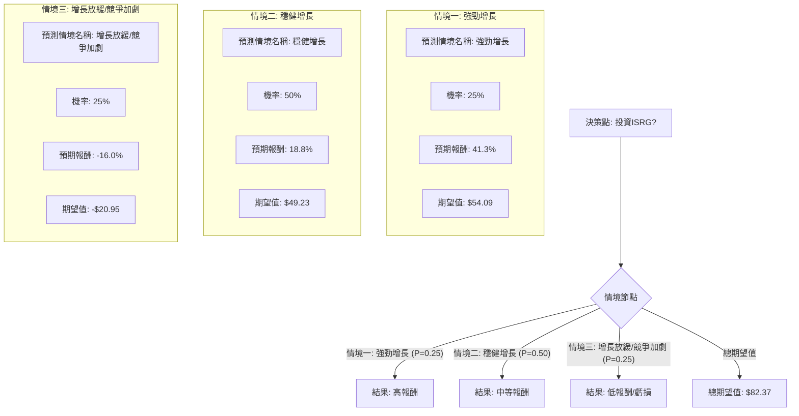

根據對美股公司 Intuitive Surgical (ISRG) 的基本面數據、最新新聞、財報、市場動態及產業趨勢的綜合分析，以下將使用決策樹分析與期望值分析來評估其目前的投資適合性。

### 核心假設

1.  **市場增長趨勢：** 機器人輔助手術 (RAS) 市場預計將持續穩健增長，主要受惠於技術進步（如 da Vinci 5 系統、AI 整合）、微創手術需求增加以及全球人口老齡化。預計到 2026 年，全球 RAS 市場規模將達到 140 億至 160.7 億美元，年複合增長率約 11% 至 16.54%。
2.  **ISRG 的市場地位：** Intuitive Surgical 憑藉其龐大的裝機量、品牌聲譽和持續創新，在市場上仍佔據主導地位（超過三分之二的市場份額）。 然而，來自 Medtronic、Stryker 和 Johnson & Johnson 等大型醫療設備公司的競爭日益激烈。
3.  **財務表現與估值：** ISRG 展現出強勁的盈利能力和健康的利潤率（毛利率 66.37%，營業利潤率 29.30%，淨利率 28.58%），且無長期負債，流動性良好。然而，其目前的估值指標（P/E 69.29, Forward P/E 53.94, P/B 10.97, P/S 19.31, PEG 3.6）相對較高，表明市場已將其未來可觀的增長預期大部分計入股價。
4.  **近期業績與展望：** 公司初步公布的 2025 年第四季度營收增長 19% 至 28.7 億美元，超出市場預期。 但其對 2026 年全球 da Vinci 手術量增長 13%-15% 的預期略低於分析師共識的 15.2%，導致股價在公布後下跌約 4.8%。

### 決策樹分析

**決策點：投資 ISRG 股票**

我們將考慮三種未來情境，並為每種情境分配機率和預期報酬。

*   **當前股價 (Close):** $523.69
*   **分析師平均目標價 (Target Price):** $616.78 - $637.32
*   **分析師最高目標價:** $740.00
*   **分析師最低目標價:** $440.00
*   **Simply Wall St DCF 估值:** $352.31 (被認為高估 49.7%)

### 計算過程

**1. 情境定義與預期報酬計算 (基於當前股價 $523.69)**

*   **情境一：強勁增長**
    *   **情境描述：** ISRG 超越 2026 年保守指引，da Vinci 5 系統加速普及，新產品線（如 AI 整合、Ion 系統）表現優異，競爭影響小於預期。股價達到分析師最高目標價 $740。
    *   **預期報酬：** (($740.00 - $523.69) / $523.69) * 100% = **41.3%**
    *   **機率 (Probability)：** 25% (考慮到競爭加劇和公司保守指引，實現超預期增長的機率較低)

*   **情境二：穩健增長**
    *   **情境描述：** ISRG 達成 2026 年 13%-15% 的手術量增長指引，公司營運表現穩健，但面臨持續的競爭壓力，且高估值限制了股價的顯著擴張。股價達到分析師平均目標價 $622。
    *   **預期報酬：** (($622.00 - $523.69) / $523.69) * 100% = **18.8%**
    *   **機率 (Probability)：** 50% (這是最可能的情境，符合公司指引和多數分析師的預期)

*   **情境三：增長放緩/競爭加劇**
    *   **情境描述：** ISRG 未能達到 2026 年增長指引，競爭對手（如 Medtronic, J&J）的產品對市場份額造成更大衝擊，或宏觀經濟逆風（如醫療保健支出緊縮）影響系統銷售和手術量。股價跌至分析師最低目標價 $440。
    *   **預期報酬：** (($440.00 - $523.69) / $523.69) * 100% = **-16.0%** (虧損)
    *   **機率 (Probability)：** 25% (高估值和競爭風險是真實存在的，公司對 2026 年的保守展望也增加了這種可能性)

**2. 期望值計算 (Expected Value Calculation)**

*   **情境一期望值：** 0.25 * 41.3% = 10.325%
*   **情境二期望值：** 0.50 * 18.8% = 9.400%
*   **情境三期望值：** 0.25 * (-16.0%) = -4.000%

*   **總期望值 (Overall Expected Value)：** 10.325% + 9.400% - 4.000% = **15.725%**

將總期望值轉換為預期股價：
預期股價 = 當前股價 * (1 + 總期望值)
預期股價 = $523.69 * (1 + 0.15725) = $523.69 * 1.15725 = **$605.99**

### 最終結論

根據決策樹分析和期望值計算，投資 ISRG 股票的**整體期望報酬率為 15.725%**，對應的預期股價為 $605.99。這個預期股價略低於分析師的平均目標價 $616.78 - $637.32。

**判斷：適合投資**

**理由：**
儘管 ISRG 目前的估值較高 (P/E 69.29, PEG 3.6)，且面臨日益激烈的競爭，但其在機器人輔助手術市場的領導地位、強勁的盈利能力、健康的財務狀況（無債務、高流動性）以及 da Vinci 5 系統和 AI 整合等創新產品的潛力，為其提供了堅實的增長基礎。

雖然公司對 2026 年的手術量增長指引略顯保守，導致近期股價下跌，但這可能為長期投資者提供了逢低買入的機會。 分析師普遍給予「買入」或「強烈買入」評級，且平均目標價顯示出約 18-19% 的上漲空間。

綜合來看，15.725% 的正向期望報酬率表明，儘管存在風險，但 ISRG 仍具有吸引人的上漲潛力，因此目前**適合投資**。然而，投資者應密切關注其 2026 年手術量增長是否能超越保守預期，以及競爭格局的變化。