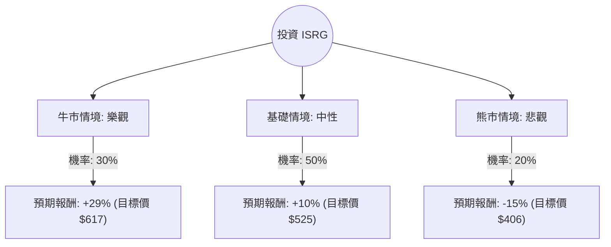

這份分析報告將結合您提供的基本面數據與最新的市場動態（如 **da Vinci 5** 的推出、手術量增長趨勢及 GLP-1 藥物的影響），利用**決策樹（Decision Tree）**與**期望值分析（Expected Value Analysis）**評估 Intuitive Surgical (ISRG) 的投資價值。

---

### 一、 核心假設與市場背景分析

在建立模型前，我們先整合基本面與最新資訊：

1.  **產品週期（da Vinci 5）**：ISRG 正處於新一代系統 da Vinci 5 的推廣初期。歷史經驗顯示，新系統更換週期會帶動資本支出增加與長期服務收入。
2.  **手術量增長**：2024 年全球手術量增長強勁（約 14-18%），特別是在一般外科與婦科。
3.  **估值壓力**：目前 P/E 約 60.7，遠高於標普 500 平均水平。雖然 Forward P/E 降至 41.65，但市場對其容錯率極低。
4.  **競爭與外部因素**：GLP-1 減肥藥對減重手術的衝擊已逐漸被市場消化，目前數據顯示對整體手術量影響有限。

---

### 二、 決策樹分析 (Decision Tree)

我們以 **1 年持有期**為基準，設定三種可能的情境：

#### 節點詳細說明：

| 情境 | 機率 (P) | 預期股價 | 預期報酬率 (R) | 說明 |
| :--- | :--- | :--- | :--- | :--- |
| **牛市 (Bull)** | 30% | $617 | +29.1% | dV5 普及速度超預期，利潤率因規模效應大幅提升，市佔率穩固。 |
| **基礎 (Base)** | 50% | $525 | +9.8% | 手術量穩定增長 15%，dV5 換機潮符合預期，估值維持高位。 |
| **熊市 (Bear)** | 20% | $406 | -15.1% | 宏觀經濟衰退導致醫院縮減資本支出，競爭對手（如美敦力）搶佔份額，估值修正。 |

---

### 三、 期望值計算過程 (Expected Value Calculation)

**1. 計算公式：**
$$EV = (P_{Bull} \times R_{Bull}) + (P_{Base} \times R_{Base}) + (P_{Bear} \times R_{Bear})$$

**2. 帶入數值：**
*   牛市貢獻：$0.30 \times 29.1\% = 8.73\%$
*   基礎貢獻：$0.50 \times 9.8\% = 4.90\%$
*   熊市貢獻：$0.20 \times (-15.1\%) = -3.02\%$

**3. 總期望報酬率：**
$$EV = 8.73\% + 4.90\% - 3.02\% = 10.61\%$$

**4. 核心假設依據：**
*   **上行空間**：參考分析師平均目標價 $617.17（約 29% 空間）。
*   **下行風險**：參考 52 週低點與 SMA200 支撐位，若估值回歸至歷史平均 P/E (約 45-50x)，股價約回落至 $400 附近。
*   **財務健康度**：Debt/Eq 僅 0.01，現金流極其充沛（Quick Ratio 3.96），這降低了破產風險，但無法抵禦估值修正風險。

---

### 四、 綜合評估與最終結論

#### 1. 優勢分析 (Pros)
*   **極高的護城河**：毛利率 65.98%，營業利益率 29.27%，顯示其在手術機器人市場的壟斷定價權。
*   **成長動能**：EPS Q/Q 增長 17.04%，Sales Q/Q 增長 18.76%，在大型醫療器械股中表現優異。
*   **財務穩健**：幾乎沒有負債，且擁有極高的流動比率（4.87），足以應對研發與擴張。

#### 2. 劣勢分析 (Cons)
*   **估值過高**：P/E 60.7 且 PEG 高達 2.98，意味著股價已透支了未來三年的部分成長。
*   **技術面偏弱**：目前股價低於 SMA20, SMA50, SMA200，顯示短期處於修正趨勢（Perf Month -5.16%）。
*   **內部人減持**：Insider Trans 為 -6.41%，顯示公司內部人員在當前價位有套現行為。

---

### 最終判斷：適合投資 (分批買入 / 逢低佈局)

**結論理由：**
雖然 ISRG 目前的估值偏高且短期技術面呈現修正，但其**期望報酬率為正（+10.61%）**，且具備極強的產業競爭力。

1.  **長期主義**：ISRG 的商業模式（刮鬍刀與刮鬍刀片模式）極其穩定，手術量增加會帶動高毛利的耗材收入。
2.  **dV5 催化劑**：新產品週期才剛開始，這通常是 ISRG 股價長期走強的起點。
3.  **風險管理**：建議不要在當前 $478 一次性投入，因其股價正處於 SMA200 之下。**較佳策略是在 $430 - $450 區間（接近 52 週低點與支撐位）分批進場**，以降低估值修正帶來的短期衝擊。

**投資建議：** **適合投資**（建議對象：長期投資者；短期投資者需注意估值回調風險）。