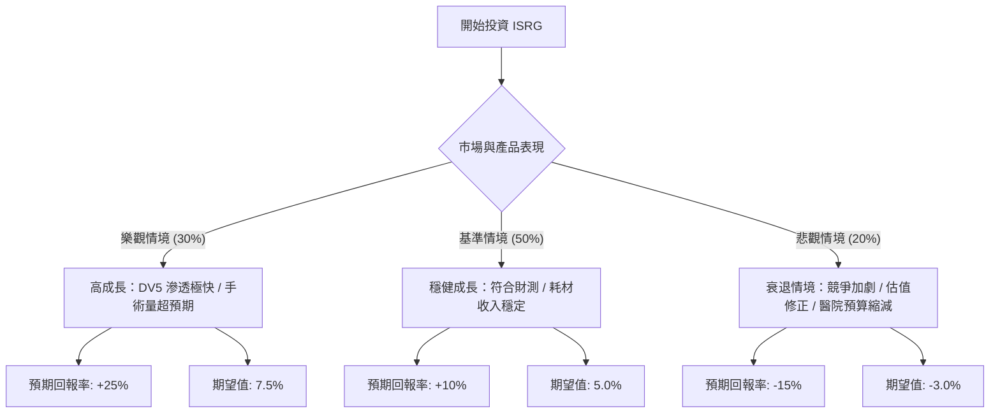

針對美股醫療手術機器人龍頭 **Intuitive Surgical (ISRG)**，以下運用「決策樹分析」與「期望值分析」進行投資評估。

---

### 一、 核心假設 (Core Assumptions)

在進行定量分析前，我們先設定以下基於市場現狀、財務數據與產業趨勢的假設：

1.  **市場趨勢**：全球人口老化導致手術需求增加，微創手術（MIS）滲透率持續提升。ISRG 的手術量（Procedure Volume）預計年成長率維持在 14% - 17%。
2.  **產品週期**：新一代系統 **da Vinci 5 (DV5)** 的推出將帶動換機潮與客單價提升。
3.  **財務健康**：ISRG 擁有極高的經常性收入（超過 75% 來自耗材與服務），且現金流充裕。
4.  **估值壓力**：目前本益比（P/E Ratio）約在 70x - 75x 之間，處於歷史高位，這意味著市場已預期了高度成長，容錯率較低。
5.  **當前股價基準**：假設為 **$440 USD**（以此作為基準點計算 12 個月預期報酬）。

---

### 二、 決策樹分析圖 (Decision Tree)

使用 Markdown 結構化展示決策路徑：

---

### 三、 期望值分析與計算過程

我們將投資回報拆解為三個節點情境，計算其**加權期望回報率 (Expected Return)**。

#### 1. 情境參數設定：
*   **樂觀情境 (Bull Case)**：機率 **30%**
    *   核心原因：DV5 帶來超額毛利，國際市場（如中國、印度）滲透率爆發。
    *   預期股價：$550 (+25%)
*   **基準情境 (Base Case)**：機率 **50%**
    *   核心原因：手術量成長符合預期（15%），雖然 P/E 可能因利率環境稍微下修，但盈餘增長抵銷影響。
    *   預期股價：$484 (+10%)
*   **悲觀情境 (Bear Case)**：機率 **20%**
    *   核心原因：競爭對手（如 Medtronic, J&J）產品獲得重大突破，或高利率導致醫院資本支出延後。
    *   預期股價：$374 (-15%)

#### 2. 計算公式：
$$EV = \sum (Probability_i \times Return_i)$$

#### 3. 計算過程：
*   **樂觀節點期望值**：$0.30 \times 25\% = 7.5\%$
*   **基準節點期望值**：$0.50 \times 10\% = 5.0\%$
*   **悲觀節點期望值**：$0.20 \times (-15\%) = -3.0\%$

**總整體期望報酬率 (Total EV)**：
$$7.5\% + 5.0\% - 3.0\% = 9.5\%$$

---

### 四、 最終結論

#### **判斷：適合投資 (中立偏多，建議分批布局)**

#### **理由分析：**
1.  **期望值為正 (9.5%)**：雖然 9.5% 的預期報酬率在成長股中不算極端驚人，但考慮到 ISRG 的產業龍頭地位與強大的競爭護城河，此報酬率具有較高的勝率。
2.  **高經常性收入帶來的防禦性**：ISRG 即使在系統銷售放緩的情境下，已安裝的 9,000 多台設備仍會持續產生高毛利的耗材收入，這使它在悲觀情境下具有較強的下檔支撐。
3.  **技術壁壘**：新推出的 da Vinci 5 具備力道感測技術與更強的運算能力，進一步拉開與競爭對手的代差，確保了未來 3-5 年的市場主導權。

#### **風險提示：**
*   **估值過高**：目前 9.5% 的 EV 與美國 10 年期國債殖利率（約 4.2% - 4.5%）相比，風險溢酬（Risk Premium）不算特別寬裕。
*   **策略建議**：由於當前股價已反映多數利多，不建議單筆大額追高，應採取**定期定額**或於**股價回落至基準情境下方 (約 $410-$420)** 時進行布局。