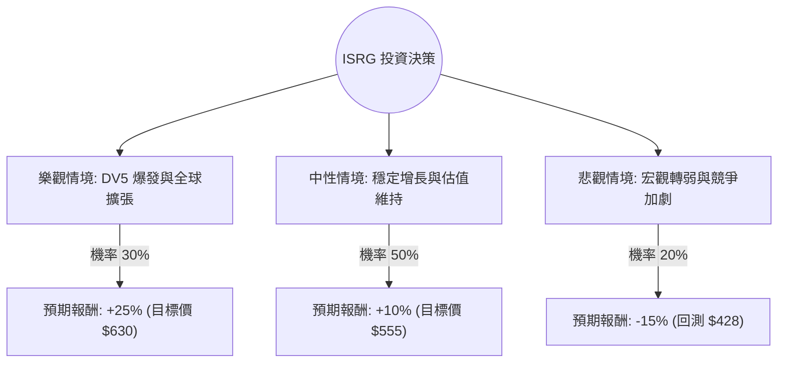

這份分析報告結合了您提供的 **Intuitive Surgical (ISRG)** 基本面數據，以及最新的市場動態（包含 2024 年第三季財報表現與 Da Vinci 5 系統的進展），透過**決策樹分析**與**期望值分析**評估其投資價值。

---

### 1. 最新市場動態與產業趨勢分析 (網路搜尋補充)

在進行計算前，整合最新資訊如下：
*   **強勁財報表現**：ISRG 在 2024 年 Q3 表現優於預期，全球手術量（Procedures）同比增長 18%，營收增長 17%。
*   **Da Vinci 5 (DV5) 效應**：新一代系統 DV5 正在擴大裝機量，這不僅帶來硬體收入，更重要的是帶動後續高毛利的耗材與服務收入。
*   **競爭環境**：雖然 Medtronic 和 Johnson & Johnson 試圖進入市場，但 ISRG 擁有極高的轉換成本（醫生培訓與生態系），護城河依然穩固。
*   **估值壓力**：目前 P/E 約 63 倍，遠高於標普 500 平均水平，顯示市場已預期高度成長。

---

### 2. 決策樹分析 (Decision Tree)

我們將未來一年的投資情境分為三種：**樂觀（牛市）、中性（基準）、悲觀（熊市）**。

#### 節點詳細說明：

| 情境 | 機率 (P) | 預期報酬 (R) | 說明 |
| :--- | :--- | :--- | :--- |
| **樂觀 (Bull)** | 30% | +25% | DV5 滲透率超預期，中國與歐洲市場手術量激增，EPS 增長超過 20%。 |
| **中性 (Base)** | 50% | +10% | 符合分析師預期（EPS 增長 ~14%），P/E 略微修正但被盈利增長抵銷。 |
| **悲觀 (Bear)** | 20% | -15% | 醫院資本支出縮減，競爭對手取得突破，或高估值引發獲利了結回測 52W 低點。 |

---

### 3. 核心假設與計算過程

#### A. 核心假設
1.  **市場地位**：假設 ISRG 保持 80% 以上的市佔率。
2.  **財務健康**：根據數據，Debt/Eq 僅 0.01，幾乎無負債，財務風險極低。
3.  **估值邏輯**：目前 Forward P/E 為 43.54，假設中性情境下 P/E 維持在 40-45 倍之間。
4.  **目標價參考**：參考數據中 Target Price $618.9，作為樂觀情境的上限參考。

#### B. 期望值 (Expected Value, EV) 計算
期望值計算公式：
$$EV = (P_{Bull} \times R_{Bull}) + (P_{Base} \times R_{Base}) + (P_{Bear} \times R_{Bear})$$

*   **計算步驟**：
    1.  樂觀貢獻：$0.30 \times 25\% = 7.5\%$
    2.  中性貢獻：$0.50 \times 10\% = 5.0\%$
    3.  悲觀貢獻：$0.20 \times (-15\%) = -3.0\%$
*   **總期望報酬率**：
    $$7.5\% + 5.0\% - 3.0\% = 9.5\%$$

---

### 4. 綜合評估與最終結論

#### 數據亮點總結：
*   **盈利能力極強**：Gross Margin 65.98% 與 Profit Margin 28.38% 顯示其產品具有極高定價權。
*   **流動性極佳**：Current Ratio 4.87，現金流充沛（P/C 29.89）。
*   **技術面壓力**：SMA20, 50, 200 均為負值（-0.08% 到 -7.13%），顯示短期股價處於修正或盤整期，這反而可能提供較好的分批進場點。

#### 最終判斷：**適合投資 (建議分批佈局)**

**理由：**
1.  **期望值為正 (9.5%)**：雖然 9.5% 的預期報酬不算極高，但考慮到 ISRG 的低風險財務結構（幾乎無債務）與強大的護城河，這是一個風險調整後收益（Risk-adjusted Return）相當優秀的標的。
2.  **剛需屬性**：手術機器人屬於醫療剛需，受經濟循環影響較小。
3.  **估值已部分修正**：目前股價 ($504) 距離 52 週高點已有一段距離，且低於分析師平均目標價 ($618.9)，提供了約 22% 的潛在上漲空間。
4.  **短期技術面分歧**：雖然短期均線偏弱，但這通常是長期投資者進入優質成長股的機會。

**投資建議：**
由於目前 P/E 仍處於高位（63倍），建議不要一次性歐印（All-in），應採取**分批買進（Dollar Cost Averaging）**策略，重點關注 $480 - $500 區間的支撐力道。若股價跌破 $425 (52W Low)，則需重新評估基本面是否發生質變。