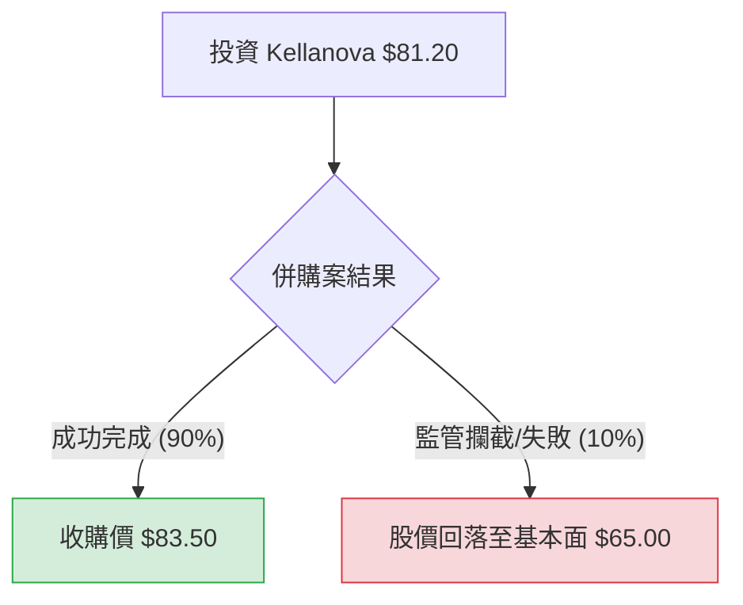

針對美股公司 **Kellanova (股票代碼：K)**，目前最核心的投資邏輯已從「基本面成長」轉向「併購套利（Merger Arbitrage）」。

2024 年 8 月，全球零食巨頭 **瑪氏（Mars, Inc.）** 正式宣佈將以每股 **83.50 美元** 的現金價格收購 Kellanova。這項交易預計於 2025 年上半年完成。

以下是基於此背景的決策樹分析與期望值評估。

---

### 一、 核心假設與數據背景

1.  **當前股價**：約 **$81.00 - $81.50**（假設以 $81.20 作為買入基準）。
2.  **收購價格**：**$83.50**（現金交易）。
3.  **預計完成時間**：2025 年上半年（約需等待 6-9 個月）。
4.  **基本面支撐**：若交易失敗，股價可能回落至併購消息傳出前的水平（約 $62 - $67 區間）。
5.  **主要風險**：反壟斷法（Antitrust）審查、全球經濟系統性風險。

---

### 二、 決策樹分析 (Decision Tree)

使用 Markdown 繪製決策樹如下：

#### 節點詳細說明：

| 節點名稱 | 預測情境 | 機率 (P) | 預期價值 (V) | 報酬率 (ROI) |
| :--- | :--- | :--- | :--- | :--- |
| **情境 A** | **併購成功 (Success)** | 90% | $83.50 | +2.83% |
| **情境 B** | **併購失敗 (Failure)** | 10% | $65.00 | -19.95% |

---

### 三、 期望值計算過程 (Expected Value Analysis)

#### 1. 期望值 (EV) 計算公式：
$$EV = (P_{success} \times V_{success}) + (P_{failure} \times V_{failure})$$

*   **$P_{success}$ (成功機率)**：**90%**。理由：Mars 與 Kellanova 的產品重疊度雖有，但在零食領域競爭者眾多，且 Mars 為私有公司，此併購案被視為補足產品線而非壟斷，通過審查機率高。
*   **$P_{failure}$ (失敗機率)**：**10%**。理由：主要來自各國監管機構對大型食品併購的嚴格審查。
*   **$V_{success}$**：$83.50 (收購價)
*   **$V_{failure}$**：$65.00 (參考併購前股價與同業估值)

#### 2. 計算過程：
*   $EV = (0.90 \times 83.50) + (0.10 \times 65.00)$
*   $EV = 75.15 + 6.50$
*   **$EV = 81.65$**

#### 3. 期望報酬分析：
*   **當前成本**：$81.20
*   **期望價值**：$81.65
*   **預期獲利空間**：$81.65 - $81.20 = **$0.45 (約 0.55%)**

---

### 四、 核心假設與市場動態分析

1.  **產業趨勢**：全球零食市場正在整合。Kellanova 旗下的 Pringles (品客) 與 Cheez-It 表現強勁，這使得 Mars 有極強動機完成收購以對抗百事 (PepsiCo)。
2.  **財務狀況**：Kellanova 拆分後財務透明度提高，Q2 財報顯示有機營收成長優於預期，這為股價提供了「失敗後的緩衝墊」，即便交易失敗，其基本面仍優於傳統穀物業務。
3.  **時間成本**：此交易預計 2025 年中完成。若現在買入，年化報酬率（Annualized Return）可能僅約 4-5%，與目前美債無風險利率（約 4%）相近。

---

### 五、 最終結論

#### **判斷：不適合投資 (對於一般散戶投資者)**

#### **理由：**
1.  **風險報酬比不對稱 (Asymmetric Risk)**：
    *   **潛在獲利**：每股僅約 $2.30 ($83.50 - $81.20)。
    *   **潛在虧損**：若交易意外失敗，股價可能瞬間跌至 $65 附近，每股虧損高達 $16.20。
    *   為了賺取不到 3% 的絕對收益，需承擔近 20% 的下行風險，這在統計學上並非優質交易。
2.  **機會成本過高**：
    *   目前市場預期收益已高度反映在股價中（Spread 僅剩約 2.8%）。在等待交易完成的半年到一年內，資金鎖定在 K 上的年化回報率與貨幣市場基金（MMF）或高利定存相差無幾，但後者幾乎零風險。
3.  **套利空間狹窄**：
    *   此股票目前適合「專業併購套利基金」進行大規模對沖操作，對於追求資本增長的個人投資者而言，缺乏吸引力。

**建議：** 除非您預期 Mars 會加價（機率極低，因為已簽署確定性協議）或您需要一個極低波動、類似債券的避風港，否則目前不建議介入 Kellanova。