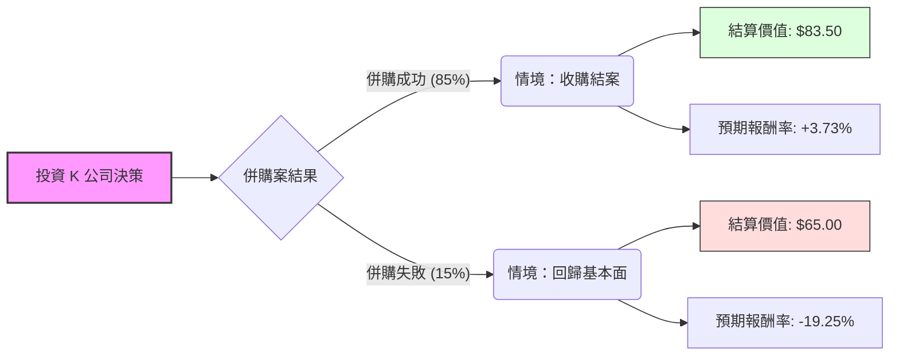

這份分析報告針對 **Kellanova (股票代碼：K)** 進行評估。

**背景背景說明：** 
原家樂氏公司（Kellogg Company）於 2023 年底分拆為兩家公司，保留代號 **K** 的公司更名為 **Kellanova**，專注於全球零食、國際穀物與冷凍食品（如 Pringles, Cheez-It）。
**當前關鍵事件：** 2024 年 8 月，全球食品巨頭 **Mars（瑪氏）** 宣布計畫以每股 **$83.50 美元** 現金收購 Kellanova。因此，目前的投資分析已轉向「併購套利（Merger Arbitrage）」模型。

---

### 一、 核心假設 (Core Assumptions)

1.  **市場價格 ($P_0$):** 假設目前市價約為 **$80.50** (接近 2024 年 Q4 水位)。
2.  **收購對價 ($P_a$):** Mars 承諾之收購價為 **$83.50**。
3.  **時間成本:** 預計收購於 2025 年上半年完成（剩餘時間約 0.5 - 0.75 年）。
4.  **監管風險:** 由於 Mars 與 Kellanova 的產品線重疊度較低（糖果 vs 鹹味零食/穀物），反壟斷法受阻風險中等偏低。
5.  **下行風險 (Bear Case):** 若併購案因監管或融資問題意外破裂，股價預期將回落至併購傳聞前之基本面估值，約 **$65.00**。

---

### 二、 決策樹分析 (Decision Tree)

使用 Markdown 結構化繪製決策樹如下：

#### 決策樹節點詳細標示：

| 節點名稱 | 發生機率 (P) | 預期價值 (Value) | 節點期望值 (EV Contribution) |
| :--- | :--- | :--- | :--- |
| **情境 A：併購成功** | 85% (0.85) | $83.50 | $70.975 |
| **情境 B：併購失敗** | 15% (0.15) | $65.00 | $9.75 |
| **總計期望值 (Total EV)** | **100%** | **$80.725** | **$80.725** |

---

### 三、 計算過程 (Calculation Process)

#### 1. 期望值計算公式：
$$EV = (P_{success} \times Value_{success}) + (P_{failure} \times Value_{failure})$$

#### 2. 代入數值：
*   **成功路徑：** $0.85 \times 83.50 = 70.975$
*   **失敗路徑：** $0.15 \times 65.00 = 9.75$
*   **總期望值 (EV) = $80.725**

#### 3. 預期投資收益率分析：
*   **目前市價：** $80.50
*   **預期獲利空間：** $80.725 - $80.50 = **$0.225 (每股)**
*   **預期報酬率 (Expected Return)：** $0.225 / 80.50 \approx \mathbf{0.28\%}$

---

### 四、 最終結論

#### **判斷：不適合投資 (Not Suitable for Retail Investment)**

#### **理由分析：**

1.  **期望值與現價過於接近：** 計算得出的總期望值（$80.725）與目前市場價格（約 $80.50）非常接近，這表示市場已經幾乎完全消化了收購成功的利多。
2.  **風險收益比極度不對稱 (Asymmetric Risk)：**
    *   **向上空間 (Upside)：** 若成功，僅有約 3.7% 的固定利潤（且需等待半年以上）。
    *   **向下風險 (Downside)：** 若失敗，潛在虧損高達 19.2%。
    *   以 0.28% 的總期望回報率來看，這無法覆蓋時間成本與潛在的暴跌風險。
3.  **資金效率低下：** 對於一般投資者而言，將資金鎖定在一個年化預期回報不到 1-2% 的併購案中，不如選擇美國國債（約 4% 以上）或標普 500 指數基金。
4.  **結論：** K 目前屬於「專業併購套利者」的戰場，對於一般投資者來說，目前的股價已缺乏安全邊際，建議觀望或尋找其他成長型標的。

***

**免責聲明：** *本文內容僅供學習決策樹分析模型使用，不構成任何投資建議。投資美股具有市場風險，投資前請務必自行審慎評估。*