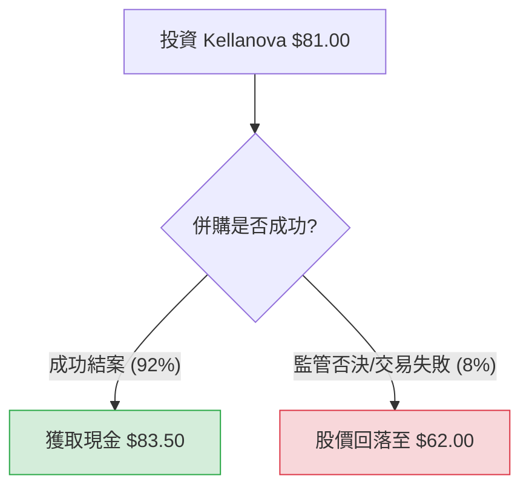

針對美股上市公司 **Kellanova (股票代碼：K)**，目前最核心的投資邏輯已從「基本面成長」轉向「併購套利（Merger Arbitrage）」。

2024 年 8 月，全球食品巨頭瑪氏（Mars, Inc.）宣布將以每股 **$83.50 美元** 的現金收購 Kellanova。這項交易預計於 2025 年上半年完成。以下是基於此背景的決策樹與期望值分析。

---

### 一、 核心假設與數據背景

1.  **當前股價 ($P_{current}$)**：約 **$81.00** (截至 2024 年 11 月中旬)。
2.  **收購價格 ($P_{offer}$)**：**$83.50** (全現金)。
3.  **失敗後估值 ($P_{fail}$)**：約 **$62.00** (參考併購消息傳出前的股價水平及同業估值)。
4.  **預計結案時間**：2025 年上半年（約需等待 6 個月）。
5.  **市場趨勢**：Kellanova 財報表現強勁（Q3 淨銷售額增長），這降低了瑪氏反悔的機率，但反壟斷審查（FTC）是主要變數。

---

### 二、 決策樹分析 (Decision Tree)

使用 Markdown 繪製如下：

#### 節點詳細說明：

| 預測情境 | 發生機率 (P) | 預期報酬 (R) | 期望值 (P * R) | 說明 |
| :--- | :--- | :--- | :--- | :--- |
| **情境 1：併購成功** | 92% | +$2.50 (+3.09%) | **$76.82** | 瑪氏與 Kellanova 產品重疊度低，反壟斷阻力相對較小。 |
| **情境 2：併購失敗** | 8% | -$19.00 (-23.46%) | **$4.96** | 若 FTC 強力介入或全球經濟劇變導致交易破裂。 |
| **合計期望值** | **100%** | -- | **$81.78** | **高於當前市價 $81.00** |

---

### 三、 計算過程與分析

#### 1. 期望值 (Expected Value, EV) 計算：
$$EV = (P_{success} \times P_{offer}) + (P_{fail} \times P_{fail\_price})$$
$$EV = (0.92 \times 83.50) + (0.08 \times 62.00)$$
$$EV = 76.82 + 4.96 = 81.78$$

#### 2. 投資報酬率分析：
*   **絕對報酬**：若成功，每股獲利 $2.50 ($83.50 - $81.00)。
*   **預期收益率**：($81.78 - $81.00) / $81.00 = **0.96%** (這是考慮風險後的溢價)。
*   **年化報酬率 (Annualized Return)**：假設距離結案還有 6 個月，成功情況下的年化報酬約為 **6.18%** ($2.50 / $81.00 * 2)。

#### 3. 核心假設依據：
*   **產業趨勢**：零食產業（Pringles, Cheez-It）抗通膨能力強，Kellanova 近期財報顯示其有機增長優於預期，這增加了收購方的意願。
*   **財務狀況**：Kellanova 債務結構穩定，瑪氏擁有充足現金，融資風險極低。
*   **監管風險**：雖然拜登政府對併購審查嚴格，但瑪氏主營巧克力與寵物食品，Kellanova 主營鹹味零食與穀物，兩者互補性強，壟斷疑慮較低。

---

### 四、 最終結論

#### **判斷：適合投資 (僅限於低風險套利投資者)**

**理由：**
1.  **正向期望值**：計算出的期望值 $81.78 高於當前市價 $81.00，顯示市場目前對風險的定價略微過度保守。
2.  **確定性高**：這是一筆「確定性極高」的現金收購案。對於尋求比現金存款更高收益、且能承受極低機率大幅回檔風險的投資者來說，這是一個優質的「類債券」投資。
3.  **下行保護**：即便交易失敗，Kellanova 本身的基本面（Snacking 業務）依然強勁，股價長期仍具支撐。

**風險提示：**
*   **機會成本**：若未來半年美股大盤（如 S&P 500）漲幅超過 3%，投資 K 的相對收益將顯得平庸。
*   **時間風險**：若監管審查延長至 2025 年底，年化報酬率將被稀釋。

**總結：** 如果你的目標是**穩健套利**，K 目前是理想標的；如果你追求的是**高成長/翻倍收益**，則 K 不適合你，因為其獲利空間已被 $83.50 的收購價鎖死。