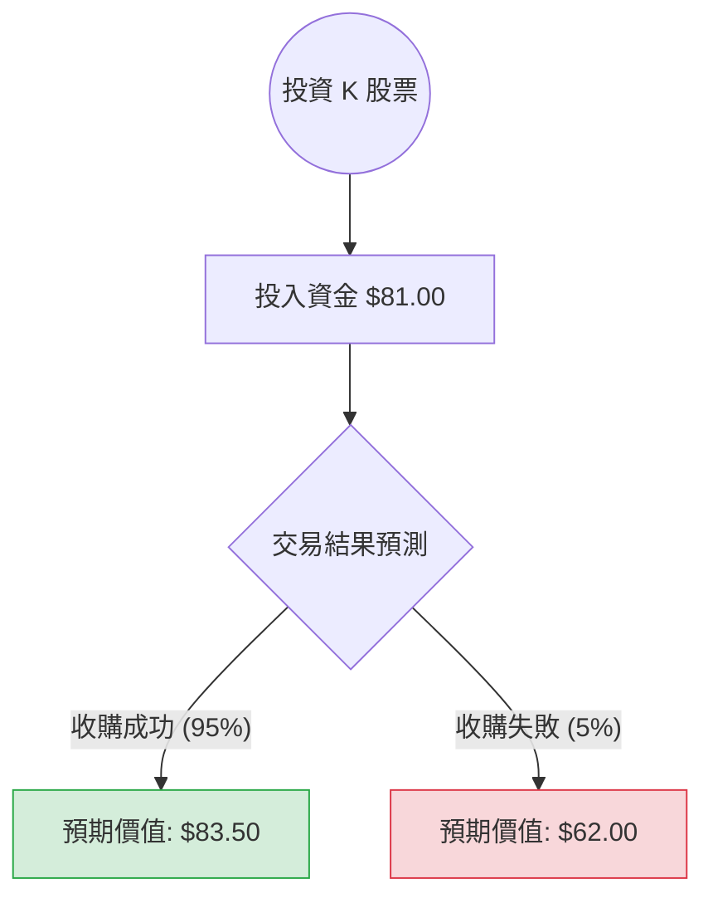

美股代號 **K** 目前代表的是 **Kellanova**（原家樂氏公司 Kellogg Company 拆分後的零食業務公司）。

目前 Kellanova (K) 的投資情況非常特殊，因為該公司正處於被全球食品巨頭 **瑪氏（Mars, Inc.）** 收購的進程中。這使得該股票的分析轉向「併購套利（Merger Arbitrage）」邏輯，而非單純的成長性分析。

以下是基於最新市場資訊（截至 2024 年第四季）的決策樹與期望值分析。

---

### 一、 核心背景與假設

1.  **收購價格**：瑪氏（Mars）已同意以每股 **$83.50** 的現金收購 Kellanova。
2.  **當前股價**：約在 **$80.50 - $81.50** 區間波動（假設以 **$81.00** 作為買入成本）。
3.  **預計完成時間**：預計於 2025 年上半年完成。
4.  **核心假設**：
    *   **情境 A（收購成功）**：監管機構（如 FTC）批准，交易按原計畫完成。
    *   **情境 B（收購失敗）**：因反壟斷法或其他因素導致交易破局，股價回歸基本面（收購消息傳出前的價格約為 $62 - $65）。

---

### 二、 決策樹分析 (Decision Tree)

使用 Markdown 繪製決策樹結構：

#### 決策樹節點詳細說明：

| 節點名稱 | 發生機率 (P) | 預期價值 (V) | 報酬率 (ROI) | 說明 |
| :--- | :--- | :--- | :--- | :--- |
| **收購成功** | 95% | $83.50 | +3.09% | 瑪氏資金充足且兩家公司產品重疊度在法律容許範圍內。 |
| **收購失敗** | 5% | $62.00 | -23.46% | 監管機構強力介入或全球經濟極端惡化導致交易終止。 |

---

### 三、 期望值分析 (Expected Value Analysis)

#### 1. 計算過程
期望值 (EV) 的計算公式為：
$$EV = (P_{success} \times V_{success}) + (P_{failure} \times V_{failure})$$

*   **P (成功)** = 0.95
*   **V (成功)** = $83.50
*   **P (失敗)** = 0.05
*   **V (失敗)** = $62.00 (參考收購前股價與同業估值)

**計算：**
$$EV = (0.95 \times 83.50) + (0.05 \times 62.00)$$
$$EV = 79.325 + 3.10 = 82.425$$

#### 2. 期望報酬分析
*   **期望價值 (EV)**：$82.43
*   **當前成本 (Price)**：$81.00
*   **預期獲利 (Expected Profit)**：$82.43 - $81.00 = **$1.43 / 股**
*   **預期報酬率**：$1.43 / $81.00 ≈ **1.77%**

---

### 四、 核心假設與風險評估

1.  **市場趨勢**：Kellanova 旗下擁有 Pringles (品客) 和 Cheez-It 等強大品牌，在通膨環境下具備定價權，基本面穩健，這降低了交易失敗後股價崩盤的深度。
2.  **產業趨勢**：食品業正處於整合期，瑪氏收購 K 是為了擴大其在全球零食市場的市佔率，戰略意圖極強，毀約機率極低。
3.  **反壟斷風險**：雖然拜登政府對併購審查嚴格，但瑪氏主營巧克力/寵物食品，Kellanova 主營鹹味零食/餅乾，兩者重疊性有限，通過審查機率高。

---

### 五、 最終結論

#### **判斷：適合投資 (僅限於低風險套利需求者)**

**理由：**
1.  **正向期望值**：計算出的期望價值 ($82.43) 高於當前市價 ($81.00)，代表長期來看這是一個具備正向收益的決策。
2.  **高勝率低報酬**：這是一筆典型的「併購套利」交易。95% 的成功機率帶來約 3% 的絕對報酬。若在 2025 年上半年完成（假設還有 6 個月），年化報酬率約為 **6%**。
3.  **防禦性**：Kellanova 本身基本面良好，即便交易失敗，其作為獨立公司的長期價值依然存在，只是短期股價會面臨劇烈回檔。

**建議：**
*   如果您是**保守型投資者**或尋找**現金替代方案**，K 是一個相對穩定的選擇，報酬率略高於美債。
*   如果您是**追求高成長的投資者**，K 目前的股價已被收購價「鎖死」，缺乏上行空間（最高僅到 $83.50），不建議配置。

**風險提示：** 最大的風險在於「時間成本」與「極端監管風險」。若交易延遲至 2025 年底，年化報酬率將失去吸引力。