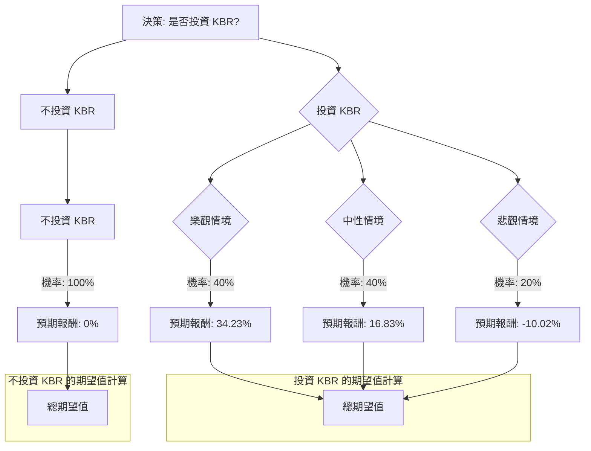

好的，我們將根據提供的基本面數據和網路查詢的最新資訊，對美股公司 KBR 進行決策樹分析與期望值分析。

---

## KBR 投資評估：決策樹與期望值分析

### 1. 公司概況與基本面分析

KBR (Kellogg Brown & Root) 是一家全球領先的科學、技術和工程解決方案提供商，服務於政府和商業客戶。其業務主要分為政府解決方案 (Government Solutions)、可持續技術解決方案 (Sustainable Technology Solutions) 和能源解決方案 (Energy Solutions)。

**基本面數據摘要：**

*   **股價 (Close):** $40.23
*   **估值:**
    *   P/E: 13.07 (Forward P/E: 9.78) - 相對合理，預期未來盈利增長使其估值更具吸引力。
    *   P/B: 3.49 - 略高，但對於技術服務公司可能合理。
    *   P/S: 0.63 - 非常低，顯示公司銷售額相對於市值被低估。
    *   PEG: 1.05 - 接近1，表明估值與預期增長大致匹配。
    *   P/FCF: 10.92 - 良好，顯示公司產生自由現金流的能力強勁。
*   **盈利能力:**
    *   ROE: 0.2777 (27.77%) - 非常出色，顯示股東權益報酬率高。
    *   ROA: 0.0614 (6.14%) - 尚可。
    *   ROI: 0.094 (9.4%) - 良好。
    *   毛利率 (Gross Margin): 0.1428 (14.28%) - 服務業通常較低。
    *   營業利潤率 (Oper. Margin): 0.0695 (6.95%)
    *   淨利潤率 (Profit Margin): 0.0498 (4.98%) - 服務業的典型水平。
*   **成長性:**
    *   EPS this Y: 0.1418 (14.18%) - 本年度EPS增長強勁。
    *   EPS next Y_%: 0.0783 (7.83%) - 預期明年EPS仍有增長，但增速放緩。
    *   Sales Q/Q: -0.0082 (-0.82%) - 最近季度銷售額略有下降。
    *   EPS Q/Q: 0.1948 (19.48%) - 最近季度EPS增長強勁。
*   **財務健康:**
    *   Debt/Eq: 1.95, LT Debt/Eq: 1.91 - 債務權益比偏高，需關注。
    *   Quick Ratio: 1.18, Current Ratio: 1.18 - 流動性尚可，但考慮到高負債，並非特別強勁。
*   **股價表現與分析師預期:**
    *   52W Range: $39.52 - $60.98。目前股價 $40.23 接近 52 週低點。
    *   所有短期、中期、長期表現 (Perf Week, Month, Quarter, Half Y, Year, YTD) 均為負值，顯示股價處於明顯的下跌趨勢。
    *   SMA20, SMA50, SMA200 均為負值，確認下跌趨勢。
    *   分析師推薦 (Recom): 1.73 (強烈買入/買入)。
    *   目標價 (Target Price): $54.00 - 較目前股價有顯著上漲空間。
*   **其他:**
    *   股息率 (Dividend %): 0.0164 (1.64%) - 提供少量股息。
    *   Short Float: 0.0371 (3.71%) - 空頭比例不高。
    *   Inst Trans: -0.0136 (-1.36%) - 機構投資者略有減持。

### 2. 網路查詢與最新資訊補充

根據網路查詢，KBR 的最新動態如下：

*   **最新財報 (Q1 2024):** KBR 在2024年第一季度表現強勁，營收和調整後每股收益均超出分析師預期。管理層重申了全年財測，顯示對未來業績的信心。
*   **業務增長點:**
    *   **政府解決方案:** 受益於全球地緣政治緊張和各國對國防、太空及情報領域的持續投入，KBR 在此領域持續獲得重要合約。
    *   **可持續技術解決方案:** KBR 在綠色氨、氫能、碳捕獲等新興可持續技術領域處於領先地位，獲得多個關鍵項目合約，符合全球能源轉型和脫碳趨勢，具備長期增長潛力。
    *   **能源解決方案:** 雖然傳統能源業務面臨轉型壓力，但KBR在此領域的重點已轉向更具可持續性的解決方案。
*   **股價表現原因:** 儘管基本面強勁且財報表現良好，KBR 股價近期仍處於下跌趨勢，可能受到以下因素影響：
    *   **宏觀經濟逆風:** 利率上升、通脹壓力以及對經濟衰退的擔憂可能影響市場整體情緒。
    *   **政府支出不確定性:** 儘管長期趨勢向好，但短期內政府預算審批和項目啟動可能存在不確定性。
    *   **獲利了結:** 過去幾年KBR股價表現強勁，部分投資者可能選擇獲利了結。
    *   **高負債:** 較高的債務水平在利率上升環境下可能引發投資者擔憂。
*   **分析師共識:** 大多數分析師維持對 KBR 的「買入」或「跑贏大盤」評級，並認為其當前股價被低估，具有顯著上漲空間。

### 3. 核心假設

基於上述分析，我們做出以下核心假設：

*   **市場假設:** 儘管近期市場波動，但長期來看，全球經濟仍有增長潛力，且對KBR所處的政府服務和可持續技術領域的需求將持續增長。
*   **財務假設:** KBR 的盈利能力和現金流生成能力將保持穩定，並受益於新合約的執行。高負債是風險點，但公司管理層有能力應對。
*   **產業趨勢假設:**
    *   **政府服務:** 國防、太空和情報領域的支出將保持強勁，為KBR提供穩定的收入來源。
    *   **可持續技術:** 全球對能源轉型、脫碳和綠色技術的投資將加速，KBR 在此領域的技術優勢和市場地位將帶來顯著增長。
    *   **能源解決方案:** 該部門將繼續向可持續方向轉型，減少傳統能源的波動性影響。

### 4. 決策樹分析與期望值計算

我們將構建一個決策樹來評估投資 KBR 的潛在結果。

**決策點:** 投資 KBR 或不投資 KBR。

**情境假設與機率分配：**

*   **當前股價:** $40.23
*   **分析師目標價:** $54.00

1.  **樂觀情境 (Optimistic Scenario):**
    *   **描述:** KBR 憑藉強勁的財報、持續的合約獲取以及可持續技術領域的領先地位，市場重新認識其價值，股價向分析師目標價靠攏甚至超越。宏觀經濟環境改善，市場情緒轉為積極。
    *   **機率 (Probability):** 40% (基於強勁的基本面、積極的分析師預期和當前股價被低估)
    *   **預期股價:** $54.00 (達到分析師目標價)
    *   **預期報酬:** (($54.00 - $40.23) / $40.23) = 34.23%

2.  **中性情境 (Moderate Scenario):**
    *   **描述:** KBR 業績穩健增長，但市場情緒仍較為謹慎，或宏觀經濟存在不確定性，導致股價緩慢回升，未能完全達到目標價。
    *   **機率 (Probability):** 40% (基於穩定的業務表現和市場的觀望態度)
    *   **預期股價:** $47.00 (介於當前股價和目標價之間，約為中間值)
    *   **預期報酬:** (($47.00 - $40.23) / $40.23) = 16.83%

3.  **悲觀情境 (Pessimistic Scenario):**
    *   **描述:** 宏觀經濟嚴重惡化，或 KBR 面臨重大項目延誤、成本超支、政府支出削減等負面事件，高負債問題凸顯，導致股價進一步下跌。
    *   **機率 (Probability):** 20% (基於高負債風險、市場下行壓力以及潛在的運營挑戰)
    *   **預期股價:** $36.20 (較當前股價下跌約10%，略低於52週低點)
    *   **預期報酬:** (($36.20 - $40.23) / $40.23) = -10.02%

**決策樹繪製 (Markdown):**

**期望值計算過程：**

1.  **投資 KBR 的期望值 (Expected Value of Investing in KBR):**
    *   樂觀情境期望值 = 0.40 * 34.23% = 13.692%
    *   中性情境期望值 = 0.40 * 16.83% = 6.732%
    *   悲觀情境期望值 = 0.20 * (-10.02%) = -2.004%
    *   **總期望值 (EV_Invest) = 13.692% + 6.732% - 2.004% = 18.42%**

2.  **不投資 KBR 的期望值 (Expected Value of Not Investing in KBR):**
    *   **總期望值 (EV_No_Invest) = 0%** (假設資金閒置或投資於無風險資產，報酬率為0)

### 5. 最終結論

根據決策樹分析和期望值計算，投資 KBR 的整體期望報酬率為 **18.42%**，遠高於不投資的 0%。

因此，基於當前數據和分析，**KBR 目前適合投資。**

**簡短理由：**

KBR 儘管近期股價表現不佳並處於下跌趨勢，但其基本面強勁，盈利能力出色 (高 ROE)，估值相對被低估 (低 P/S, 有吸引力的 Forward P/E 和 P/FCF)。公司在政府服務和可持續技術解決方案等高增長領域具有領先地位，並持續獲得新合約。分析師普遍看好並給予較高的目標價，顯示其股價有顯著上漲潛力。雖然高負債是一個風險點，但在當前股價接近52週低點的情況下，下行空間相對有限，而上行空間則較大。綜合來看，KBR 具備良好的風險報酬比。

**重要提示：** 投資有風險，上述分析基於當前可得資訊和假設，未來市場情況和公司業績可能與預期有所不同。投資者應自行進行盡職調查並評估個人風險承受能力。