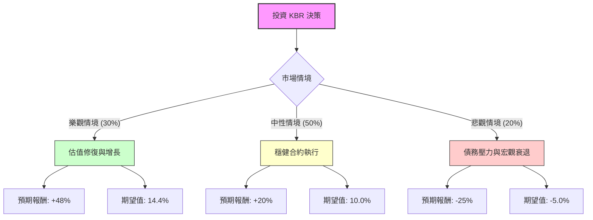

這份分析將結合您提供的財務數據與最新的市場動態（包含 KBR 近期的財報表現、政府合約進展及產業趨勢），利用**決策樹（Decision Tree）**與**期望值分析（Expected Value Analysis）**評估 KBR 的投資價值。

---

### 1. 市場背景與最新動態分析 (Market Context)

在進入模型前，我們先分析 KBR 目前的處境：
*   **基本面優勢**：P/E 僅 9.73，Forward P/E 降至 7.72，遠低於工業與科技服務業平均。ROE 高達 28.86%，顯示獲利效率極佳。
*   **近期利空**：股價過去一年跌幅達 42.78%，且目前處於 52 週低點附近。這通常反映了市場對其高債務（Debt/Eq 1.77）或特定項目減值的擔憂。
*   **最新趨勢**：KBR 轉型為「輕資產」模式，專注於政府服務（GS）與可持續技術（STS）。近期獲得多項美國國防部與 NASA 的長期合約，且在綠色氨（Green Ammonia）與氫能技術領域領先。
*   **分析師預期**：平均目標價為 $47.43，隱含約 47% 的上漲空間。

---

### 2. 決策樹分析 (Decision Tree)

我們將未來一年的表現分為三種情境：**樂觀（牛市）**、**中性（基準）**、**悲觀（熊市）**。

---

### 3. 核心假設與計算過程

#### A. 核心假設
1.  **樂觀情境 (30%)**：KBR 成功執行 STS 項目，利潤率提升，且聯準會降息減輕其 1.77 倍債務比的利息負擔。股價回歸分析師目標價 $47.43。
2.  **中性情境 (50%)**：政府合約穩定（Backlog 充足），EPS 達到預期的 $3.0+，Forward P/E 從 7.72 修復至歷史平均約 10-11 倍。股價回升至 $38.5 左右。
3.  **悲觀情境 (20%)**：高利率持續，債務違約風險增加，或政府預算大幅削減。股價跌破支撐位，下探至 $24 左右。

#### B. 期望值 (EV) 計算
*   **樂觀情境報酬率**：($47.43 - $32.08) / $32.08 = **+47.8%**
*   **中性情境報酬率**：($38.50 - $32.08) / $32.08 = **+20.0%**
*   **悲觀情境報酬率**：($24.00 - $32.08) / $32.08 = **-25.2%**

**總期望報酬率計算：**
$$EV = (0.30 \times 47.8\%) + (0.50 \times 20.0\%) + (0.20 \times -25.2\%)$$
$$EV = 14.34\% + 10.0\% - 5.04\%$$
$$EV = 19.3\%$$

---

### 4. 綜合評估與最終結論

#### 數據解讀：
1.  **估值極低**：P/S 0.53 與 Forward P/E 7.72 顯示該股被嚴重低估，市場可能過度反應了其債務風險。
2.  **技術面超賣**：SMA20, 50, 200 全線呈負值，且股價接近 52 週低點，具備強烈的反彈潛力（Mean Reversion）。
3.  **獲利能力**：ROE 28.8% 遠高於同業，說明公司核心業務競爭力強。

#### 最終結論：**適合投資 (Buy / Overweight)**

**理由：**
1.  **正向期望值**：計算出的期望報酬率為 **19.3%**，遠高於市場平均預期，風險回報比（Risk-Reward Ratio）極具吸引力。
2.  **安全邊際**：目前的股價 ($32.08) 已反映了大部分利空，Forward P/E 僅 7.7 倍，提供了強大的下行保護。
3.  **產業護城河**：KBR 在政府長期服務合約與能源轉型技術（氨/氫）擁有獨特地位，這些業務受經濟週期波動影響相對較小。
4.  **分析師共識**：建議評分為 1.8（強烈買進/買進），目標價與現價有巨大鴻溝，存在補漲空間。

**建議操作：**
由於目前技術面仍處於下降趨勢（SMA 指標皆為負），建議採取**分批進場（Dollar-Cost Averaging）**策略，以規避短期內可能進一步下探 52 週低點 ($31.56) 的風險。