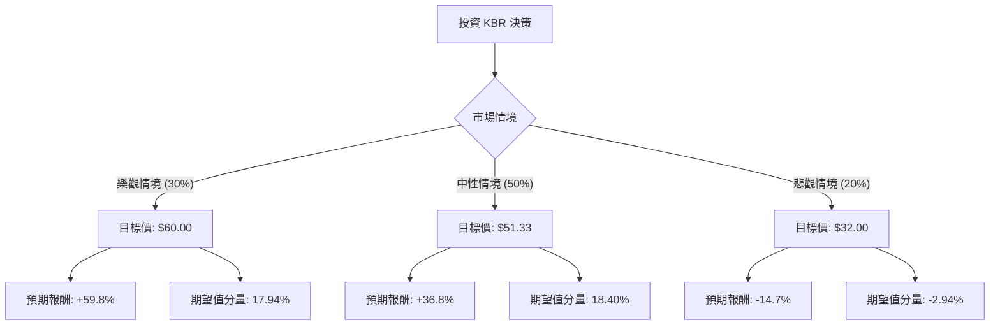

這份分析報告將結合您提供的基本面數據，以及最新的市場動態（包含 KBR 最近的財報表現、收購案及產業趨勢），利用**決策樹（Decision Tree）**與**期望值分析（Expected Value Analysis）**來評估 KBR 的投資價值。

---

### 1. 市場動態與核心假設更新

在進行計算前，我們先整合最新的市場資訊：
*   **業務轉型**：KBR 已從傳統工程轉型為專注於「政府服務（GS）」與「永續技術（STS）」的高毛利公司。
*   **近期收購**：2024 年 8 月 KBR 完成了對 **LinQuest** 的收購，這將強化其在美國國防部與航太領域的數位工程能力。
*   **財務狀況**：雖然數據顯示 Debt/Eq 較高（1.92），但其自由現金流（P/FCF 9.85）強勁，且 ROE 高達 30.18%，顯示資本運用效率極佳。
*   **估值低廉**：目前股價（$37.53）接近 52 週低點（$36.19），Forward P/E 僅 8.91，遠低於行業平均。

---

### 2. 決策樹分析 (Decision Tree)

我們將未來一年的投資情境分為三種：**樂觀（Bull）**、**中性（Base）**、**悲觀（Bear）**。

#### 節點詳細說明：

1.  **樂觀情境 (Probability: 30%)**
    *   **假設**：LinQuest 收購產生巨大綜效，STS 業務受惠於全球能源轉型加速，且美國國防預算超預期增長。
    *   **預期股價**：$60.00 (突破 52W 高點，反映 P/E 回歸至 15x)。
    *   **報酬率**：($60.00 - $37.53) / $37.53 = **+59.8%**。

2.  **中性情境 (Probability: 50%)**
    *   **假設**：公司達到分析師平均目標價。積壓訂單（Backlog）穩定轉化為營收，EPS 增長符合預期（4.33%）。
    *   **預期股價**：$51.33 (參考數據中的 Target Price)。
    *   **報酬率**：($51.33 - $37.53) / $37.53 = **+36.8%**。

3.  **悲觀情境 (Probability: 20%)**
    *   **假設**：高利率環境導致債務利息支出過重，政府合約因預算爭議延遲，或法律訴訟賠償超預期。
    *   **預期股價**：$32.00 (跌破支撐位，反映市場對高槓桿的擔憂)。
    *   **報酬率**：($32.00 - $37.53) / $37.53 = **-14.7%**。

---

### 3. 期望值計算 (Expected Value Calculation)

**總期望報酬率 (Expected Return) 計算公式：**
$E(R) = \sum (P_i \times R_i)$

*   $P_i$ = 該情境發生的機率
*   $R_i$ = 該情境的預期報酬率

**計算過程：**
1.  樂觀：$0.30 \times 59.8\% = 17.94\%$
2.  中性：$0.50 \times 36.8\% = 18.40\%$
3.  悲觀：$0.20 \times (-14.7\%) = -2.94\%$

**總期望報酬率 = $17.94\% + 18.40\% - 2.94\% = 33.4\%$**

---

### 4. 核心假設與風險評估

*   **市場趨勢**：地緣政治緊張局勢（俄烏、中東）支撐了 KBR 的政府解決方案業務。
*   **財務健康**：雖然 Debt/Eq 1.92 偏高，但 Quick Ratio 1.22 顯示短期流動性無虞。
*   **技術面**：股價目前低於 SMA20、50、200，處於超賣區間，從價值投資角度看，這提供了較大的安全邊際（Margin of Safety）。
*   **成長性**：EPS Q/Q 增長 51.58% 是極強的信號，顯示利潤率正在改善。

---

### 5. 最終結論

**判斷：適合投資 (Strong Buy / Value Play)**

#### 理由：
1.  **極高的期望報酬**：計算出的期望報酬率高達 **33.4%**，遠高於市場平均水準。
2.  **估值窪地**：Forward P/E 僅 8.91，且股價接近一年低點，下行風險相對有限（悲觀情境設定為 -14.7%）。
3.  **基本面強勁**：ROE 30% 顯示公司在同業中具有極強的競爭力與獲利能力。
4.  **產業紅利**：KBR 處於國防科技與綠能轉型的交匯點，這兩個領域受宏觀經濟波動影響相對較小，具有防禦性。

**建議操作：**
由於目前技術面（SMA 指標）仍呈空頭排列，建議採取**分批進場**策略，以規避短期內可能還有的探底風險，長期持有以等待估值修復至目標價 $51.33。