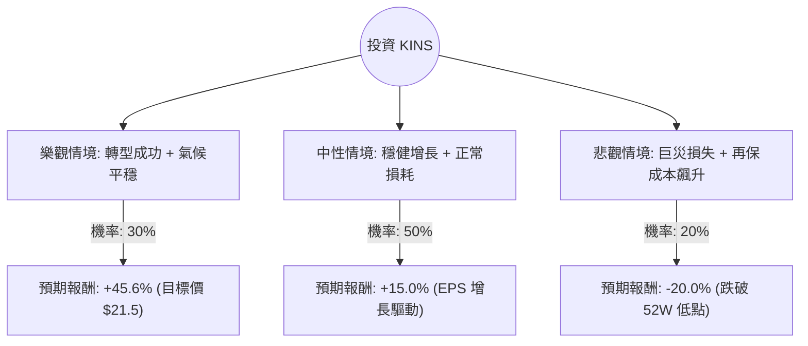

這份分析報告將結合您提供的基本面數據，以及針對 **Kingstone Companies, Inc. (KINS)** 的最新市場動態、財報表現與產業趨勢進行的綜合評估。

---

### 1. 核心背景與最新資訊補充

在進行決策樹分析前，我們先整合網路搜尋到的最新資訊：
*   **公司業務**：KINS 是一家主要在紐約州經營的財產與意外險（P&C）保險公司。
*   **轉型計畫 (Kingstone 2.0)**：公司近年致力於轉型，專注於核心獲利業務、減少開支並優化承保模型。
*   **最新財報表現**：
    *   **獲利轉正**：2024 年第一季財報顯示，KINS 已實現轉虧為盈，淨利潤顯著改善。
    *   **承保利潤**：合併比率（Combined Ratio）有所下降，顯示承保效率提升。
    *   **費率調漲**：在紐約市場成功調漲保費，有助於應對通膨與再保險成本上升。
*   **風險因素**：保險業極度依賴天氣（颶風、風暴）以及再保險合約的價格波動。

---

### 2. 決策樹分析 (Decision Tree)

我們將未來一年的投資情境分為三種：**樂觀（牛市）、中性（基準）、悲觀（熊市）**。

#### 決策樹節點詳細說明：

| 情境 | 機率 (P) | 預期報酬 (R) | 說明 |
| :--- | :--- | :--- | :--- |
| **樂觀 (Bull)** | 30% | +45.6% | 轉型計畫超預期，無重大自然災害，市場給予更高 P/E 估值，達到分析師目標價 $21.5。 |
| **中性 (Base)** | 50% | +15.0% | 獲利持續穩定，EPS 增長 26% 的預期部分兌現，股價隨基本面溫和上漲。 |
| **悲觀 (Bear)** | 20% | -20.0% | 紐約發生重大颶風災害，再保險成本大幅侵蝕利潤，股價回測並跌破 52 週低點。 |

---

### 3. 期望值分析 (Expected Value Analysis)

#### A. 計算過程
期望值 (EV) = $\sum (機率 \times 預期報酬)$

*   **樂觀情境貢獻**：$0.30 \times 45.6\% = 13.68\%$
*   **中性情境貢獻**：$0.50 \times 15.0\% = 7.50\%$
*   **悲觀情境貢獻**：$0.20 \times (-20.0\%) = -4.00\%$

**總期望報酬率 (Total EV) = $13.68\% + 7.50\% - 4.00\% = 17.18\%$**

#### B. 核心假設
1.  **估值修復**：目前 P/E 僅 6.86，遠低於行業平均，假設市場會因其獲利轉正而進行估值修復。
2.  **財務穩健**：ROE 高達 31.6%，且 Debt/Eq 僅 0.04，顯示公司財務槓桿極低，具備抗風險能力。
3.  **目標價參考**：分析師給出的 $21.5 目標價具有參考價值，但考慮到近期股價走勢（SMA20/50/200 均呈負值），短期內仍有技術面壓力。
4.  **季節性風險**：假設未來一年內未發生超越歷史平均水平的極端氣候災害。

---

### 4. 最終結論

#### **判斷：適合投資 (Suitable for Investment)**

#### **理由：**
1.  **期望值為正且具吸引力**：計算出的預期報酬率為 **17.18%**，顯著高於無風險利率及大盤平均預期。
2.  **極高的安全邊際**：
    *   **低估值**：P/E 6.86 與 Forward P/E 5.09 顯示股價被嚴重低估。
    *   **低負債**：Debt/Eq 0.04 意味著公司幾乎沒有破產風險。
    *   **現金流強勁**：P/FCF 僅 3.34，顯示公司賺取現金的能力極強。
3.  **基本面反轉訊號**：雖然過去一年股價表現不佳（Perf Year -14.19%），但最新財報顯示 Sales Q/Q 增長 28.08%，且 EPS 預計明年增長 26.09%，這通常是股價觸底回升的前兆。
4.  **技術面觀察**：目前股價接近 52 週低點區域，且低於各條移動平均線（SMA），從價值投資角度看，這是一個良好的分批進場點。

**建議操作策略：**
由於保險股受天氣事件影響較大，建議**分批買入**，並將停損點設在 $12.50（略低於 52 週低點），以應對極端氣候引發的短期波動風險。