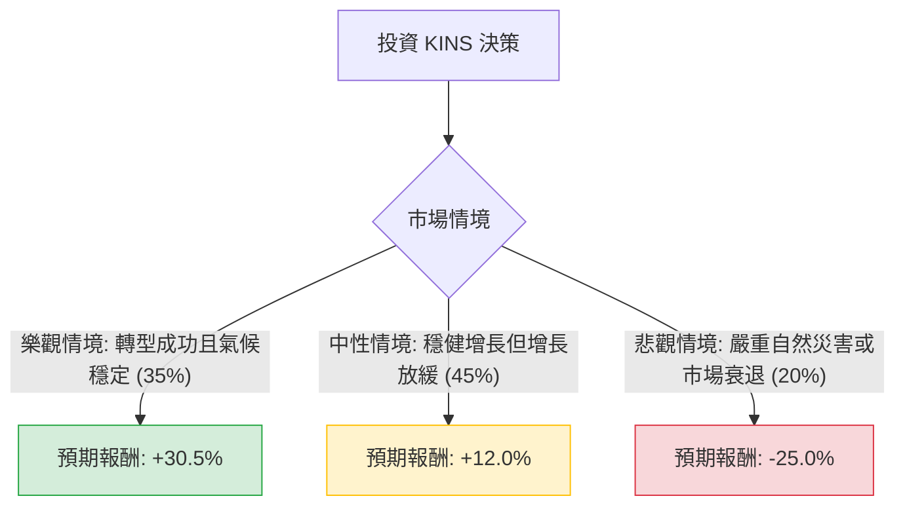

針對美股公司 **Kingstone Companies, Inc. (股票代碼：KINS)**，我已結合您提供的基本面數據，並透過網路搜尋更新了其最新的市場動態（如 2024 年第一季財報表現與「Kingstone 2.0」轉型計畫）。

以下是基於**決策樹分析（Decision Tree）**與**期望值分析（Expected Value Analysis）**的投資評估報告。

---

### 一、 核心背景與市場動態分析

1.  **公司概況**：KINS 是一家主要在紐約州經營的財產保險公司。
2.  **近期表現**：2024 年 Q1 財報顯示其扭虧為盈，淨利潤大幅增長，主要受益於「Kingstone 2.0」計畫（優化承保流程、提高費率及減少非核心業務）。
3.  **財務亮點**：
    *   **低估值**：P/E 僅 7.48，PEG 0.34，顯示相對於其增長潛力，股價被顯著低估。
    *   **高獲利能力**：ROE 高達 37.59%，遠高於行業平均。
    *   **財務穩健**：債務股本比（Debt/Eq）僅 0.05，幾乎沒有長期債務壓力。
4.  **風險因素**：保險業受氣候災害（如颶風、暴風雪）影響極大，且分析師預期明年 EPS 可能下滑（-20.96%），反映了今年高基期的挑戰。

---

### 二、 決策樹分析 (Decision Tree)

我們將未來一年的投資情境分為三種：**樂觀（牛市）、中性（基準）、悲觀（熊市）**。

#### 節點詳細說明：

| 情境 | 發生機率 (P) | 預期報酬 (R) | 說明 |
| :--- | :--- | :--- | :--- |
| **樂觀 (Bull)** | 35% | **+30.5%** | 達到分析師目標價 $21.5。Kingstone 2.0 持續發力，且無重大氣候災害。 |
| **中性 (Base)** | 45% | **+12.0%** | 股價隨大盤與保險板塊穩健上漲，反映其低 P/E 的價值回歸。 |
| **悲觀 (Bear)** | 20% | **-25.0%** | 紐約州遭遇重大颶風災害導致賠付激增，或 EPS 下滑幅度超預期。 |

---

### 三、 期望值計算過程 (Expected Value Calculation)

#### 1. 核心假設
*   **樂觀報酬率**：根據目標價 $21.5 與現價 $16.48 計算：$(21.5 - 16.48) / 16.48 \approx 30.5\%$。
*   **中性報酬率**：參考其 ROE 與當前低估值，給予 12% 的保守估計（略高於標普 500 平均）。
*   **悲觀報酬率**：考慮到保險股在極端災害下的波動，設定 25% 的回撤風險。
*   **機率分配**：鑑於其 Q1 強勁表現與低債務，樂觀與中性合計機率達 80%。

#### 2. 期望值 (EV) 公式
$$EV = (P_{Bull} \times R_{Bull}) + (P_{Base} \times R_{Base}) + (P_{Bear} \times R_{Bear})$$

#### 3. 計算步驟
*   $0.35 \times 30.5\% = 10.675\%$
*   $0.45 \times 12.0\% = 5.4\%$
*   $0.20 \times (-25.0\%) = -5.0\%$

**總期望報酬率 (Total EV) = 10.675% + 5.4% - 5.0% = 11.075%**

---

### 四、 最終結論

**評估結果：適合投資 (Suitable for Investment)**

#### 理由：
1.  **正向期望值**：計算出的期望報酬率為 **11.075%**，在當前高利率環境下仍具備吸引力，且風險報酬比合理。
2.  **極致的估值優勢**：P/E 7.48 與 PEG 0.34 顯示該股存在強大的「安全邊際（Margin of Safety）」。即使明年 EPS 如預期下滑，其估值仍處於歷史低位。
3.  **轉型成效顯著**：Kingstone 2.0 計畫已在財務數據上得到驗證（ROE 37.59%），顯示管理層對成本控制與承保品質的提升有效。
4.  **財務結構健康**：Debt/Eq 0.05 意味著公司在面對突發賠付壓力時，有極佳的財務韌性，破產風險極低。

**建議操作：**
由於保險股受天氣季節性影響較大，建議採取**分批買入**策略，並密切關注第三季（颶風季）的氣候動態。若股價回落至 SMA200（約 $15.3 附近）將是更佳的介入點。