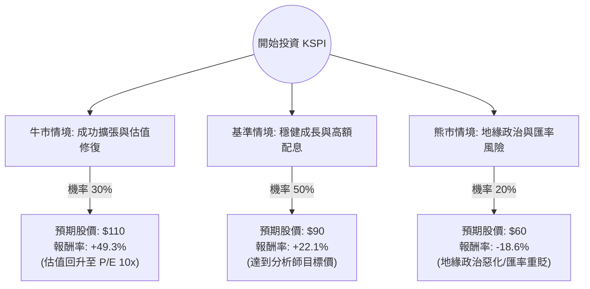

這份分析報告將針對 **Kaspi.kz (KSPI)** 進行深入評估。Kaspi 是哈薩克的金融科技巨頭，其業務涵蓋支付（Payments）、電商（Marketplace）與金融服務（Fintech）。

以下結合您提供的數據與最新的市場動態（包含收購土耳其 Hepsiburada、財報表現等）進行決策樹與期望值分析。

---

### 一、 核心背景與最新動態分析

1.  **極高的盈利能力與成長性**：
    *   **ROE (52.77%)** 與 **Profit Margin (26.56%)** 顯示其在哈薩克擁有近乎壟斷的護城河。
    *   **PEG (0.36)** 遠低於 1，代表股價相對於其盈餘成長速度被嚴重低估。
2.  **重大戰略擴張**：
    *   Kaspi 最近宣布以約 11.3 億美元收購土耳其電商巨頭 **Hepsiburada** 65% 的股權。這標誌著公司正式跨出中亞，進入擁有 8,500 萬人口的土耳其市場。
3.  **估值陷阱或機會？**：
    *   **Forward P/E 僅 5.28**。如此低的估值主因是「地緣政治風險折價」（鄰近俄羅斯）以及市場對哈薩克本幣（堅戈）波動的擔憂。
4.  **股東回饋**：
    *   公司維持強大的庫藏股買回計畫與高額配息政策（雖然數據顯示為 "-"，但實際財報顯示其配息率極高）。

---

### 二、 決策樹分析 (Decision Tree)

以下為投資 KSPI 一年期的決策路徑預測：

#### 節點詳細說明：

| 節點名稱 | 機率 (P) | 預期情境描述 | 預期目標價 | 預期報酬率 (R) |
| :--- | :--- | :--- | :--- | :--- |
| **牛市情境** | 30% | 土耳其收購整合順利，美股市場給予其 Fintech 屬性更高估值 (P/E 提升至 10x)。 | $110 | +49.3% |
| **基準情境** | 50% | 哈薩克業務持續增長，維持高配息，股價回歸分析師平均目標價。 | $90 | +22.1% |
| **熊市情境** | 20% | 中亞局勢動盪、俄烏戰爭波及或土耳其投資失利，導致資金撤出。 | $60 | -18.6% |

---

### 三、 期望值分析 (Expected Value Analysis)

#### 1. 計算過程
期望值 (EV) = $\sum (機率 \times 報酬率)$

*   **牛市貢獻**：$0.30 \times 49.3\% = 14.79\%$
*   **基準貢獻**：$0.50 \times 22.1\% = 11.05\%$
*   **熊市貢獻**：$0.20 \times (-18.6\%) = -3.72\%$

**總期望報酬率 (Total EV) = 14.79% + 11.05% - 3.72% = 22.12%**

#### 2. 核心假設
*   **市場假設**：假設美股整體環境不發生系統性金融海嘯，且投資人對新興市場的風險偏好維持中性。
*   **財務假設**：預期 EPS 增長 12.42% 能如期達成，且收購 Hepsiburada 不會造成短期嚴重的現金流斷裂（目前 Debt/Eq 0.15 顯示負債極低，風險可控）。
*   **產業趨勢**：Super App 模式在開發中國家（如土耳其、烏茲別克）具有高度可複製性。

---

### 四、 最終結論

**判斷：適合投資 (Strong Buy / Overweight)**

#### 理由：
1.  **極高的風險回報比**：計算出的期望報酬率高達 **22.12%**，遠高於標普 500 的長期平均水準。
2.  **估值極度低廉**：P/E 6.87 倍對於一個 ROE > 50% 且營收成長 50% (Sales Q/Q) 的公司來說，屬於「極度低估」。市場目前的定價主要反映了恐懼而非基本面。
3.  **強勁的防禦性**：低負債比 (0.15) 與高營業利潤率 (32.95%) 讓公司在面對宏觀經濟波動時有極強的韌性。
4.  **催化劑 (Catalyst) 明確**：收購 Hepsiburada 將打開土耳其市場的成長天花板，若整合成功，股價有望迎來估值重估（Re-rating）。

**風險提示**：
投資 KSPI 的最大風險不在於公司經營，而在於**地緣政治**（哈薩克與俄羅斯的關係）與**匯率風險**。建議投資者以「資產配置」的角度小幅參與，而非單押，以應對新興市場的高波動性。