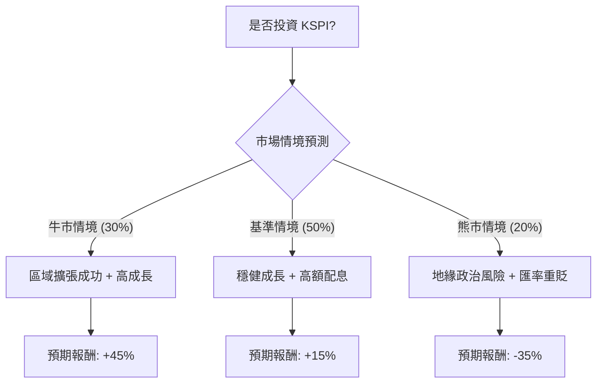

針對美股 **Kaspi.kz (KSPI)** 的投資評估，我們將結合該公司在哈薩克的壟斷地位、近期對土耳其電商 Hepsiburada 的收購案，以及宏觀政治風險進行分析。

以下是基於**一年期持有視角**的決策樹與期望值分析。

---

### 一、 核心假設 (Core Assumptions)

在進行計算前，我們設定以下關鍵假設：
1.  **市場地位**：Kaspi 在哈薩克擁有超過 1,400 萬月活躍用戶（其人口約 2,000 萬），支付與電商市佔率極高，基石穩固。
2.  **海外擴張**：近期收購土耳其 Hepsiburada 65% 股權，被視為進入 8,500 萬人口市場的關鍵。
3.  **財務表現**：淨利潤成長率預期維持在 20-25%，且公司維持高配息政策（殖利率約 7-9%）。
4.  **宏觀風險**：地緣政治（中亞局勢）、匯率風險（堅戈 KZT 對美金貶值）為主要變數。

---

### 二、 決策樹分析 (Decision Tree)

使用 Markdown 結構展示決策路徑：

#### 節點詳細資訊表：

| 節點名稱 | 情境描述 | 發生機率 (P) | 預期報酬 (R) | 說明 |
| :--- | :--- | :---: | :---: | :--- |
| **牛市情境** | 土耳其市場整合優於預期，獲利翻倍 | 30% | +45% | 本益比修復 + 盈餘成長 |
| **基準情境** | 哈薩克業務穩定，土耳其整合平穩 | 50% | +15% | 盈餘成長 (20%) + 配息 (8%) - 匯率損失 |
| **熊市情境** | 中亞政治動盪或制裁波及，匯率重挫 | 20% | -35% | 估值下修 + 資金撤出 |

---

### 三、 期望值計算 (Expected Value Calculation)

我們計算投資 KSPI 一年的預期報酬率期望值 $E(R)$：

$$E(R) = \sum (P_i \times R_i)$$

**計算過程：**
1.  **牛市貢獻**：$0.30 \times 45\% = 13.5\%$
2.  **基準貢獻**：$0.50 \times 15\% = 7.5\%$
3.  **熊市貢獻**：$0.20 \times (-35\%) = -7\%$

**總期望值計算：**
$$E(R) = 13.5\% + 7.5\% - 7\% = \mathbf{14.0\%}$$

---

### 四、 最終結論與判斷

#### **評估結果：適合投資 (Suitable for Investment)**

#### **判斷理由：**
1.  **正向期望值 (14%)**：在計入極端負面情境（熊市 -35%）後，整體期望值仍達 14%，遠高於美股大盤長期平均。
2.  **護城河極深**：Kaspi 不僅是銀行，更是超級 App（支付 + 電商 + 旅行）。這種生態系統在哈薩克幾乎沒有競爭對手，現金流極其強勁。
3.  **高殖利率提供防禦**：其 8% 左右的殖利率能有效對沖股價波動，在基準情境下，即使股價持平，投資者仍能獲得不錯回報。
4.  **增量成長動能**：收購 Hepsiburada 是神來之筆，將經營範疇從 2,000 萬人口擴張至 1 億人規模的市場，具備估值上修（Re-rating）的潛力。

#### **風險提示：**
*   **地緣政治**：由於鄰近俄羅斯，需關注美國對相關區域的二級制裁風險。
*   **流動性**：KSPI 的交易量相較於一線科技股較小，建議分批進場，避免滑價。

---
**免責聲明：** 本分析僅基於財務模型與市場數據推算，不構成具體投資建議。投資美股及新興市場具備高度風險，請投資人自行斟酌風險承受能力。