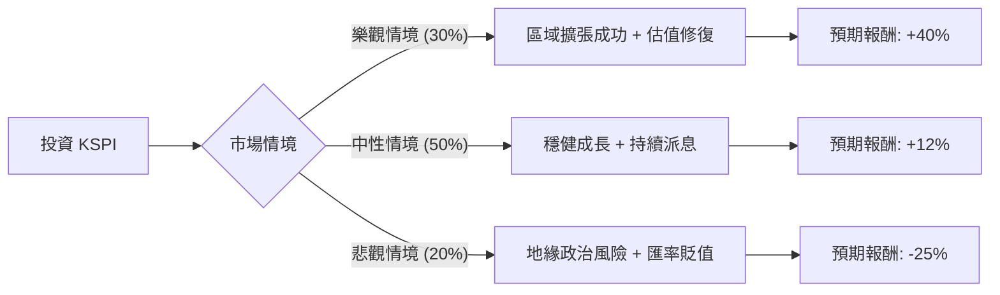

這份分析報告將結合您提供的基本面數據與最新的市場動態（Kaspi.kz, 代號：KSPI），透過**決策樹（Decision Tree）**與**期望值分析（Expected Value Analysis）**，評估其投資價值。

---

### 1. 核心背景與市場動態分析

在進入計算前，我們先整合最新資訊：
*   **公司性質**：Kaspi.kz 是哈薩克的「超級 App」霸主，業務涵蓋支付（Payments）、金融科技（Fintech）與電商（Marketplace）。
*   **最新動態**：
    *   **納斯達克上市**：2024 年初在美國 NASDAQ 上市，增加了流動性與機構投資者的關注。
    *   **高成長與高獲利**：ROE 高達 52.77%，且 Sales Q/Q 成長 50%，顯示其在哈薩克市場的壟斷地位極其穩固。
    *   **擴張策略**：正積極進入烏茲別克等中亞市場，尋求第二成長曲線。
    *   **風險因素**：地緣政治（鄰近俄羅斯）、匯率波動（哈薩克堅戈 KZT 對美元）、以及監管風險。

---

### 2. 決策樹分析 (Decision Tree)

我們將未來一年的投資表現分為三種情境：**樂觀（Bull）**、**中性（Base）**、**悲觀（Bear）**。

#### 決策樹節點詳細說明：

| 節點 (情境) | 發生機率 (P) | 預期報酬 (R) | 說明 |
| :--- | :--- | :--- | :--- |
| **樂觀 (Bull)** | 30% (0.3) | +40% | 成功滲透烏茲別克市場，美股市場給予更高本益比（P/E 回升至 12x）。 |
| **中性 (Base)** | 50% (0.5) | +12% | 維持哈薩克領先地位，EPS 成長符合預期（12.9%），領取 2.1% 股息。 |
| **悲觀 (Bear)** | 20% (0.2) | -25% | 中亞局勢動盪或哈薩克政府加強金融監管，導致資金撤出，匯率大幅貶值。 |

---

### 3. 期望值計算過程 (Expected Value Calculation)

#### A. 核心假設
1.  **估值基礎**：目前 P/E 僅 7.94，遠低於全球金融科技同業（如 MercadoLibre 或 NuBank），具備安全邊際。
2.  **成長性**：PEG 0.47 顯示股價相對於成長性被嚴重低估（PEG < 1 通常視為便宜）。
3.  **獲利能力**：ROE 52.7% 顯示極強的資本利用效率，能支撐股價下行風險。

#### B. 期望值 (EV) 計算
期望值公式：$EV = \sum (P_i \times R_i)$

*   **樂觀貢獻**：$0.3 \times 40\% = 12\%$
*   **中性貢獻**：$0.5 \times 12\% = 6\%$
*   **悲觀貢獻**：$0.2 \times (-25\%) = -5\%$

**總期望報酬率 (Total EV) = 12% + 6% - 5% = 13%**

---

### 4. 綜合評估與最終結論

#### 數據亮點總結：
*   **極低估值**：Forward P/E 僅 6.18，PEG 0.47，這在成長型科技股中極為罕見。
*   **強勁現金流**：P/FCF 為 5.75，顯示公司賺取的是真金白銀，足以支撐其 2.1% 的股息發放。
*   **技術面**：股價位於 SMA20, 50, 200 之上，呈現多頭排列，且近期一個月表現（+17.43%）強勁。

#### 潛在風險：
*   **地緣政治**：哈薩克與俄羅斯的經濟聯繫緊密，若制裁擴大可能受波及。
*   **流動性**：雖然在 NASDAQ 上市，但交易量仍不及美股一線藍籌。

---

### **最終結論：適合投資 (Invest)**

**理由：**
1.  **期望值為正 (13%)**：即便考慮了 20% 的極端悲觀情境，整體期望報酬率依然優於多數成熟市場標的。
2.  **極高的安全邊際**：P/E 低於 8 倍且 ROE 超過 50%，這代表投資者是以「價值股」的價格買入「高成長股」。
3.  **成長動能明確**：Sales Q/Q 50% 的成長率與中亞數位轉型的紅利，提供了強大的基本面支撐。

**建議操作：**
由於 KSPI 屬於新興市場股票，受宏觀政治影響較大，建議**分批建倉**，並將持倉比例控制在投資組合的 5%-10% 以內，以應對可能的匯率或地緣政治波動。