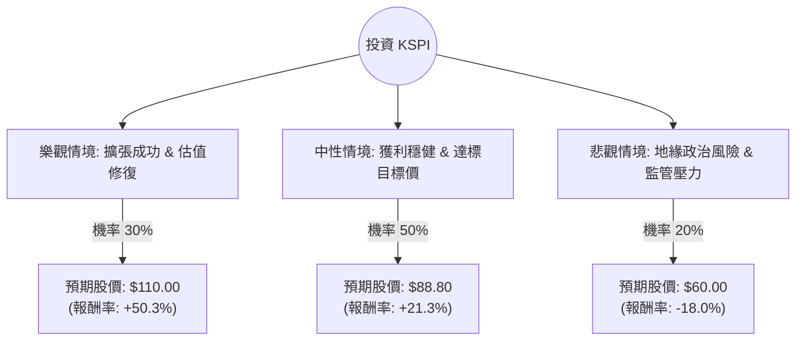

這份分析報告將結合您提供的基本面數據與最新的市場動態（如 Kaspi.kz 在 2024 年第三季的強勁財報、收購烏茲別克 Humo 支付系統的擴張計畫等），利用**決策樹（Decision Tree）**與**期望值分析（Expected Value Analysis）**來評估 KSPI 的投資價值。

---

### 一、 核心假設與背景分析

在建立模型前，我們先整合關鍵資訊：

1.  **極高的獲利能力與低估值**：ROE 高達 61.7%，P/E 僅 6.61，PEG 0.54。這顯示公司在成長的同時，股價相對於盈餘非常便宜。
2.  **成長動能**：Sales Q/Q 增長 52.35%，且公司正積極從哈薩克擴張至烏茲別克（收購 Humo），這將打開新的市場空間。
3.  **市場風險**：地緣政治（鄰近俄羅斯）、哈薩克本國監管風險，以及近期股價處於 SMA20/50/200 之下，顯示技術面偏弱。
4.  **當前股價 ($P_0$)**：$73.20
5.  **分析師目標價**：$88.80 (約 +21% 漲幅)

---

### 二、 決策樹分析 (Decision Tree)

我們將未來一年的情境分為三種：**樂觀（擴張成功）**、**中性（穩健成長）**與**悲觀（地緣政治/監管衝擊）**。

#### 節點詳細說明：

1.  **樂觀情境 (Bull Case) - 30%**：
    *   **描述**：烏茲別克市場貢獻顯著營收，Super App 生態系持續擴張，市場給予估值修復（P/E 回升至 10 倍左右）。
    *   **預期股價**：參考 52W 高點 $109.27，設定為 **$110.00**。
2.  **中性情境 (Base Case) - 50%**：
    *   **描述**：維持現有 20%-30% 的獲利增長，地緣政治保持現狀。
    *   **預期股價**：參考分析師平均目標價 **$88.80**。
3.  **悲觀情境 (Bear Case) - 20%**：
    *   **描述**：中亞局勢動盪或哈薩克政府加強對金融科技的稅收監管，導致資金流出。
    *   **預期股價**：跌破 52W 低點 ($70.61)，下探至 **$60.00**。

---

### 三、 期望值計算過程 (Expected Value Analysis)

#### 1. 預期股價計算 (Expected Price, $E[P]$)
$$E[P] = (P_{Bull} \times Prob_{Bull}) + (P_{Base} \times Prob_{Base}) + (P_{Bear} \times Prob_{Bear})$$
$$E[P] = (110.00 \times 0.30) + (88.80 \times 0.50) + (60.00 \times 0.20)$$
$$E[P] = 33.00 + 44.40 + 12.00 = \mathbf{89.40}$$

#### 2. 預期報酬率 (Expected Return)
$$\text{Expected Return} = \frac{E[P] - P_0}{P_0}$$
$$\text{Expected Return} = \frac{89.40 - 73.20}{73.20} \approx \mathbf{22.13\%}$$

#### 3. 核心假設依據：
*   **市場面**：KSPI 的 P/FCF 僅 2.31，現金流極其強勁，這為股價提供了強大的下行支撐（Margin of Safety）。
*   **財務面**：EPS next Y 預期增長 9.47%，配合 0.54 的 PEG，顯示目前股價被嚴重低估。
*   **產業趨勢**：中亞地區數位支付滲透率仍有提升空間，Kaspi 作為壟斷級別的 Super App，具有極強的護城河。

---

### 四、 最終結論

#### **判斷：適合投資 (Strong Buy / Accumulate)**

#### **理由：**
1.  **期望值極具吸引力**：計算出的期望股價為 **$89.40**，較當前股價有 **22.13%** 的預期漲幅，遠高於一般市場平均回報。
2.  **極高的安全邊際**：P/E 6.6 倍對於一個 ROE > 60% 且營收增長 > 50% 的科技公司來說，幾乎是「價值陷阱」等級的低價，但考慮到其強勁的現金流（P/FCF 2.31），這更像是市場的過度恐慌而非基本面惡化。
3.  **成長路徑清晰**：收購 Humo 進入烏茲別克市場是明確的利多，能抵銷哈薩克國內市場飽和的疑慮。
4.  **技術面反轉機會**：雖然目前股價在均線下方，但已接近 52 週低點，下行空間有限（悲觀情境預估僅 -18%），而上行潛力巨大。

**建議操作：**
鑑於目前技術面（SMA20/50/200 均為負值）偏弱，建議採取**分批買進（Dollar Cost Averaging）**策略，以應對短期內可能因地緣政治引起的波動，長期持有以等待估值回歸正常水平。