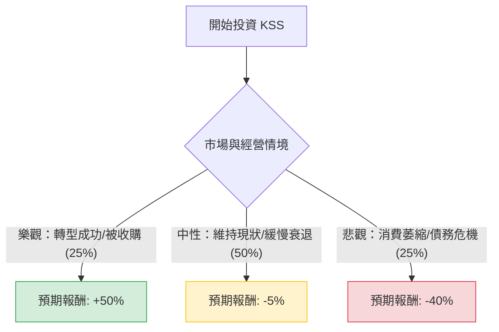

針對美股 **Kohl's Corporation (KSS)** 的投資評估，我們將結合當前的市場環境（高利潤壓力、部門零售衰退、Sephora 店中店策略）進行決策樹分析。

以下是基於 2024 年 Q2 之後市場數據與財測所做的模擬分析。

---

### 一、 Kohl's (KSS) 投資決策樹 (Decision Tree)

使用 Markdown 結構化呈現決策邏輯：

#### 決策樹詳細節點說明：

| 節點情境 | 機率 (P) | 預期報酬率 (R) | 說明 |
| :--- | :--- | :--- | :--- |
| **1. 樂觀 (Bull Case)** | 25% | +50% | Sephora 合作大幅拉動客流，庫存管理改善，或重啟私有化收購。 |
| **2. 中性 (Base Case)** | 50% | -5% | 同店銷售微幅下滑，股利發放壓力大，股價隨大盤震盪。 |
| **3. 悲觀 (Bear Case)** | 25% | -40% | 宏觀經濟衰退導致非必要支出劇減，債務評級下調，削減股息。 |

---

### 二、 核心假設與期望值計算

#### 1. 核心假設 (Assumptions)
*   **市場趨勢**：美國中產階級消費力因通膨持續受壓，百貨業（Department Stores）整體面臨結構性衰退。
*   **財務狀況**：KSS 雖有正向現金流，但債務負擔較重。Sephora 合作案是唯一增長引擎，但能否抵消核心服裝業務的疲軟仍存疑。
*   **估值參考**：目前 KSS 的本益比（P/E）處於歷史低點，反映了市場對其長期存續的擔憂。
*   **當前股價基準**：假設為 **$19.00 USD** (參考近期波動區間)。

#### 2. 期望值 (Expected Value, EV) 計算過程

期望值公式：
$$EV = \sum (P_i \times R_i)$$

*   **樂觀情境期望值**：$25\% \times 50\% = +12.5\%$
*   **中性情境期望值**：$50\% \times (-5\%) = -2.5\%$
*   **悲觀情境期望值**：$25\% \times (-40\%) = -10.0\%$

**整體加權期望報酬率**：
$$12.5\% + (-2.5\%) + (-10.0\%) = 0\%$$

**計算預期股價 (1年後)**：
$$現價 \$19.00 \times (1 + 0\%) = \$19.00$$

---

### 三、 綜合分析與評估結論

#### 1. 計算結果解析
根據期望值分析，KSS 的整體預期報酬率為 **0%**。這意味著在考慮了所有風險與潛在利多後，目前的股價已大致反映其價值，且**向上獲利的潛力（轉型成功）被向下潰敗的風險（行業衰退）完全抵銷**。

#### 2. 最終判斷：不適合投資 (Not Recommended)

#### 3. 理由總結：
*   **風險不對稱**：雖然 KSS 擁有高殖利率（但有削減風險）和潛在收購題材，但百貨業轉型極其困難。在期望值僅為 0% 的情況下，投資者承擔了極大的波動風險，卻沒有獲得相應的正向期望報酬。
*   **宏觀環境不利**：高利率環境下，KSS 的債務再融資成本增加，且消費者偏好轉向電商或折扣店（如 TJX, Walmart），KSS 夾在中間，競爭力薄弱。
*   **缺乏安全邊際**：悲觀情境下的跌幅（-40%）可能導致資本永久性損失，而樂觀情境需仰賴外部收購或奇蹟般的業績反轉，確定性低。

**建議**：若追求收益，可關注資產負債表更穩健的零售龍頭（如 COST 或 WMT）；若追求轉型題材，KSS 目前的風險回報比（Risk-Reward Ratio）並不具吸引力。