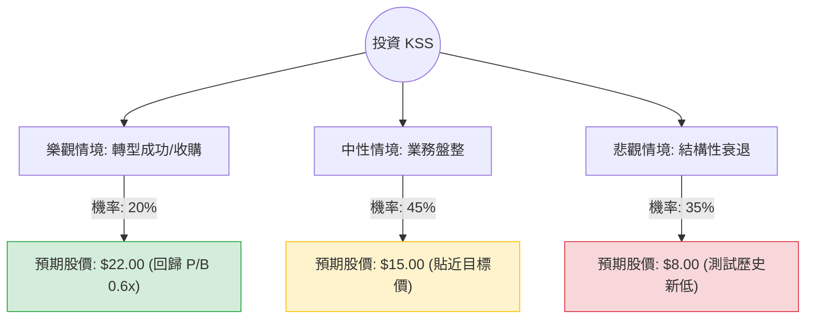

這份分析報告將結合您提供的基本面數據與最新的市場動態（包含 2024 年第三季財報與股利政策變動），利用**決策樹（Decision Tree）**與**期望值分析（Expected Value Analysis）**評估 Kohl's (KSS) 的投資價值。

---

### 1. 最新市場動態與核心假設

在進行計算前，必須納入最新的關鍵資訊（截至 2024 年 11 月底）：
*   **財報表現：** Q3 營收年減 8.8%，同店銷售額下降 9.3%，顯示核心百貨業務持續萎縮。
*   **股利政策重大變動：** Kohl's 於 11 月宣布**暫停發放股利**，以保留現金償還債務。這與您數據中的 3.4% 殖利率已有出入，這會導致收息型法人撤出。
*   **領導層更迭：** 現任 CEO Tom Kingsbury 將於 2025 年 1 月卸任，由 Michaels 前 CEO Ashley Buchanan 接任。
*   **估值極低：** P/B 僅 0.41，P/S 0.11，顯示市場已預期極差的狀況，具備「深層價值」或「被收購」的潛力。
*   **高空單比例：** Short Float 高達 28.5%，若有正面消息極易引發軋空（Short Squeeze）。

---

### 2. 決策樹分析 (Decision Tree)

我們將未來一年的情境分為三種：**樂觀（轉型成功/被收購）**、**中性（維持現狀）**、**悲觀（衰退加劇）**。

---

### 3. 期望值計算過程

#### A. 核心假設與參數設定
*   **當前股價 ($P_0$):** $14.69
*   **情境 1：樂觀 (Optimistic) - 20% 機率**
    *   **假設：** 新任 CEO 成功縮減開支，Sephora 店中店帶動客流回升，或因估值過低引發私有化收購。
    *   **目標價：** $22.00 (約為 2024 年初水平)。
    *   **報酬率：** +49.8%
*   **情境 2：中性 (Neutral) - 45% 機率**
    *   **假設：** 銷售繼續微幅下滑，但暫停股利後債務壓力減輕，股價在淨值下方橫盤整理。
    *   **目標價：** $15.00 (參考分析師平均目標價 $15.32)。
    *   **報酬率：** +2.1%
*   **情境 3：悲觀 (Pessimistic) - 35% 機率**
    *   **假設：** 消費者支出進一步轉向電商或折扣店，同店銷售跌幅擴大至雙位數，面臨生存危機。
    *   **目標價：** $8.00 (跌破 52 週低點 $6.38 附近的支撐)。
    *   **報酬率：** -45.5%

#### B. 期望值 (EV) 計算
$$EV = (P_1 \times Prob_1) + (P_2 \times Prob_2) + (P_3 \times Prob_3)$$
$$EV = (22.00 \times 0.20) + (15.00 \times 0.45) + (8.00 \times 0.35)$$
$$EV = 4.40 + 6.75 + 2.80 = 13.95$$

#### C. 預期報酬率
$$\text{Expected Return} = \frac{EV - P_0}{P_0} = \frac{13.95 - 14.69}{14.69} \approx -5.04\%$$

---

### 4. 綜合評估與最終結論

#### 財務數據分析總結：
1.  **價值陷阱風險：** 雖然 P/E (6.26) 和 P/B (0.41) 極低，但 **Sales Q/Q (-4.15%)** 和 **EPS Q/Q (1.49, 但基數極低)** 顯示基本面仍在惡化。
2.  **流動性壓力：** Quick Ratio 僅 0.37，且 Debt/Eq 高達 1.64，這解釋了為何公司必須暫停股利以保命。
3.  **技術面與籌碼面：** 股價低於 SMA200 (-9.99%)，處於空頭排列。28.5% 的高空單比例雖然提供軋空想像，但在基本面好轉前，這更多是下行壓力的來源。

#### 最終結論：**不適合投資 (Not Recommended)**

**理由：**
1.  **期望值為負：** 經過加權計算，預期一年後的股價期望值為 **$13.95**，低於目前的市價 $14.69，預期報酬率為 **-5.04%**。
2.  **失去收益支撐：** 暫停股利移除了該股最大的吸引力（原先的高配息），將導致大量收益型基金拋售，短期內股價缺乏支撐買盤。
3.  **轉型不確定性：** 新任 CEO 需到 2025 年才上任，在零售業競爭激烈的環境下，轉型需要時間且成功率具高度不確定性。
4.  **風險收益比不對稱：** 雖然有潛在的軋空或收購機會，但核心業務的結構性衰退（同店銷售大跌 9.3%）使得下行風險（跌至 $8 或更低）遠高於上行空間。

**建議：** 除非看到同店銷售額（Comparable Sales）止跌回升，或新任 CEO 提出極具說服力的轉型計畫，否則目前 KSS 較像是一個「價值陷阱」，建議觀望。