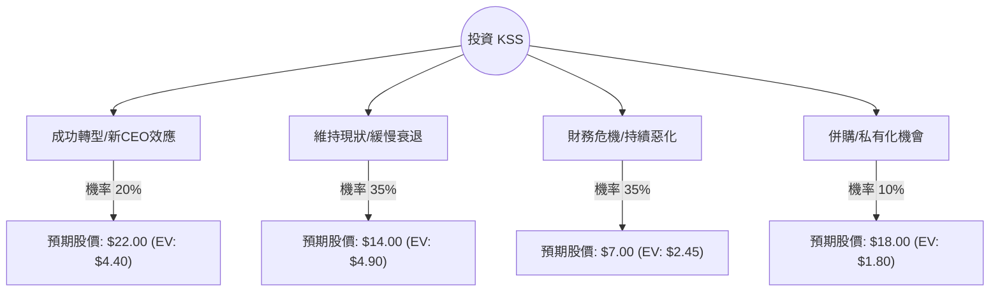

這份分析報告將結合您提供的基本面數據與最新的市場動態（特別是 2024 年 11 月底發布的 Q3 財報與股利政策變動），利用**決策樹（Decision Tree）**與**期望值分析（Expected Value Analysis）**評估 Kohl's (KSS) 的投資價值。

---

### 1. 最新市場動態與背景分析 (Context)

在進行計算前，必須納入最新的關鍵資訊（截至 2024 年 11 月底）：
*   **財報利空：** KSS 最近一季（Q3）同店銷售額下降 9.3%，淨銷售額下降 8.8%，表現低於市場預期。
*   **股利停發：** 公司宣佈**暫停發放季度股利**（原為每股 0.50 美元），這對尋求收益的投資者是重大打擊，也是股價近期暴跌的主因。
*   **管理層變動：** 現任 CEO Tom Kingsbury 將於 2025 年 1 月卸任，由 Michaels 前 CEO Ashley Buchanan 接任。
*   **估值極低：** P/B 僅 0.36，顯示股價遠低於帳面價值，存在潛在的資產回收價值或被收購可能。
*   **高空單比例：** Short Float 高達 24.55%，市場看空情緒極重，但也存在軋空（Short Squeeze）的機會。

---

### 2. 決策樹分析圖 (Decision Tree)

我們將未來一年的情境分為四種：**成功轉型（Bull）**、**維持現狀（Base）**、**持續衰退（Bear）**、以及**被收購/私有化（M&A）**。

---

### 3. 期望值計算過程 (Expected Value Calculation)

#### A. 核心假設與情境說明
1.  **成功轉型 (Bull Case) - 20%：** 新任 CEO 成功優化庫存，Sephora 店中店持續貢獻增長，且重啟股利。股價回升至 52 週高點附近。
2.  **維持現狀 (Base Case) - 35%：** 銷售持續疲軟但未進一步惡化，公司維持生存，股價在目前分析師目標價 ($15.32) 附近震盪。
3.  **持續衰退 (Bear Case) - 35%：** 零售環境惡化，高負債（Debt/Eq 1.64）導致財務壓力，同店銷售持續負成長。股價下探至歷史低點或更低。
4.  **併購機會 (M&A Case) - 10%：** 由於 P/B 極低 (0.36)，吸引私募股權基金或競爭對手提出收購。

#### B. 期望值 (EV) 計算
*   **現價 ($P_0$):** $13.15

| 情境 | 預期股價 ($P_i$) | 預期報酬率 | 機率 ($P_i$) | 加權期望值 |
| :--- | :--- | :--- | :--- | :--- |
| 成功轉型 | $22.00 | +67.3% | 0.20 | $4.40 |
| 維持現狀 | $14.00 | +6.5% | 0.35 | $4.90 |
| 持續衰退 | $7.00 | -46.8% | 0.35 | $2.45 |
| 併購機會 | $18.00 | +36.9% | 0.10 | $1.80 |
| **總計** | | | **1.00** | **$13.55** |

*   **總期望值 (Total EV) = $13.55**
*   **預期報酬率 = ($13.55 - $13.15) / $13.15 = +3.04%**

---

### 4. 綜合評估與最終結論

#### 核心數據解讀：
*   **財務風險：** 暫停股利與下調財測顯示公司現金流壓力巨大。Debt/Eq 1.64 與 Quick Ratio 0.37 顯示短期流動性偏緊。
*   **估值陷阱：** 雖然 P/E 5.61 與 P/B 0.36 看似極其便宜，但這是典型的「價值陷阱（Value Trap）」，因為獲利能力（ROE 6.9%）正在萎縮。
*   **技術面：** 股價低於所有均線（SMA20, 50, 200 均為負值），且月跌幅達 30%，目前處於自由落體狀態。

#### 最終判斷：**不適合投資 (Not Recommended)**

#### 理由：
1.  **期望值過低：** 經過加權計算，預期報酬率僅為 **3.04%**。考慮到 KSS 目前面臨的高波動性與基本面惡化，這個報酬率完全無法補償其承擔的風險（Risk-Reward Ratio 極差）。
2.  **失去核心支撐：** KSS 過去吸引投資者的主因是高殖利率，暫停股利將導致機構法人（Inst Trans）持續撤出，短期內缺乏買盤支撐。
3.  **不確定性極高：** 新任 CEO 需到 2025 年才上任，轉型成效至少需要 2-3 個季度才能體現。在同店銷售額（Comp Sales）轉正前，股價難有起色。
4.  **高空單風險：** 雖然 24.5% 的空單可能引發軋空，但這屬於投機行為而非投資，不符合穩健投資原則。

**建議：** 除非您是極短線的投機者（博弈軋空或超跌反彈），否則對於長期投資者而言，應等待公司銷售數據企穩或新任 CEO 提出明確轉型計畫後再行考慮。目前資金留在 KSS 的機會成本過高。