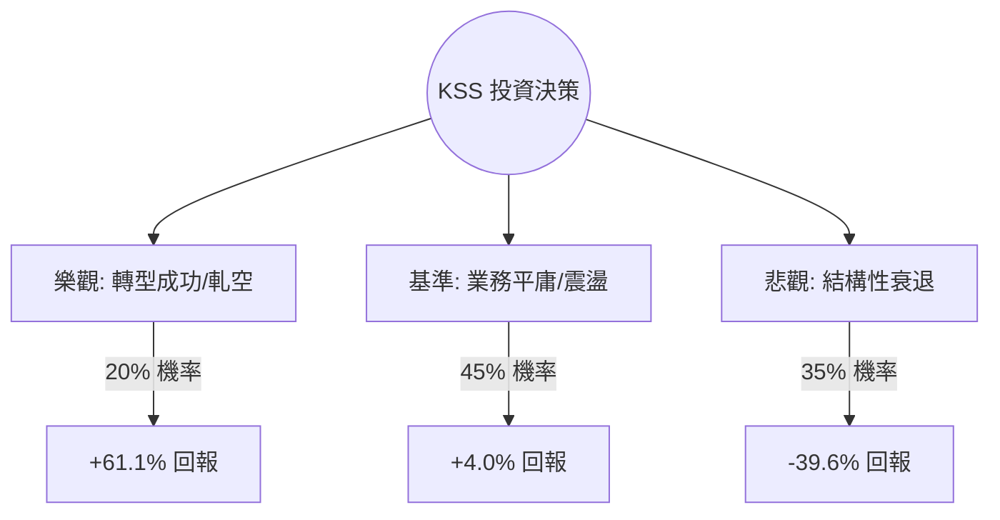

# KSS (Kohl's Corporation) 量化投資分析報告

作為量化投資分析師，針對 Kohl's (KSS) 的當前數據與市場動態，我將透過機率模型與期望值（Expected Value, EV）框架進行深度拆解。目前 KSS 處於極低估值（P/B 0.4）與基本面惡化的拉鋸戰中。

---

### 1. 核心驅動因素與風險 (Drivers & Risks)

#### **關鍵催化劑 (Catalysts)**
1.  **新任 CEO 轉型預期**：Ashley Buchanan（前 Michaels CEO）將於 2025 年 1 月接任。市場期待其零售轉型經驗能改善 Kohl's 混亂的庫存管理與疲軟的客流量。
2.  **Sephora 店中店與店型優化**：Sephora 合作案是目前唯一的增長亮點，若能成功帶動非化妝品類的交叉銷售，將有效提升坪效。
3.  **高空單比例 (Short Squeeze)**：目前 Short Float 高達 24.05%。任何優於預期的財報或戰略更新，都極易引發空頭回補的劇烈反彈。

#### **主要風險點 (Risks)**
1.  **同店銷售持續萎縮**：Sales Q/Q 下降 2.04%，反映出核心百貨業務在中低階消費市場競爭力流失（受 TJX、Ross 擠壓）。
2.  **財務槓桿與利息壓力**：Debt/Eq 高達 1.62，在當前高利率環境下，利息支出侵蝕利潤，且公司近期削減股息顯示現金流壓力增大。
3.  **宏觀消費疲軟**：若 2025 年美國經濟放緩，非必需消費品百貨將首當其衝。

---

### 2. 情境設定與機率賦予 (Scenario Modeling)

基於 12 個月預測週期，設定以下互斥且窮盡的情境：

#### **樂觀情境 (Bull Case)**
*   **發生條件**：新 CEO 上任百日計畫超預期，Sephora 帶動客流回升，且成功觸發空頭擠壓。
*   **預估機率**：20%
*   **目標價格與預期回報**：**$24.00 (+61.1%)**。基於 P/B 回升至 0.6x（歷史中值附近）或 Forward P/E 恢復至 12x。

#### **基準情境 (Base Case)**
*   **發生條件**：業務維持現狀，銷售緩慢下滑但利潤率因成本控制穩定，新 CEO 策略尚待觀察。
*   **預估機率**：45%
*   **目標價格與預期回報**：**$15.50 (+4.0%)**。接近分析師平均目標價 $15.05，反映估值修復受限於增長停滯。

#### **悲觀情境 (Bear Case)**
*   **發生條件**：同店銷售跌幅擴大，債務違約風險疑慮上升，或被剔除出主要指數。
*   **預估機率**：35%
*   **目標價格與預期回報**：**$9.00 (-39.6%)**。回測 52 週低點並考慮流動性折價，P/B 降至 0.25x。

---

### 3. 期望值計算與決策樹 (EV Calculation & Decision Tree)

#### **決策樹結構**

#### **總期望值計算**
*   `EV = (0.20 * 0.611) + (0.45 * 0.04) + (0.35 * -0.396)`
*   `EV = 0.1222 + 0.018 - 0.1386`
*   **`EV = 0.0016 (或 0.16%)`**

#### **風險回報比分析**
*   **上行潛力**：+61.1%
*   **下行空間**：-39.6%
*   **風險回報比**：1.54 : 1
*   **分析**：儘管具備不對稱的上行潛力（受惠於極低 P/B 與高空單），但悲觀情境的發生機率與殺傷力抵消了大部分期望值，導致整體 EV 接近盈虧平衡點。

---

### 4. 決策總結 (Decision Summary)

| 情境 | 發生機率 (%) | 預期報酬率 (%) | 關鍵驅動/觸發因素 |
| :--- | :--- | :--- | :--- |
| **樂觀 (Bull)** | 20% | +61.1% | 新 CEO 轉型奏效、觸發 Short Squeeze |
| **基準 (Base)** | 45% | +4.0% | 業務穩定但無增長、維持低估值震盪 |
| **悲觀 (Bear)** | 35% | -39.6% | 銷售持續惡化、債務壓力導致信用評等下調 |
| **整體期望值** | **100%** | **+0.16%** | **加權平均預期回報接近持平** |

**最終結論：**
1.  **投資建議**：**避開 (Avoid) / 觀望**
2.  **核心逻辑**：從量化角度看，KSS 的期望值僅為 0.16%，在考慮到其高波動性與 1.62 的債務權益比後，該筆交易的「風險調整後收益」極不具吸引力。雖然 P/B 0.4 提供了理論上的安全邊際，但負向的 SMA200 (-13.44%) 與持續下滑的銷售額顯示該股正處於「價值陷阱」區間。
3.  **風控建議**：若已持倉，應以 **$13.50**（近期支撐位）作為硬性止損線。若股價突破 **$17.50**（站回 SMA200 且成交量放大），則代表樂觀情境機率上升，屆時可重新評估進場機會。