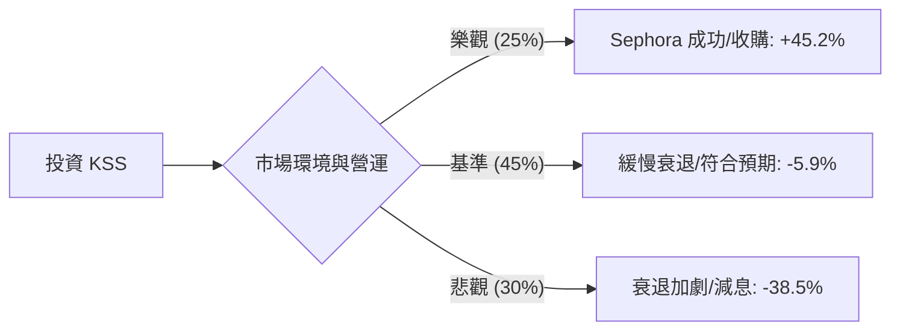

# KSS (Kohl's Corp) 投資價值量化分析報告

作為量化投資分析師，針對 **Kohl's Corp (KSS)** 的現狀，我將結合其極低的估值倍數（P/B 0.47, P/S 0.13）與疲軟的增長預期（EPS Next Year -22.64%）進行概率建模。

---

### 1. 核心驅動因素與風險 (Drivers & Risks)

#### **關鍵催化劑 (Catalysts)**
1.  **Sephora 店中店轉型成效**：KSS 與 Sephora 的合作是目前唯一的增長引擎。若 Sephora 帶動的客流量能成功轉化為高毛利的服裝銷售，將顯著改善營運利潤率（目前僅 3.86%）。
2.  **潛在私有化或併購題材**：鑑於其 P/B 僅 0.47 且 P/FCF 低至 1.89，公司資產價值（房地產與現金流）遠高於市值，可能再次吸引私募股權基金的收購興趣。
3.  **空頭擠壓 (Short Squeeze)**：高達 30.83% 的空頭佔比（Short Float），一旦財報稍微優於預期，極易引發劇烈的技術性反彈。

#### **主要風險點 (Risks)**
1.  **核心客群消費力萎縮**：中低收入受通膨影響嚴重，導致同店銷售額（Sales Q/Q -0.87%）持續低迷。
2.  **資產負債表壓力**：Debt/Eq 高達 1.54，且 Quick Ratio 僅 0.41，顯示短期流動性緊張，在長期高利率環境下再融資成本高昂。
3.  **品牌老化與競爭**：面對 TJX 等折扣零售商與電商的夾擊，KSS 的百貨模式面臨結構性衰退。

---

### 2. 情境設定與機率賦予 (Scenario Modeling)

基於未來 12 個月的展望，設定以下三種互斥情境：

#### **樂觀情境 (Bull Case)**
*   **發生條件**：Sephora 貢獻超出預期，帶動同店銷售轉正；管理層成功削減成本並去庫存；市場傳出明確收購意向。
*   **預估機率**：25%
*   **目標價格與預期回報**：**$26.00 (+45.2%)**。基於 Forward P/E 回升至 15x 或接近 52 週高點。

#### **基準情境 (Base Case)**
*   **發生條件**：業務維持現狀，Sephora 增長被核心業務萎縮抵消；股息維持發放但無增長；股價受限於分析師平均目標價。
*   **預估機率**：45%
*   **目標價格與預期回報**：**$16.83 (-5.9%)**。參考市場共識目標價 (Target Price)。

#### **悲觀情境 (Bear Case)**
*   **發生條件**：經濟進入衰退，EPS 衰退幅度超過 22%；被迫削減股息以保全現金；信用評級下調。
*   **預估機率**：30%
*   **目標價格與預期回報**：**$11.00 (-38.5%)**。測試 52 週低點，反映資產減值風險。

---

### 3. 期望值計算與決策樹 (EV Calculation & Decision Tree)

#### **決策樹結構**

```mermaid
graph LR
    A[投資 KSS] --> B{市場環境與營運}
    B -- 樂觀 (25%) --> C[Sephora 成功/收購: +45.2%]
    B -- 基準 (45%) --> D[緩慢衰退/符合預期: -5.9%]
    B -- 悲觀 (30%) --> E[衰退加劇/減息: -38.5%]
```

#### **總期望值計算**
*   `EV = (0.25 * 45.2%) + (0.45 * -5.9%) + (0.30 * -38.5%)`
*   `EV = 11.3% - 2.65% - 11.55%`
*   **`EV = -2.9%`**

#### **風險回報比分析**
*   **上行潛力**：27.2% (相對於基準點的溢價)
*   **下行空間**：32.6% (相對於基準點的跌幅)
*   **分析**：期望值為負，且下行風險的機率權重與幅度超過上行潛力，這是一個典型的「價值陷阱」特徵。

---

### 4. 決策總結 (Decision Summary)

| 情境 | 發生機率 (%) | 預期報酬率 (%) | 關鍵驅動/觸發因素 |
| :--- | :--- | :--- | :--- |
| **樂觀 (Bull)** | 25% | +45.2% | Sephora 轉型大獲成功、潛在私有化、空頭擠壓 |
| **基準 (Base)** | 45% | -5.9% | 營收持續微幅萎縮，估值維持在歷史低位 |
| **悲觀 (Bear)** | 30% | -38.5% | 宏觀衰退、股息削減、債務違約風險增加 |
| **整體期望值** | **100%** | **-2.9%** | **加權平均預期回報為負** |

**最終結論：**
1.  **投資建議**：**避開 (Avoid) / 觀望**
2.  **核心逻辑**：儘管 KSS 的 P/B 與 P/FCF 極具吸引力，但其負增長的 EPS 預期（-22.6%）與疲軟的流動性指標（Quick Ratio 0.41）顯示基本面尚未見底。期望值計算結果為負（-2.9%），顯示目前價格並未提供足夠的安全邊際來補償其結構性衰退的風險。
3.  **風控建議**：若已持股，應以 **$15.50**（跌破近期支撐）作為強制止損線。若欲博取空頭擠壓反彈，建議僅以極小倉位透過價外看漲期權（Call Options）參與，以限制最大損失。