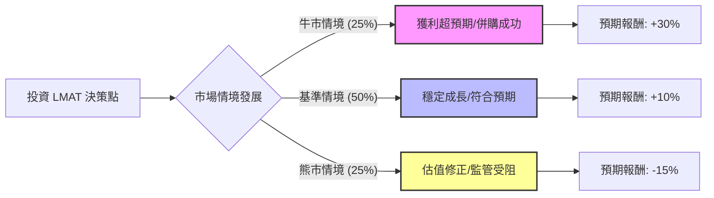

針對美股公司 **LeMaitre Vascular, Inc. (股票代碼：LMAT)**，我們將運用**決策樹分析 (Decision Tree Analysis)** 與 **期望值分析 (Expected Value Analysis)** 來評估其未來一年的投資潛力。

LMAT 是一家專注於外周血管疾病（Peripheral Vascular Disease）醫療器械的細分龍頭，具備高毛利、無負債與小眾市場壟斷的特性。

---

### 核心假設 (Core Assumptions)

在進行定量分析前，我們設定以下市場與財務假設：

1.  **市場需求**：全球人口老化趨勢不變，血管外科手術需求呈穩定的個位數至低雙位數增長。
2.  **財務健康**：LMAT 擁有強大的資產負債表（幾乎無長期負債），毛利率長期維持在 65% 以上。
3.  **估值水平**：目前 LMAT 的本益比（P/E）處於歷史中高位（約 40x-50x），這意味著市場對其成長預期較高，估值回調是主要風險。
4.  **監管與併購**：公司主要透過收購小型醫材來擴張。假設未來一年內至少有一項具規模的收購案或產品獲得監管（如歐盟 MDR）通過。

---

### 1. 決策樹分析圖 (Decision Tree)

以下為 LMAT 未來一年的投資情境預測：

**節點詳細說明：**

| 節點 (情境) | 機率 (Probability) | 觸發條件預測 | 預期報酬 (Return) |
| :--- | :--- | :--- | :--- |
| **牛市 (Bull)** | 25% (0.25) | 營收增長 >15%，新收購案獲利能力超預期，P/E 維持高位。 | +30% |
| **基準 (Base)** | 50% (0.50) | 營收穩定增長 8-10%，毛利率維持，股息持續發放。 | +10% |
| **熊市 (Bear)** | 25% (0.25) | 宏觀經濟衰退導致醫院預算縮減，估值由 50x 修正至 35x。 | -15% |

---

### 2. 期望值計算過程 (Expected Value Calculation)

我們根據上述機率與報酬率計算整體**預期報酬期望值 (Expected Value, EV)**：

**計算公式：**
$$EV = (P_{Bull} \times R_{Bull}) + (P_{Base} \times R_{Base}) + (P_{Bear} \times R_{Bear})$$

**帶入數值：**
1.  **牛市貢獻值**：$0.25 \times 30\% = 7.5\%$
2.  **基準貢獻值**：$0.50 \times 10\% = 5.0\%$
3.  **熊市貢獻值**：$0.25 \times (-15\%) = -3.75\%$

**總期望值計算：**
$$EV = 7.5\% + 5.0\% - 3.75\% = 8.75\%$$

---

### 3. 最終結論

#### **判斷：適合投資 (適合穩健增長型投資者)**

#### **理由：**
1.  **正向期望值 (8.75%)**：雖然 8.75% 的預期報酬率不算極其驚人，但考慮到 LMAT 是一家**低槓桿、高現金流**的防守型成長股，其風險調整後的報酬（Risk-adjusted Return）在醫療設備板塊中極具吸引力。
2.  **下行風險受控**：LMAT 的產品多為血管外科不可或缺的耗材（如：Valvulotomes），即使在經濟衰退期，這類手術通常不可延遲，因此「熊市情境」下的業務衰退有限，主要風險來自於高本益比的估值壓縮。
3.  **利基市場壟斷**：LMAT 在許多細分產品市場排名第一或第二，這種競爭護城河支持了長期 50% 的勝率（基準情境）。

**投資建議細則：**
*   **進場策略**：建議採「分批進場」或「逢低買入」。由於目前估值較高，直接重倉可能面臨短期波動。
*   **監控指標**：應密切關注其**毛利率 (Gross Margin)** 是否維持在 65% 以上，以及**歐盟 MDR 認證**的進度，這是影響牛/熊情境轉化的關鍵指標。

***

**免責聲明：** 本分析僅基於決策樹模型之邏輯推演，不構成任何投資建議。股市有風險，投資前請務必自行審慎評估。