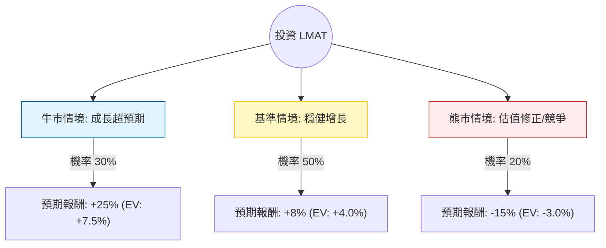

這份分析報告將結合您提供的 **LeMaitre Vascular (LMAT)** 基本面數據，以及最新的市場動態（包含 2024 年第二季財報表現與產業趨勢），利用**決策樹（Decision Tree）**與**期望值分析（Expected Value Analysis）**評估其投資價值。

---

### 一、 市場與公司背景補充（最新資訊）

1.  **強勁的財報表現**：LMAT 在 2024 年 Q2 報告了創紀錄的營收，同比增長約 13%，且毛利率維持在 70% 左右的高水準。公司上調了全年營收與利潤指引。
2.  **產業地位**：LMAT 專注於周邊血管外科手術的利基市場（Niche Market），在該領域擁有極高的定價權。
3.  **財務健康度**：流動比率（Current Ratio）高達 12.56，負債比極低，顯示其擁有極強的抗風險能力與併購潛力。
4.  **估值壓力**：目前 P/E 超過 45 倍，且股價（$113.45）已高於分析師平均目標價（$111.22），顯示短期估值偏高。

---

### 二、 決策樹分析 (Decision Tree)

以下決策樹模擬未來一年（12個月）的投資情境：

#### 節點詳細說明：

1.  **牛市情境 (Bull Case) - 30% 機率**
    *   **條件**：公司成功完成新的利基市場併購，且 EPS 增長率超過市場預期的 10%。
    *   **預期報酬**：股價挑戰 $142（基於 Forward P/E 擴張與獲利增長）。
2.  **基準情境 (Base Case) - 50% 機率**
    *   **條件**：維持現有 10-12% 的營收增長，利潤率穩定。股價隨盈餘增長緩步上升，但受限於高估值。
    *   **預期報酬**：股價達到 $122（約 8% 漲幅）。
3.  **熊市情境 (Bear Case) - 20% 機率**
    *   **條件**：整體美股市場估值下修，或內部人士持續減持（數據顯示 Insider Trans -11.79%），導致股價回測 SMA200。
    *   **預期報酬**：股價回落至 $96（約 -15% 跌幅）。

---

### 三、 核心假設與計算過程

#### 1. 核心假設
*   **市場趨勢**：高齡化社會對血管手術需求持續增加（長期利多）。
*   **財務假設**：毛利率能維持在 68% 以上，且 EPS 增長能維持在 9-15% 區間。
*   **估值假設**：P/E 雖高，但因其利基市場壟斷地位，市場願意給予溢價，但進一步擴張空間有限。

#### 2. 期望值 (Expected Value, EV) 計算
期望值 = Σ (各情境機率 × 各情境報酬率)

*   **牛市貢獻**：$30\% \times 25\% = 7.5\%$
*   **基準貢獻**：$50\% \times 8\% = 4.0\%$
*   **熊市貢獻**：$20\% \times (-15\%) = -3.0\%$

**總期望報酬率 (Total EV) = 7.5% + 4.0% - 3.0% = 8.5%**

---

### 四、 最終結論

#### **判斷：適合投資（但建議「分批買入」或「等待回調」）**

**理由如下：**

1.  **正向期望值**：8.5% 的預期報酬率雖然不算極高，但在醫療器材利基市場中屬於穩健表現。
2.  **極強的資產負債表**：Current Ratio 12.56 與低債務（Debt/Eq 0.47）提供了極高的安全邊際，即便市場波動，公司倒閉或財務危機風險極低。
3.  **高獲利能力**：Gross Margin (69.8%) 與 Profit Margin (23.1%) 顯示公司在產業鏈中擁有強大話語權。
4.  **警訊提醒**：
    *   **估值過高**：目前股價已超越分析師目標價，且 PEG 為 3.59，顯示目前價格並不便宜。
    *   **內部人減持**：Insider Trans 為 -11.79%，這通常是短期股價見頂的信號。
    *   **技術面**：股價遠高於 SMA200 (22.97%)，短期內有過熱跡象。

**總結建議：**
LMAT 是一家**基本面極其優秀**的公司，適合追求長期穩健增長的投資者。然而，由於目前股價處於 52 週高點附近且估值偏高，**不建議在現價一次性重倉投入**。較佳策略是在股價回調至 SMA50（約 $106-$108 區間）時再行布局，以提高安全邊際。