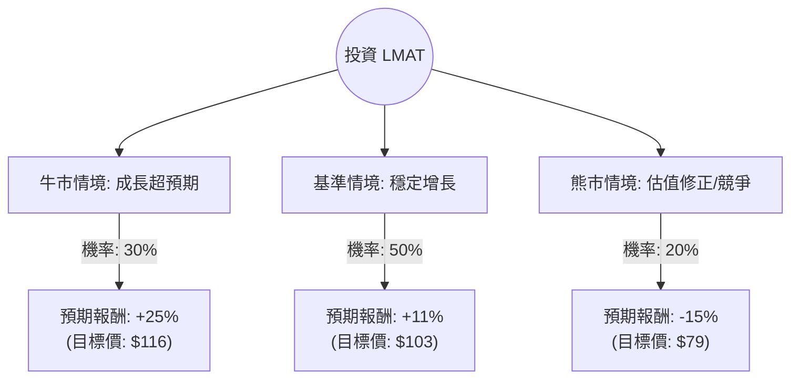

這份分析報告將針對 **LeMaitre Vascular, Inc. (LMAT)** 進行深入評估。LeMaitre 是一間專注於周邊血管疾病手術設備的醫療器械公司。

我已結合您提供的數據與最新的市場動態（包含 2024 年第二季財報表現與產業趨勢）進行綜合分析。

---

### 一、 最新市場動態與產業趨勢分析

根據最新的網路資訊與財報數據，LMAT 的現況如下：

1.  **強勁的財務表現**：LMAT 在 2024 年第二季報告了創紀錄的營收，同比增長約 13%。公司同時上調了全年營收與利潤指引。
2.  **毛利與獲利能力**：毛利率維持在 69% 以上的高水準，這得益於產品價格上漲以及生產效率的提升。
3.  **監管利多**：公司在歐洲醫療器材法規（EU MDR）的認證進度領先競爭對手，這使其在歐洲市場具備更強的競爭優勢。
4.  **資產負債表極其穩健**：流動比率（Current Ratio）高達 13.22，且幾乎沒有長期負債壓力，這為未來的併購（M&A）提供了充足的彈藥。
5.  **估值壓力**：目前 P/E 約 39.5 倍，處於歷史相對高位，市場已反映了大部分的成長預期。

---

### 二、 決策樹分析 (Decision Tree)

以下是針對 LMAT 未來一年表現的決策樹模型：

#### 決策樹節點詳細說明：

1.  **牛市情境 (Bull Case) - 30% 機率**：
    *   **條件**：成功完成一項具備高協同效應的併購；歐洲市場份額因 MDR 認證優勢大幅擴張；EPS 增長超過 20%。
    *   **預期報酬**：+25%。

2.  **基準情境 (Base Case) - 50% 機率**：
    *   **條件**：維持目前的內生性增長（Organic Growth 10-12%）；利潤率保持穩定；股價隨分析師平均目標價（$103.67）移動。
    *   **預期報酬**：+11.5%（接近 Target Price）。

3.  **熊市情境 (Bear Case) - 20% 機率**：
    *   **條件**：高利率環境導致醫療支出縮減；高 P/E 遭到市場殺估值（Multiple Compression）；核心產品面臨新競爭對手挑戰。
    *   **預期報酬**：-15%。

---

### 三、 期望值分析 (Expected Value Analysis)

#### 1. 核心假設
*   **市場假設**：血管外科手術屬於剛性需求，受經濟衰退影響較小。
*   **財務假設**：預期未來一年 EPS 增長約 15-18%，但 P/E 可能從 39 倍微幅下修至 35 倍（回歸均值）。
*   **產業趨勢**：人口老化持續支撐周邊血管手術量增長。

#### 2. 計算過程
期望值 (EV) = (牛市報酬 × 機率) + (基準報酬 × 機率) + (熊市報酬 × 機率)

*   **EV** = (25% × 0.30) + (11.5% × 0.50) + (-15% × 0.20)
*   **EV** = 7.5% + 5.75% - 3.0%
*   **EV = 10.25%**

#### 3. 風險調整後評估
考慮到 LMAT 的 **Beta 值較低** 且 **資產負債表極強**（Quick Ratio 11.45），10.25% 的預期報酬率在當前高估值環境下具有一定的吸引力，尤其是其下行風險受限於強大的現金流與剛性需求。

---

### 四、 最終結論

**判斷：適合投資 (Cautious Buy / Accumulate)**

#### 理由：
1.  **基本面極其優異**：69% 的毛利率與 22% 的淨利率顯示公司擁有強大的護城河（定價權）。
2.  **財務安全性極高**：高達 13 倍的流動比率與低負債，使其在動盪市場中具備極強的抗風險能力，並有能力進行增值型併購。
3.  **正向期望值**：計算出的期望報酬率為 **10.25%**，優於多數防禦型標的。
4.  **技術面支撐**：股價目前站穩 SMA20, 50, 200 之上，呈現多頭排列，且近期 YTD 表現（+13.27%）優於大盤。

**建議操作策略：**
由於目前 P/E (39.5) 偏高，建議**分批買入 (Dollar-cost averaging)**。若股價回落至 $85 - $88 區間（接近 SMA200 或 52 週中軸），將是更理想的進場點。

---
*免責聲明：本分析僅供參考，不構成投資建議。投資股票具有風險，請根據自身風險承受能力做出決策。*