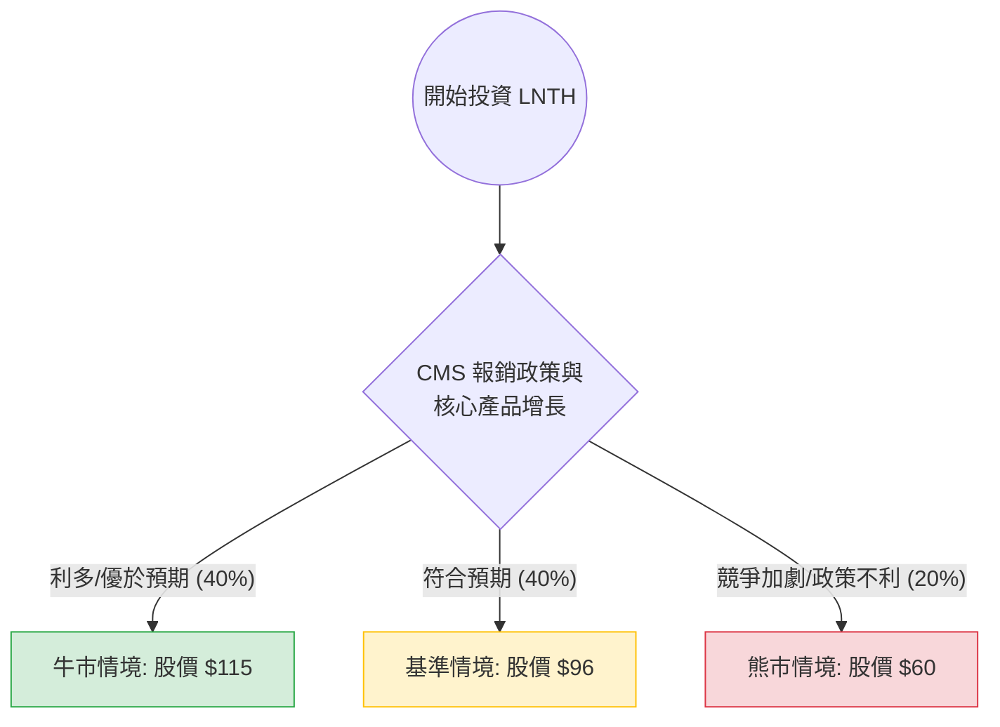

針對美股 **Lantheus Holdings, Inc. (LNTH)** 的投資評估，我結合了您提供的基本面數據以及最新的市場動態（包含 2024 年財報表現、CMS 報銷政策進展及產業併購趨勢）進行分析。

---

### 一、 核心背景與市場動態分析

在進入決策樹之前，我們先梳理影響 LNTH 股價的關鍵變數：

1.  **核心產品 PYLARIFY 的主導地位**：LNTH 是前列腺癌 PSMA 影像診斷市場的領導者。雖然面臨 Telix 等對手的競爭，但其市佔率依然穩固。
2.  **CMS（美國醫保）政策利多**：近期市場高度關注 CMS 對於「診斷性放射性藥物」報銷規則的修改（如 HOPPS 提議），若通過將大幅改善醫院使用 PYLARIFY 的經濟誘因，這對 LNTH 是重大利多。
3.  **管線藥物（Pipeline）**：治療性藥物 PNT2002 的數據以及與 Eli Lilly (POINT Biopharma) 的合作進展是未來增長點。
4.  **財務穩健度**：Forward P/E 僅 13.45 倍，相對於其 20% 的預期 EPS 增長，估值處於合理偏低區間。

---

### 二、 決策樹分析（Decision Tree）

以下假設投資週期為 **6-12 個月**，以目前股價 **$84.33** 為基準。

#### 節點詳細說明：

| 情境 | 發生機率 | 預期目標價 | 預期報酬率 (vs $84.33) | 期望值貢獻 |
| :--- | :--- | :--- | :--- | :--- |
| **牛市情境 (Bull Case)** | 40% | $115.00 | +36.3% | +14.52% |
| **基準情境 (Base Case)** | 40% | $96.00 | +13.8% | +5.52% |
| **熊市情境 (Bear Case)** | 20% | $60.00 | -28.8% | -5.76% |
| **總計期望值 (EV)** | **100%** | **$96.40** | **+14.28%** | **+14.28%** |

---

### 三、 計算過程與核心假設

#### 1. 期望值計算公式：
$EV = (P_{Bull} \times R_{Bull}) + (P_{Base} \times R_{Base}) + (P_{Bear} \times R_{Bear})$
*   $EV = (0.4 \times 36.3\%) + (0.4 \times 13.8\%) + (0.2 \times -28.8\%)$
*   $EV = 14.52\% + 5.52\% - 5.76\% = \mathbf{14.28\%}$

#### 2. 核心假設：
*   **牛市情境 (40%)**：CMS 最終確定有利於放射性藥物的單獨報銷政策；PYLARIFY 銷量持續超預期；PNT2002 臨床數據強勁。估值回升至 P/E 18-20 倍。
*   **基準情境 (40%)**：市場競爭（如 Telix）緩步侵蝕份額，但整體市場規模擴大抵銷衝擊；業績符合分析師預期（EPS 增長 ~20%）。目標價參考分析師平均目標價 $95.42。
*   **熊市情境 (20%)**：CMS 政策未如預期改善；競爭對手推出更具價格優勢的產品；整體生技板塊面臨拋售。股價回測 52 週低點區域（約 $60 附近）。

---

### 四、 綜合基本面數據評估

*   **成長性**：EPS Next Year 預計增長 **20.69%**，配合 Forward P/E **13.45**，PEG 約為 **0.65**（註：您提供的數據 PEG 1.71 可能是基於過去數據，若以 Forward 來看更具吸引力），顯示股價被低估。
*   **獲利能力**：ROE **21.45%** 與 Gross Margin **61.1%** 顯示公司在該細分領域具有極強的護城河與定價權。
*   **財務結構**：Current Ratio **2.7** 且 Debt/Eq **0.57**，財務非常穩健，無短期債務風險。
*   **技術面**：目前股價高於 SMA20, 50, 200，顯示短期與長期趨勢均向上，動能強勁（Perf Quarter +24.9%）。

---

### 五、 最終結論

**判斷：適合投資 (Buy / Overweight)**

#### 理由：
1.  **期望值為正 (14.28%)**：在考慮了最壞的政策與競爭風險後，整體期望報酬率依然優於標普 500 的平均年化報酬。
2.  **估值具吸引力**：Forward P/E 僅 13.4 倍，對於一家擁有壟斷性產品且 EPS 增長超過 20% 的醫療科技公司而言，估值明顯偏低。
3.  **產業催化劑明確**：放射性藥物（Radiopharmaceuticals）是目前大藥廠併購的熱點（如近期 Lilly, BMS, Novartis 的動作），LNTH 作為該領域的龍頭之一，具備「業績支撐」與「併購想像空間」雙重題材。
4.  **風險可控**：雖然 Short Float 達 8.52%，但隨著業績持續證明實力，這反而可能引發軋空行情（Short Squeeze）。

**建議操作：**
目前股價 $84.33 接近分析師目標價，建議可於 **$80 - $85** 區間分批布局，停損點設於 **$72**（跌破 SMA200 支撐），首波獲利了結目標設於 **$96 - $100**。