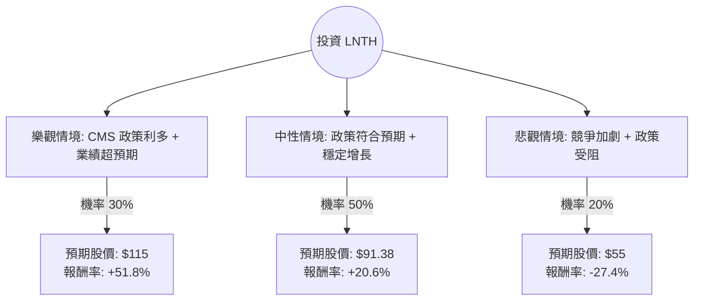

這份分析報告將結合您提供的數據與最新的市場動態（特別是關於 CMS 報銷政策的變動），利用**決策樹（Decision Tree）**與**期望值分析（Expected Value Analysis）**來評估 Lantheus Holdings (LNTH) 的投資價值。

---

### 一、 核心背景與市場動態分析

在進入模型前，必須考慮以下影響 LNTH 股價的關鍵因素：

1.  **CMS 報銷政策（關鍵催化劑）：** 美國醫療保險和醫療補助服務中心 (CMS) 最近提議修改 **OPPS（門診付費系統）** 規則。若通過，將顯著改善醫院對高成本放射性藥物（如 LNTH 的旗艦產品 PYLARIFY）的報銷方式。這被視為該產業重大的利多。
2.  **產品領先地位：** PYLARIFY 是前列腺癌 PSMA PET 成像的市場領導者。儘管面臨 Telix 等對手的競爭，LNTH 仍維持強勁的市佔率。
3.  **財務穩健度：** 數據顯示 Forward P/E 僅 12.03，遠低於其歷史平均與產業平均；ROE 達 21.45%，顯示獲利能力強。
4.  **研發管線：** 除了前列腺癌，LNTH 正在擴展至阿茲海默症成像（MK-6240）及放射治療領域。

---

### 二、 決策樹分析 (Decision Tree)

我們將未來一年的情境分為三種：**樂觀（牛市）**、**中性（基準）**、**悲觀（熊市）**。

#### 節點詳細說明：

1.  **樂觀情境 (Bull Case) - 30% 機率：**
    *   **條件：** CMS OPPS 規則順利實施，顯著提升醫院採購意願；PYLARIFY 市佔率不降反升；新藥管線數據優異。
    *   **預期股價：** $115 (接近 52 週高點並考慮溢價)。
    *   **預期報酬：** +51.8%。

2.  **中性情境 (Base Case) - 50% 機率：**
    *   **條件：** 政策如期推行但市場已部分反映；業績符合分析師預期（EPS 下年增長 21.25%）；維持現有競爭格局。
    *   **預期股價：** $91.38 (參考分析師平均目標價 Target Price)。
    *   **預期報酬：** +20.6%。

3.  **悲觀情境 (Bear Case) - 20% 機率：**
    *   **條件：** CMS 政策最終版本不如預期；競爭對手（如 Telix）大幅削價競爭；宏觀經濟導致醫療支出縮減。
    *   **預期股價：** $55 (回測 52 週低點支撐位)。
    *   **預期報酬：** -27.4%。

---

### 三、 期望值分析 (Expected Value Analysis)

#### 1. 核心假設
*   **當前股價 (P0):** $75.73
*   **持有期限:** 12 個月
*   **折現率:** 不計入（直接以預期報酬率計算總期望值）
*   **數據來源:** 參考提供的財務指標（Forward P/E 12.03 顯示估值偏低，提供安全邊際）。

#### 2. 計算過程
期望值 (EV) = Σ (各情境報酬率 × 對應機率)

*   **樂觀貢獻:** $51.8\% \times 0.30 = 15.54\%$
*   **中性貢獻:** $20.6\% \times 0.50 = 10.30\%$
*   **悲觀貢獻:** $-27.4\% \times 0.20 = -5.48\%$

**總期望報酬率 (Total EV) = 15.54% + 10.30% - 5.48% = 20.36%**

#### 3. 財務數據支持
*   **PEG 1.53：** 考慮到其高成長性，估值尚屬合理。
*   **Quick Ratio 2.51：** 流動性極佳，無短期財務風險。
*   **Short Float 8.05%：** 空方勢力存在，若有利多消息可能引發軋空（Short Squeeze），增加向上動能。

---

### 四、 最終結論

**投資建議：適合投資 (Buy / Overweight)**

#### 理由總結：
1.  **正向期望值：** 經過決策樹模型計算，LNTH 的預期年化報酬率約為 **20.36%**，遠高於市場平均預期。
2.  **估值吸引力：** Forward P/E 僅 12 倍，對於一家 ROE 超過 20% 且處於高成長放射藥物賽道的公司來說，目前股價明顯被低估。
3.  **政策紅利：** CMS 報銷規則的潛在改變是強大的催化劑，能有效解決目前醫院端使用高價診斷藥物的成本痛點。
4.  **風險可控：** 雖然面臨競爭，但 LNTH 擁有先發優勢與強大的現金流（P/FCF 13.82），足以支撐其研發與市場擴張。

**風險提示：** 需密切關注 11 月左右 CMS 公佈的最終版 OPPS 規則，若政策出現反轉，需重新評估悲觀情境的機率。