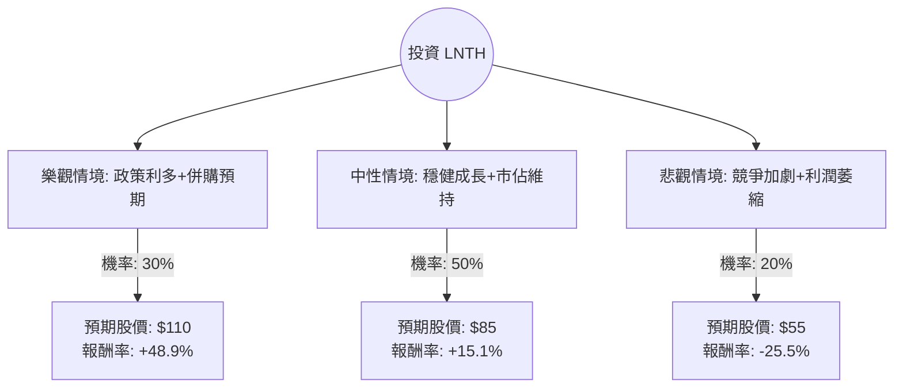

這份分析報告將結合您提供的基本面數據與最新的市場動態（包含 2024 年第一季財報、CMS 醫保政策變化及放射性藥物產業趨勢），利用**決策樹（Decision Tree）**與**期望值分析（Expected Value Analysis）**評估 Lantheus Holdings (LNTH) 的投資價值。

---

### 一、 核心背景與市場動態分析（最新資訊補充）

在進行決策樹分析前，我們必須考慮以下關鍵因素：

1.  **核心產品 Pylarify 的主導地位**：LNTH 的主要收入來源是 Pylarify（用於前列腺癌的 PSMA PET 成像）。目前該產品在市場上仍具領先地位，但面臨來自 Telix Pharmaceuticals 等對手的競爭。
2.  **CMS 政策利多（關鍵轉折點）**：美國醫療保險和醫療補助服務中心 (CMS) 最近提議修改放射性藥物（Radiopharmaceuticals）的報銷規則（Unbundling），這將使醫院在診斷性放射藥物上獲得更合理的補償，預計將大幅提升 Pylarify 的使用量。
3.  **併購熱潮（M&A）**：放射性藥物領域近期成為大藥企（如 AstraZeneca, Bristol Myers Squibb, Eli Lilly）的併購目標。LNTH 作為該領域的龍頭之一，具備潛在的被收購價值。
4.  **財務狀況**：Forward P/E 僅 13.25，相對於其在放射性藥物市場的成長性，估值處於合理偏低區間。

---

### 二、 決策樹分析 (Decision Tree)

我們將未來一年的情境分為三種：**樂觀（牛市/併購）**、**中性（基準成長）**、**悲觀（競爭加劇/政策受阻）**。

#### 1. 決策樹圖表

#### 2. 節點詳細說明與假設

| 情境 | 機率 | 預期股價 | 理由與假設 |
| :--- | :--- | :--- | :--- |
| **樂觀 (Bull)** | 30% | $110 | CMS 報銷政策正式通過，Pylarify 銷量激增；或公司被大型藥企以溢價收購。股價接近 52 週高點。 |
| **中性 (Base)** | 50% | $85 | 營收維持雙位數成長，Forward P/E 回升至 15-16 倍。股價接近分析師平均目標價 ($82.75)。 |
| **悲觀 (Bear)** | 20% | $55 | Telix 等競爭對手大幅奪取市佔；CMS 政策不如預期；研發管線 (PNT2002) 臨床數據不佳。股價回測 52 週低點。 |

---

### 三、 期望值計算 (Expected Value Analysis)

我們以目前股價 **$73.87** 為基準進行計算。

#### 1. 各情境報酬率計算：
*   **樂觀報酬率 ($R_{bull}$)**: $(110 - 73.87) / 73.87 = +48.91\%$
*   **中性報酬率 ($R_{base}$)**: $(85 - 73.87) / 73.87 = +15.07\%$
*   **悲觀報酬率 ($R_{bear}$)**: $(55 - 73.87) / 73.87 = -25.54\%$

#### 2. 總期望報酬率 (Expected Return) 計算：
$$E(R) = (P_{bull} \times R_{bull}) + (P_{base} \times R_{base}) + (P_{bear} \times R_{bear})$$
$$E(R) = (0.30 \times 48.91\%) + (0.50 \times 15.07\%) + (0.20 \times -25.54\%)$$
$$E(R) = 14.67\% + 7.54\% - 5.11\%$$
$$E(R) = \mathbf{17.1\%}$$

#### 3. 預期股價期望值：
$$E(Price) = (0.30 \times 110) + (0.50 \times 85) + (0.20 \times 55) = 33 + 42.5 + 11 = \mathbf{\$86.5}$$

---

### 四、 綜合評估與最終結論

#### 1. 數據亮點分析：
*   **估值優勢**：Forward P/E 13.25 遠低於歷史平均與同業，顯示目前股價並未充分反映其成長潛力。
*   **財務穩健**：Current Ratio 2.67 且 Gross Margin 高達 62.23%，顯示公司有足夠的現金流應對競爭與研發。
*   **技術面**：股價目前站上 SMA20, 50, 200（分別高出 8%~11%），顯示短期與中期趨勢轉強，正處於多頭排列。

#### 2. 風險提示：
*   **產品單一化**：高度依賴 Pylarify，若競爭對手推出更具成本優勢或效果更好的顯影劑，將衝擊營收。
*   **內部人交易**：數據顯示 Insider Trans 為 -0.82%，需留意內部人減持的動向。

#### 3. 最終判斷：**適合投資 (Buy / Overweight)**

**理由：**
1.  **期望值為正**：計算出的預期報酬率為 **17.1%**，預期股價為 **$86.5**，高於目前市價。
2.  **政策催化劑**：CMS 的報銷政策改變是重大利多，尚未完全反映在股價中。
3.  **產業賽道極佳**：放射性藥物是目前生技領域最熱門的併購賽道，LNTH 具備「進可攻（被收購）、退可守（穩健獲利）」的特性。
4.  **風險回報比合理**：雖然面臨競爭，但其低本益比提供了較強的下行保護（Margin of Safety）。

**建議操作：**
可在 $70 - $74 區間分批佈局，首波目標價看 $85，若 CMS 政策利多落實或出現併購消息，可上調至 $110。停損點可設在 $65（跌破主要均線支撐）。